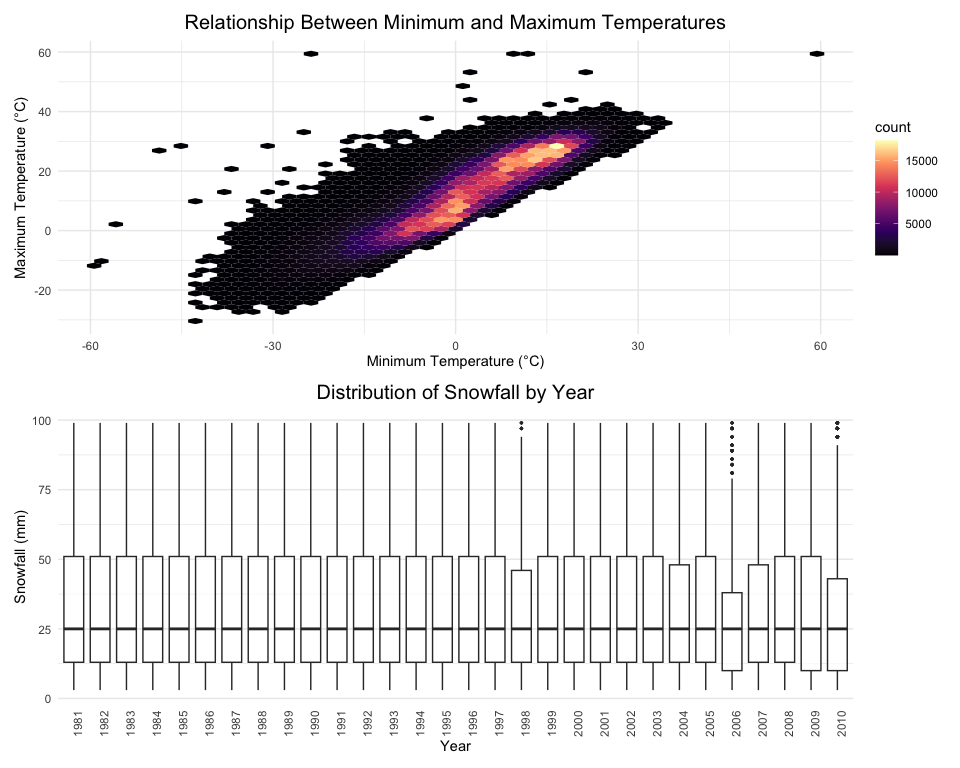

p8105_hw3_jz3900
================
ELisajava
2024-10-15

# Load Necessary Libraries

``` r
library(tidyverse) 
```

    ## ── Attaching core tidyverse packages ──────────────────────── tidyverse 2.0.0 ──
    ## ✔ dplyr     1.1.4     ✔ readr     2.1.5
    ## ✔ forcats   1.0.0     ✔ stringr   1.5.1
    ## ✔ ggplot2   3.5.1     ✔ tibble    3.2.1
    ## ✔ lubridate 1.9.3     ✔ tidyr     1.3.1
    ## ✔ purrr     1.0.2     
    ## ── Conflicts ────────────────────────────────────────── tidyverse_conflicts() ──
    ## ✖ dplyr::filter() masks stats::filter()
    ## ✖ dplyr::lag()    masks stats::lag()
    ## ℹ Use the conflicted package (<http://conflicted.r-lib.org/>) to force all conflicts to become errors

``` r
library(ggplot2)
library(lubridate)
library(ggridges)
library(patchwork) #For combining plots
library(hexbin) #For hexbin plots
library(gt)
library(p8105.datasets)
```

# Configure Global Plot Settings

``` r
knitr::opts_chunk$set(
  fig.width = 10,
  fig.asp = 0.8,
  out.width = '90%'
)

## Setting color options globally
options(
  ggplot2.continuous.color = "magma",
  ggplot2.continuous.fill = "magma"
)

## Assigning scales for discrete color and fill
discrete_color_scale <- scale_color_viridis_d
discrete_fill_scale <- scale_fill_viridis_d
```

# Problem 1

- Write a short description of the dataset.
- Clean the data. Create separate variables for year, month, and day.
  Ensure observations for temperature, precipitation, and snowfall are
  given in reasonable units.
- Make a two-panel plot showing the average max temperature in January
  and in July in each station across years.
- Make a two-panel plot showing (i) tmax vs tmin for the full
  dataset; (ii) make a plot showing the distribution of snowfall values
  greater than 0 and less than 100 separately by year.

## Step 1: Import and describe the dataset

``` r
# Load the dataset (can be skipped)
data("ny_noaa")

# Display the structure of the dataset
str(ny_noaa)
```

    ## tibble [2,595,176 × 7] (S3: tbl_df/tbl/data.frame)
    ##  $ id  : chr [1:2595176] "US1NYAB0001" "US1NYAB0001" "US1NYAB0001" "US1NYAB0001" ...
    ##  $ date: Date[1:2595176], format: "2007-11-01" "2007-11-02" ...
    ##  $ prcp: int [1:2595176] NA NA NA NA NA NA NA NA NA NA ...
    ##  $ snow: int [1:2595176] NA NA NA NA NA NA NA NA NA NA ...
    ##  $ snwd: int [1:2595176] NA NA NA NA NA NA NA NA NA NA ...
    ##  $ tmax: chr [1:2595176] NA NA NA NA ...
    ##  $ tmin: chr [1:2595176] NA NA NA NA ...
    ##  - attr(*, "spec")=
    ##   .. cols(
    ##   ..   id = col_character(),
    ##   ..   date = col_date(format = ""),
    ##   ..   prcp = col_integer(),
    ##   ..   snow = col_integer(),
    ##   ..   snwd = col_integer(),
    ##   ..   tmax = col_character(),
    ##   ..   tmin = col_character()
    ##   .. )

``` r
# Get the number of rows and columns (can be displayed in last code)
nrow(ny_noaa)
```

    ## [1] 2595176

``` r
ncol(ny_noaa)
```

    ## [1] 7

``` r
# Display the dimensions of the dataset
dim(ny_noaa)
```

    ## [1] 2595176       7

``` r
# Summarize the dataset
summary(ny_noaa)
```

    ##       id                 date                 prcp               snow       
    ##  Length:2595176     Min.   :1981-01-01   Min.   :    0.00   Min.   :  -13   
    ##  Class :character   1st Qu.:1988-11-29   1st Qu.:    0.00   1st Qu.:    0   
    ##  Mode  :character   Median :1997-01-21   Median :    0.00   Median :    0   
    ##                     Mean   :1997-01-01   Mean   :   29.82   Mean   :    5   
    ##                     3rd Qu.:2005-09-01   3rd Qu.:   23.00   3rd Qu.:    0   
    ##                     Max.   :2010-12-31   Max.   :22860.00   Max.   :10160   
    ##                                          NA's   :145838     NA's   :381221  
    ##       snwd            tmax               tmin          
    ##  Min.   :   0.0   Length:2595176     Length:2595176    
    ##  1st Qu.:   0.0   Class :character   Class :character  
    ##  Median :   0.0   Mode  :character   Mode  :character  
    ##  Mean   :  37.3                                        
    ##  3rd Qu.:   0.0                                        
    ##  Max.   :9195.0                                        
    ##  NA's   :591786

### A short description of the dataset

- The ny_noaa dataset have 2595176 columns (observations) and 7 columns
  (variables).
- The variables includes:
  - id: Weather station identifier,
  - date: Date of the observation,
  - prcp: Precipitation (tenths of mm),
  - snow: Snowfall (mm),
  - snwd: Snow depth (mm),
  - tmax: Maximum temperature (tenths of degrees C),
  - tmin: Minimum temperature (tenths of degrees C).
- Information on statistics：
  - prcp: Mean: 29.82, Min: 0.00, Max: 22860.00;
  - snow: Mean: 5, Min: -13, Max: 10160;
  - snwd: Mean 37.3, Min: 0.0, Max: 9195.0.
- Note: Some variables contain missing values.

## Step 2: Missing data

``` r
# Caculate the missing data percentages
ny_noaa %>%
  summarise(
    missing_prcp = mean(is.na(prcp)) * 100,
    missing_snow = mean(is.na(snow)) * 100,
    missing_snwd = mean(is.na(snwd)) * 100,
    missing_tmax = mean(is.na(tmax)) * 100,
    missing_tmin = mean(is.na(tmin)) * 100
  )
```

    ## # A tibble: 1 × 5
    ##   missing_prcp missing_snow missing_snwd missing_tmax missing_tmin
    ##          <dbl>        <dbl>        <dbl>        <dbl>        <dbl>
    ## 1         5.62         14.7         22.8         43.7         43.7

### Description of missing data:

- Approximately 5.62% of the prcp values are missing,
- Approximately 14.68% of the snow values are missing,
- Approximately 22.80% of the snwd values are missing,
- Approximately 43.69% of the tmax values and 46.23% of the tmin values
  are missing. The proportion of missing data for both tmax and tmin is
  notably high.

## Step 3: Data cleaning

``` r
# Create separate variables for year, month, and day
ny_noaa = ny_noaa %>%
  mutate(
    year = year(date),
    month = month(date),
    day = day(date)
  )

# Convert `prcp`, `tmax`, and `tmin` to numeric format before unit conversion
ny_noaa = ny_noaa %>%
  mutate(
    prcp = as.numeric(prcp),
    tmax = as.numeric(tmax),
    tmin = as.numeric(tmin)
  )

# Adjust units for temperature and precipitation
ny_noaa = ny_noaa %>%
  mutate(
    prcp = prcp/10,  # Precipitation converts from tenths of mm to mm.
    tmax = tmax/10,  # Max temp converts from tenths of degrees Celsius to degrees Celsius.
    tmin = tmin/10   # Min temp converts from tenths of degrees Celsius to degrees Celsius.
  )
```

``` r
# Ensure logical consistency in temperature data (tmax data is higher than tmin data)
ny_noaa = ny_noaa %>%
  filter(tmax > tmin | is.na(tmax) | is.na(tmin))  

# Filter rows with missing values in key variables (snow, snwd, tmax, tmin, prcp)
ny_noaa = ny_noaa %>%
  filter(!(is.na(snow) & is.na(snwd) & is.na(tmax) & is.na(tmin) & is.na(prcp)))
head(ny_noaa)
```

    ## # A tibble: 6 × 10
    ##   id          date        prcp  snow  snwd  tmax  tmin  year month   day
    ##   <chr>       <date>     <dbl> <int> <int> <dbl> <dbl> <dbl> <dbl> <int>
    ## 1 US1NYAB0001 2007-11-17   0.3     3     0    NA    NA  2007    11    17
    ## 2 US1NYAB0001 2007-11-18   0       0    NA    NA    NA  2007    11    18
    ## 3 US1NYAB0001 2007-11-19   0       0     0    NA    NA  2007    11    19
    ## 4 US1NYAB0001 2007-11-20   2.5     0     0    NA    NA  2007    11    20
    ## 5 US1NYAB0001 2007-11-21   7.1     0     0    NA    NA  2007    11    21
    ## 6 US1NYAB0001 2007-11-22   0.8     0    NA    NA    NA  2007    11    22

### Q 1: For snowfall, what are the most commonly observed values? Why?

``` r
# Count the occurrences of each snowfall value
snow_counts = ny_noaa %>%
  count(snow) %>%
  arrange(desc(n))

# Display the most common snowfall values
head(snow_counts)
```

    ## # A tibble: 6 × 2
    ##    snow       n
    ##   <int>   <int>
    ## 1     0 2007240
    ## 2    NA  308654
    ## 3    25   30981
    ## 4    13   23082
    ## 5    51   18253
    ## 6    76   10159

``` r
str(ny_noaa)
```

    ## tibble [2,521,165 × 10] (S3: tbl_df/tbl/data.frame)
    ##  $ id   : chr [1:2521165] "US1NYAB0001" "US1NYAB0001" "US1NYAB0001" "US1NYAB0001" ...
    ##  $ date : Date[1:2521165], format: "2007-11-17" "2007-11-18" ...
    ##  $ prcp : num [1:2521165] 0.3 0 0 2.5 7.1 0.8 0.8 0.3 0 0.8 ...
    ##  $ snow : int [1:2521165] 3 0 0 0 0 0 0 3 0 5 ...
    ##  $ snwd : int [1:2521165] 0 NA 0 0 0 NA NA 0 NA NA ...
    ##  $ tmax : num [1:2521165] NA NA NA NA NA NA NA NA NA NA ...
    ##  $ tmin : num [1:2521165] NA NA NA NA NA NA NA NA NA NA ...
    ##  $ year : num [1:2521165] 2007 2007 2007 2007 2007 ...
    ##  $ month: num [1:2521165] 11 11 11 11 11 11 11 11 11 11 ...
    ##  $ day  : int [1:2521165] 17 18 19 20 21 22 23 24 25 26 ...
    ##  - attr(*, "spec")=
    ##   .. cols(
    ##   ..   id = col_character(),
    ##   ..   date = col_date(format = ""),
    ##   ..   prcp = col_integer(),
    ##   ..   snow = col_integer(),
    ##   ..   snwd = col_integer(),
    ##   ..   tmax = col_character(),
    ##   ..   tmin = col_character()
    ##   .. )

- Answer of Q 1:
- The most commonly observed value for snowfall is 0 mm, with 2,008,508
  occurrences.
- A possible reason for this is that snowfall does not occur daily and
  is primarily concentrated in the winter months.

## Step 4: Data Visualization:

## Part 1: Average Max Temperature in January and July Across Years

``` r
# Filter data for January and July
temp_jan_jul = ny_noaa %>%
  filter(month %in% c(1, 7)) %>%
  group_by(id, year, month) %>%
  summarise(
    avg_tmax = mean(tmax, na.rm = TRUE),
    .groups = "drop"
  ) %>%
  mutate(month = case_when(
    month == 1 ~ "January",
    month == 7 ~ "July"
  ))

# Visualization for January
plot_jan <- ggplot(subset(temp_jan_jul, month == "January"), 
                   aes(x = year, y = avg_tmax, group = id, col = id)) +
  geom_point(alpha = 0.5) +
  labs(
    title = "Average Max Temperature in January",
    x = "Year",
    y = "Average Max Temperature (°C)"
  ) +
  theme_minimal() +
  theme(
    legend.position = "none",
    plot.title = element_text(hjust = 0.5)
)

# Visualization for July
plot_jul <- ggplot(subset(temp_jan_jul, month == "July"), 
                   aes(x = year, y = avg_tmax, group = id, col = id)) +
  geom_point(alpha = 0.5) +
  labs(
    title = "Average Max Temperature in July",
    x = "Year",
    y = "Average Max Temperature (°C)"
  ) +
  theme_minimal() +
  theme(
    legend.position = "none",
    plot.title = element_text(hjust = 0.5)
)

# Combine the two plots using patchwork library
combined_plot <- plot_jan / plot_jul
combined_plot + plot_layout(heights = c(1, 1))
```

    ## Warning: Removed 2923 rows containing missing values or values outside the scale range
    ## (`geom_point()`).

    ## Warning: Removed 3047 rows containing missing values or values outside the scale range
    ## (`geom_point()`).


### Q 2: Is there any observable / interpretable structure? Any outliers?

- Structure:

  - Temperature Separation: January temperatures are colder, ranging
    approximately from -10°C to 10°C, while July temperatures are much
    warmer, around 20°C to 35°C.
  - Variation: January shows more variation across years, with
    temperatures fluctuating widely. July has a more stable temperature
    range, with most values clustered between 25°C and 30°C.

- Trend:

A slight upward trend in January’s temperatures is visible over time,
while July’s temperatures remain largely stable.

- Outliers:

  - January: A few years have unusually cold temperatures, dipping below
    -10°C, which stand out as extreme values.
  - July: There are some outliers below 20°C, indicating unusually cool
    summers in certain years.

## Part 2: tmax vs tmin Plot and Snowfall Distribution

### tmax vs tmin Plot

``` r
# Hexbin plot for tmax vs tmin
p_temp = ggplot(ny_noaa, aes(x = tmin, y = tmax)) +
  geom_hex(bins = 50) +
  labs(
    title = "Relationship Between Minimum and Maximum Temperatures",
    x = "Minimum Temperature (°C)",
    y = "Maximum Temperature (°C)"
  ) +
  theme_minimal()+
  theme(
     plot.title = element_text(hjust = 0.5)
  )
```

### Snowfall Distribution by Year

``` r
### Snowfall Distribution by Year
# Filter snowfall data
snowfall_filtered = ny_noaa %>%
  filter(snow > 0, snow < 100)

# Plot snowfall distribution by year using boxplots
p_snow = ggplot(snowfall_filtered, aes(x = factor(year), y = snow)) +
  geom_boxplot(outlier.size = 0.5, alpha = 0.7) +
  labs(
    title = "Distribution of Snowfall by Year",
    x = "Year",
    y = "Snowfall (mm)"
  ) +
  theme_minimal() +
  theme(
    axis.text.x = element_text(angle = 90, hjust = 1),
    panel.grid.major.x = element_blank(),
    plot.title = element_text(hjust = 0.5) 
  )

# Fix: ensure correct color scale for hex plot
p_temp = p_temp + scale_fill_viridis_c(option = "magma")

# Combine the temperature and snowfall plots
p_temp + p_snow + plot_layout(ncol = 1)
```

    ## Warning: Removed 1063998 rows containing non-finite outside the scale range
    ## (`stat_binhex()`).


