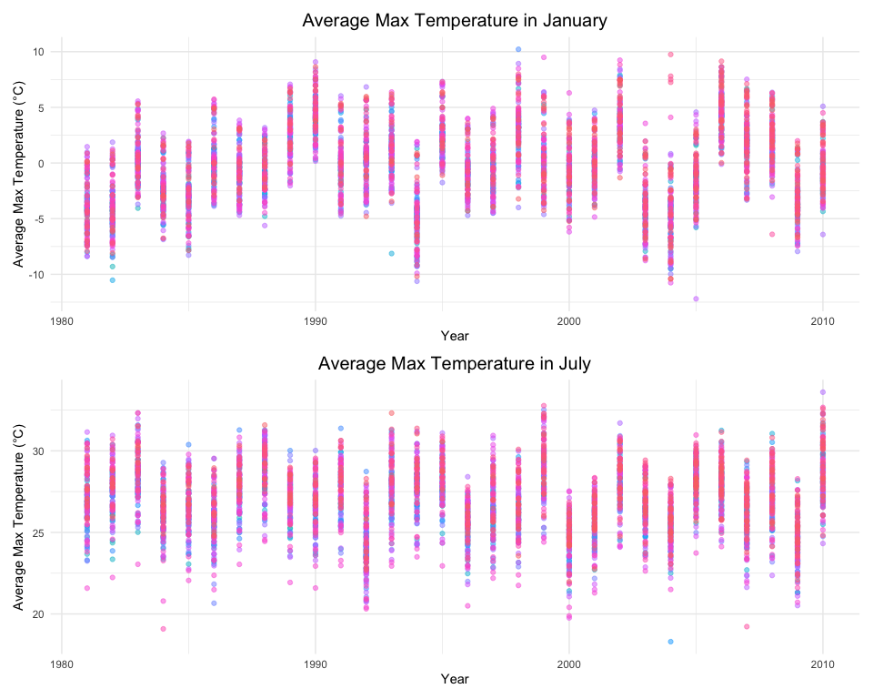
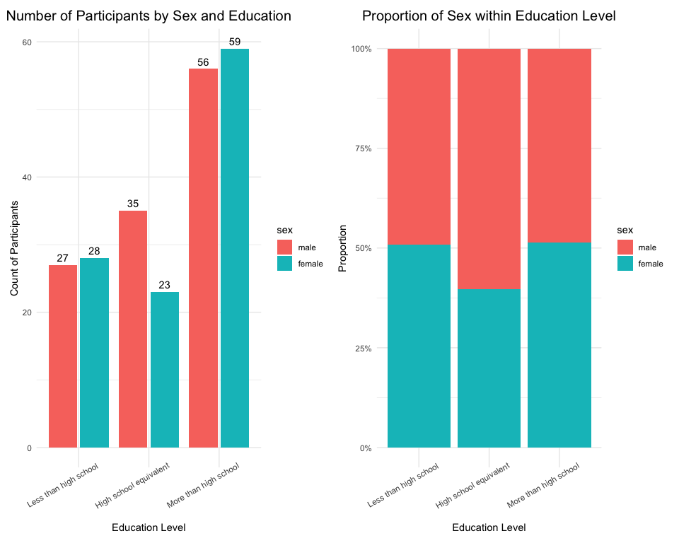
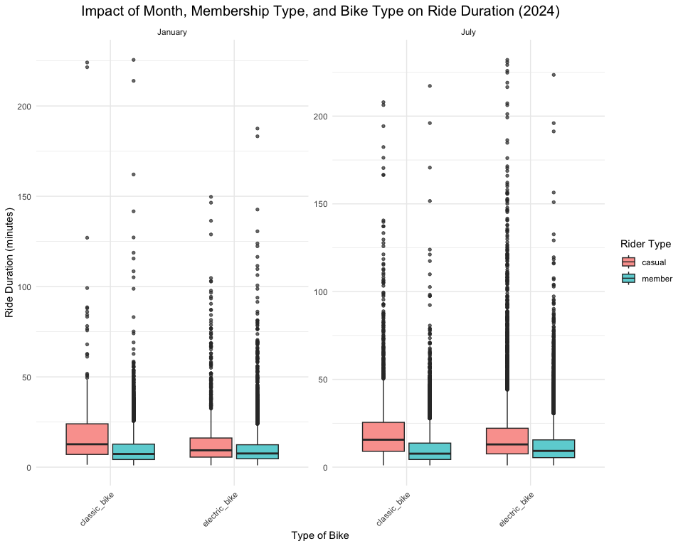

p8105_hw3_jz3900
================
ELisajava
2024-10-15

# Load Necessary Libraries

``` r
library(tidyverse) 
```

    ## ── Attaching core tidyverse packages ──────────────────────── tidyverse 2.0.0 ──
    ## ✔ dplyr     1.1.4     ✔ readr     2.1.5
    ## ✔ forcats   1.0.0     ✔ stringr   1.5.1
    ## ✔ ggplot2   3.5.1     ✔ tibble    3.2.1
    ## ✔ lubridate 1.9.3     ✔ tidyr     1.3.1
    ## ✔ purrr     1.0.2     
    ## ── Conflicts ────────────────────────────────────────── tidyverse_conflicts() ──
    ## ✖ dplyr::filter() masks stats::filter()
    ## ✖ dplyr::lag()    masks stats::lag()
    ## ℹ Use the conflicted package (<http://conflicted.r-lib.org/>) to force all conflicts to become errors

``` r
library(ggplot2)
library(lubridate)
library(ggridges)
library(patchwork) #For combining plots
library(hexbin) #For hexbin plots
library(gt)
library(p8105.datasets)
```

# Configure Global Plot Settings

``` r
knitr::opts_chunk$set(
  fig.width = 10,
  fig.asp = 0.8,
  out.width = '90%'
)

## Setting color options globally
options(
  ggplot2.continuous.color = "magma",
  ggplot2.continuous.fill = "magma"
)

## Assigning scales for discrete color and fill
discrete_color_scale <- scale_color_viridis_d
discrete_fill_scale <- scale_fill_viridis_d
```

# Problem 1

- Write a short description of the dataset.
- Clean the data. Create separate variables for year, month, and day.
  Ensure observations for temperature, precipitation, and snowfall are
  given in reasonable units.
- Make a two-panel plot showing the average max temperature in January
  and in July in each station across years.
- Make a two-panel plot showing (i) tmax vs tmin for the full
  dataset; (ii) make a plot showing the distribution of snowfall values
  greater than 0 and less than 100 separately by year.

## Step 1: Import and describe the dataset

``` r
# Load the dataset
data("ny_noaa")

# Display the structure of the dataset
str(ny_noaa)
```

    ## tibble [2,595,176 × 7] (S3: tbl_df/tbl/data.frame)
    ##  $ id  : chr [1:2595176] "US1NYAB0001" "US1NYAB0001" "US1NYAB0001" "US1NYAB0001" ...
    ##  $ date: Date[1:2595176], format: "2007-11-01" "2007-11-02" ...
    ##  $ prcp: int [1:2595176] NA NA NA NA NA NA NA NA NA NA ...
    ##  $ snow: int [1:2595176] NA NA NA NA NA NA NA NA NA NA ...
    ##  $ snwd: int [1:2595176] NA NA NA NA NA NA NA NA NA NA ...
    ##  $ tmax: chr [1:2595176] NA NA NA NA ...
    ##  $ tmin: chr [1:2595176] NA NA NA NA ...
    ##  - attr(*, "spec")=
    ##   .. cols(
    ##   ..   id = col_character(),
    ##   ..   date = col_date(format = ""),
    ##   ..   prcp = col_integer(),
    ##   ..   snow = col_integer(),
    ##   ..   snwd = col_integer(),
    ##   ..   tmax = col_character(),
    ##   ..   tmin = col_character()
    ##   .. )

``` r
# Display the dimensions of the dataset
dim(ny_noaa)
```

    ## [1] 2595176       7

``` r
# Summarize the dataset
summary(ny_noaa)
```

    ##       id                 date                 prcp               snow       
    ##  Length:2595176     Min.   :1981-01-01   Min.   :    0.00   Min.   :  -13   
    ##  Class :character   1st Qu.:1988-11-29   1st Qu.:    0.00   1st Qu.:    0   
    ##  Mode  :character   Median :1997-01-21   Median :    0.00   Median :    0   
    ##                     Mean   :1997-01-01   Mean   :   29.82   Mean   :    5   
    ##                     3rd Qu.:2005-09-01   3rd Qu.:   23.00   3rd Qu.:    0   
    ##                     Max.   :2010-12-31   Max.   :22860.00   Max.   :10160   
    ##                                          NA's   :145838     NA's   :381221  
    ##       snwd            tmax               tmin          
    ##  Min.   :   0.0   Length:2595176     Length:2595176    
    ##  1st Qu.:   0.0   Class :character   Class :character  
    ##  Median :   0.0   Mode  :character   Mode  :character  
    ##  Mean   :  37.3                                        
    ##  3rd Qu.:   0.0                                        
    ##  Max.   :9195.0                                        
    ##  NA's   :591786

### A short description of the dataset

- The ny_noaa dataset have 2595176 columns (observations) and 7 columns
  (variables).
- The variables includes:
  - id: Weather station identifier,
  - date: Date of the observation,
  - prcp: Precipitation (tenths of mm),
  - snow: Snowfall (mm),
  - snwd: Snow depth (mm),
  - tmax: Maximum temperature (tenths of degrees C),
  - tmin: Minimum temperature (tenths of degrees C).
- Information on statistics：
  - prcp: Mean: 29.82, Min: 0.00, Max: 22860.00;
  - snow: Mean: 5, Min: -13, Max: 10160;
  - snwd: Mean 37.3, Min: 0.0, Max: 9195.0.
- Note: Some variables contain missing values.

## Step 2: Missing data

``` r
# Caculate the missing data percentages
ny_noaa %>%
  summarise(
    missing_prcp = mean(is.na(prcp)) * 100,
    missing_snow = mean(is.na(snow)) * 100,
    missing_snwd = mean(is.na(snwd)) * 100,
    missing_tmax = mean(is.na(tmax)) * 100,
    missing_tmin = mean(is.na(tmin)) * 100
  )
```

    ## # A tibble: 1 × 5
    ##   missing_prcp missing_snow missing_snwd missing_tmax missing_tmin
    ##          <dbl>        <dbl>        <dbl>        <dbl>        <dbl>
    ## 1         5.62         14.7         22.8         43.7         43.7

### Description of missing data:

- Approximately 5.62% of the prcp values are missing,
- Approximately 14.68% of the snow values are missing,
- Approximately 22.80% of the snwd values are missing,
- Approximately 43.69% of the tmax values and 46.23% of the tmin values
  are missing. The proportion of missing data for both tmax and tmin is
  notably high.

## Step 3: Data cleaning

``` r
# Create separate variables for year, month, and day
ny_noaa = ny_noaa %>%
  mutate(
    year = year(date),
    month = month(date),
    day = day(date)
  )

# Convert `prcp`, `tmax`, and `tmin` to numeric format before unit conversion
ny_noaa = ny_noaa %>%
  mutate(
    prcp = as.numeric(prcp),
    tmax = as.numeric(tmax),
    tmin = as.numeric(tmin)
  )

# Adjust units for temperature and precipitation
ny_noaa = ny_noaa %>%
  mutate(
    prcp = prcp/10,  # Precipitation converts from tenths of mm to mm.
    tmax = tmax/10,  # Max temp converts from tenths of degrees Celsius to degrees Celsius.
    tmin = tmin/10   # Min temp converts from tenths of degrees Celsius to degrees Celsius.
  )
```

``` r
# Ensure logical consistency in temperature data (tmax data is higher than tmin data)
ny_noaa = ny_noaa %>%
  filter(tmax > tmin | is.na(tmax) | is.na(tmin))  

# Filter rows with missing values in key variables (snow, snwd, tmax, tmin, prcp)
ny_noaa = ny_noaa %>%
  filter(!(is.na(snow) & is.na(snwd) & is.na(tmax) & is.na(tmin) & is.na(prcp)))
head(ny_noaa)
```

    ## # A tibble: 6 × 10
    ##   id          date        prcp  snow  snwd  tmax  tmin  year month   day
    ##   <chr>       <date>     <dbl> <int> <int> <dbl> <dbl> <dbl> <dbl> <int>
    ## 1 US1NYAB0001 2007-11-17   0.3     3     0    NA    NA  2007    11    17
    ## 2 US1NYAB0001 2007-11-18   0       0    NA    NA    NA  2007    11    18
    ## 3 US1NYAB0001 2007-11-19   0       0     0    NA    NA  2007    11    19
    ## 4 US1NYAB0001 2007-11-20   2.5     0     0    NA    NA  2007    11    20
    ## 5 US1NYAB0001 2007-11-21   7.1     0     0    NA    NA  2007    11    21
    ## 6 US1NYAB0001 2007-11-22   0.8     0    NA    NA    NA  2007    11    22

### Q 1: For snowfall, what are the most commonly observed values? Why?

``` r
# Count the occurrences of each snowfall value
snow_counts = ny_noaa %>%
  count(snow) %>%
  arrange(desc(n))

# Display the most common snowfall values
head(snow_counts)
```

    ## # A tibble: 6 × 2
    ##    snow       n
    ##   <int>   <int>
    ## 1     0 2007240
    ## 2    NA  308654
    ## 3    25   30981
    ## 4    13   23082
    ## 5    51   18253
    ## 6    76   10159

``` r
str(ny_noaa)
```

    ## tibble [2,521,165 × 10] (S3: tbl_df/tbl/data.frame)
    ##  $ id   : chr [1:2521165] "US1NYAB0001" "US1NYAB0001" "US1NYAB0001" "US1NYAB0001" ...
    ##  $ date : Date[1:2521165], format: "2007-11-17" "2007-11-18" ...
    ##  $ prcp : num [1:2521165] 0.3 0 0 2.5 7.1 0.8 0.8 0.3 0 0.8 ...
    ##  $ snow : int [1:2521165] 3 0 0 0 0 0 0 3 0 5 ...
    ##  $ snwd : int [1:2521165] 0 NA 0 0 0 NA NA 0 NA NA ...
    ##  $ tmax : num [1:2521165] NA NA NA NA NA NA NA NA NA NA ...
    ##  $ tmin : num [1:2521165] NA NA NA NA NA NA NA NA NA NA ...
    ##  $ year : num [1:2521165] 2007 2007 2007 2007 2007 ...
    ##  $ month: num [1:2521165] 11 11 11 11 11 11 11 11 11 11 ...
    ##  $ day  : int [1:2521165] 17 18 19 20 21 22 23 24 25 26 ...
    ##  - attr(*, "spec")=
    ##   .. cols(
    ##   ..   id = col_character(),
    ##   ..   date = col_date(format = ""),
    ##   ..   prcp = col_integer(),
    ##   ..   snow = col_integer(),
    ##   ..   snwd = col_integer(),
    ##   ..   tmax = col_character(),
    ##   ..   tmin = col_character()
    ##   .. )

- Answer of Q 1:
  - The most commonly observed value for snowfall is 0 mm, with
    2,008,508 occurrences.
  - A possible reason for this is that snowfall does not occur daily and
    is primarily concentrated in the winter months.

## Step 4: Data Visualization:

## Part 1: Average Max Temperature in January and July Across Years

``` r
# Filter data for January and July
temp_jan_jul = ny_noaa %>%
  filter(month %in% c(1, 7)) %>%
  group_by(id, year, month) %>%
  summarise(
    avg_tmax = mean(tmax, na.rm = TRUE),
    .groups = "drop"
  ) %>%
  mutate(month = case_when(
    month == 1 ~ "January",
    month == 7 ~ "July"
  ))

# Visualization for January
plot_jan <- ggplot(subset(temp_jan_jul, month == "January"), 
                   aes(x = year, y = avg_tmax, group = id, col = id)) +
  geom_point(alpha = 0.5) +
  labs(
    title = "Average Max Temperature in January",
    x = "Year",
    y = "Average Max Temperature (°C)"
  ) +
  theme_minimal() +
  theme(
    legend.position = "none",
    plot.title = element_text(hjust = 0.5,size=15)
)

# Visualization for July
plot_jul <- ggplot(subset(temp_jan_jul, month == "July"), 
                   aes(x = year, y = avg_tmax, group = id, col = id)) +
  geom_point(alpha = 0.5) +
  labs(
    title = "Average Max Temperature in July",
    x = "Year",
    y = "Average Max Temperature (°C)"
  ) +
  theme_minimal() +
  theme(
    legend.position = "none",
    plot.title = element_text(hjust = 0.5,size=15)
)

# Combine the two plots using patchwork library
combined_plot <- plot_jan / plot_jul
combined_plot + plot_layout(heights = c(1, 1))
```

    ## Warning: Removed 2923 rows containing missing values or values outside the scale range
    ## (`geom_point()`).

    ## Warning: Removed 3047 rows containing missing values or values outside the scale range
    ## (`geom_point()`).



### Q 2: Is there any observable / interpretable structure? Any outliers?

- Structure:

  - Temperature Separation: January temperatures are colder, ranging
    approximately from -10°C to 10°C, while July temperatures are much
    warmer, around 20°C to 35°C.
  - Variation: January shows more variation across years, with
    temperatures fluctuating widely. July has a more stable temperature
    range, with most values clustered between 25°C and 30°C.

- Trend:

  - A slight upward trend in January’s temperatures is visible over
    time, while July’s temperatures remain largely stable.

- Outliers:

  - January: A few years have unusually cold temperatures, dipping below
    -10°C, which stand out as extreme values.
  - July: There are some outliers below 20°C, indicating unusually cool
    summers in certain years.

## Part 2: tmax vs tmin Plot and Snowfall Distribution

### tmax vs tmin Plot

``` r
# Hexbin plot for tmax vs tmin
p_temp = ggplot(ny_noaa, aes(x = tmin, y = tmax)) +
  geom_hex(bins = 50) +
  labs(
    title = "Relationship Between Minimum and Maximum Temperatures",
    x = "Minimum Temperature (°C)",
    y = "Maximum Temperature (°C)"
  ) +
  theme_minimal()+
  theme(
     plot.title = element_text(hjust = 0.5,size=15)
  )
```

### Snowfall Distribution by Year

``` r
### Snowfall Distribution by Year
# Filter snowfall data
snowfall_filtered = ny_noaa %>%
  filter(snow > 0, snow < 100)

# Plot snowfall distribution by year using boxplots
p_snow = ggplot(snowfall_filtered, aes(x = factor(year), y = snow)) +
  geom_boxplot(outlier.size = 0.5, alpha = 0.7) +
  labs(
    title = "Distribution of Snowfall by Year",
    x = "Year",
    y = "Snowfall (mm)"
  ) +
  theme_minimal() +
  theme(
    axis.text.x = element_text(angle = 90, hjust = 1),
    panel.grid.major.x = element_blank(),
    plot.title = element_text(hjust = 0.5,size=15) 
  )

# Fix: ensure correct color scale for hex plot
p_temp = p_temp + scale_fill_viridis_c(option = "magma")

# Combine the temperature and snowfall plots
p_temp + p_snow + plot_layout(ncol = 1)
```

    ## Warning: Removed 1063998 rows containing non-finite outside the scale range
    ## (`stat_binhex()`).


# Problem 2

- Load, tidy, merge, and organize the data sets: (1) include all
  originally observed variables); (2) exclude participants less than 21
  years of age; (3) exclude those with missing demographic data; (4)
  encode data with reasonable variable classes (i.e. not numeric, and
  using factors with the ordering of tables and plots in mind).

- Produce a reader-friendly table for the number of men and women in
  each education category, and create a visualization of the age
  distributions for men and women in each education category. Comment on
  these items.

- Using the tidied dataset, aggregate across minutes to create a total
  activity variable for each participant. Plot these total activities
  (y-axis) against age (x-axis); your plot should compare men to women
  and have separate panels for each education level. Include a trend
  line or a smooth to illustrate differences. Comment on your plot.

- Make a three-panel plot that shows the 24-hour activity time courses
  for each education level and use color to indicate sex. Describe in
  words any patterns or conclusions you can make based on this graph;
  including smooth trends may help identify differences.

## Step 1: Load and Organize the Data Sets

``` r
# Load the data sets
demographics <- read.csv(file = "./dataset/nhanes_covar.csv", skip = 4)
accelerometer <- read.csv(file = "./dataset/nhanes_accel.csv")

# Check structure and summary of both data sets
str(demographics)
```

    ## 'data.frame':    250 obs. of  5 variables:
    ##  $ SEQN     : int  62161 62164 62169 62174 62177 62178 62180 62184 62186 62189 ...
    ##  $ sex      : int  1 2 1 1 1 1 1 1 2 2 ...
    ##  $ age      : int  22 44 21 80 51 80 35 26 17 30 ...
    ##  $ BMI      : num  23.3 23.2 20.1 33.9 20.1 28.5 27.9 22.1 22.9 22.4 ...
    ##  $ education: int  2 3 2 3 2 2 3 2 NA 3 ...

``` r
summary(demographics)
```

    ##       SEQN            sex             age             BMI          education   
    ##  Min.   :62161   Min.   :1.000   Min.   :16.00   Min.   :16.50   Min.   :1.00  
    ##  1st Qu.:62296   1st Qu.:1.000   1st Qu.:31.00   1st Qu.:23.93   1st Qu.:2.00  
    ##  Median :62436   Median :1.000   Median :46.50   Median :27.80   Median :2.00  
    ##  Mean   :62435   Mean   :1.476   Mean   :48.15   Mean   :29.11   Mean   :2.25  
    ##  3rd Qu.:62570   3rd Qu.:2.000   3rd Qu.:65.00   3rd Qu.:33.30   3rd Qu.:3.00  
    ##  Max.   :62704   Max.   :2.000   Max.   :80.00   Max.   :56.30   Max.   :3.00  
    ##                                                  NA's   :4       NA's   :18

``` r
str(accelerometer)
```

    ## 'data.frame':    250 obs. of  1441 variables:
    ##  $ SEQN   : int  62161 62164 62169 62174 62177 62178 62180 62184 62186 62189 ...
    ##  $ min1   : num  1.11 1.92 5.85 5.42 6.14 ...
    ##  $ min2   : num  3.12 1.67 5.18 3.48 8.06 ...
    ##  $ min3   : num  1.47 2.38 4.76 3.72 9.99 ...
    ##  $ min4   : num  0.938 0.935 6.482 3.808 6.598 ...
    ##  $ min5   : num  1.6 2.59 6.85 6.85 4.57 ...
    ##  $ min6   : num  0.145 5.221 7.242 4.449 2.783 ...
    ##  $ min7   : num  2.1 2.393 6.115 0.561 7.104 ...
    ##  $ min8   : num  0.509 4.902 7.484 1.608 7.253 ...
    ##  $ min9   : num  1.632 1.968 5.471 0.698 10.127 ...
    ##  $ min10  : num  1.2 3.13 6.49 2.72 7.49 ...
    ##  $ min11  : num  0.947 2.771 5.135 4.845 2.718 ...
    ##  $ min12  : num  0.0263 2.4539 3.5134 0.5777 2.3941 ...
    ##  $ min13  : num  0.0552 2.1964 5.4329 1.174 2.2013 ...
    ##  $ min14  : num  0.037 3.079 3.836 2.801 0.85 ...
    ##  $ min15  : num  2.1 7.72 10.22 1.06 3.3 ...
    ##  $ min16  : num  0.543 9.464 6.942 0.029 2.918 ...
    ##  $ min17  : num  0.0915 6.8507 5.9619 0.9488 3.6746 ...
    ##  $ min18  : num  0.97 5.5 8.16 2.68 7.59 ...
    ##  $ min19  : num  0.814 6.11 14.2 4.881 6.248 ...
    ##  $ min20  : num  0.965 3.443 8.693 0.127 5.79 ...
    ##  $ min21  : num  0.0478 3.5679 25.992 2.5968 3.3457 ...
    ##  $ min22  : num  1.86 1.47 9.24 5.02 3.32 ...
    ##  $ min23  : num  1.08 3.1 6.63 1.65 3.01 ...
    ##  $ min24  : num  1.03 1.77 5.1 5.26 4.18 ...
    ##  $ min25  : num  1.23 3.28 4.78 4.72 2.24 ...
    ##  $ min26  : num  2.29 4.53 8.48 5.02 3.79 ...
    ##  $ min27  : num  0.0607 2.5034 7.4079 4.7187 5.7221 ...
    ##  $ min28  : num  0.0533 1.3331 4.4674 6.8562 5.5306 ...
    ##  $ min29  : num  0.103 0.765 5.384 2.806 12.468 ...
    ##  $ min30  : num  0.0907 5.9849 3.7921 4.3602 5.6324 ...
    ##  $ min31  : num  0.309 3.25 5.987 3.357 1.305 ...
    ##  $ min32  : num  0.401 0.745 4.218 1.742 2.748 ...
    ##  $ min33  : num  1.234 0.99 3.491 1.998 0.395 ...
    ##  $ min34  : num  0.033 1.342 3.624 0.98 1.554 ...
    ##  $ min35  : num  3.0613 3.5911 5.953 0.0155 0.6207 ...
    ##  $ min36  : num  1.723 5.063 7.598 0.457 0.247 ...
    ##  $ min37  : num  0.0605 4.642 7.6967 0.6662 1.5099 ...
    ##  $ min38  : num  4.22 5.02 6.34 1.05 1.69 ...
    ##  $ min39  : num  0.805 2.664 20.129 0.02 3.07 ...
    ##  $ min40  : num  0.898 1.363 10.044 0.507 4.033 ...
    ##  $ min41  : num  1.7445 2.4273 4.4081 0.0427 2.1993 ...
    ##  $ min42  : num  1.506 5.165 8.664 0.756 0.69 ...
    ##  $ min43  : num  0.857 6.527 10.432 1.763 1.255 ...
    ##  $ min44  : num  1.03 3.22 6.75 3.29 3.02 ...
    ##  $ min45  : num  0.0495 6.4894 3.8894 0.0893 2.7264 ...
    ##  $ min46  : num  0.137 6.602 3.976 0.732 7.687 ...
    ##  $ min47  : num  0.911 2.535 3.47 1.363 1.78 ...
    ##  $ min48  : num  0.299 3.532 5.168 0.117 1.399 ...
    ##  $ min49  : num  0.364 2.365 5.692 0.759 1.329 ...
    ##  $ min50  : num  0.0455 1.0396 5.194 0.5965 3.2546 ...
    ##  $ min51  : num  0.0307 0.805 3.5296 0.419 2.827 ...
    ##  $ min52  : num  2.216 0.722 6.174 0.147 2.251 ...
    ##  $ min53  : num  0.0577 1.1586 7.8921 1.7413 0.3917 ...
    ##  $ min54  : num  1.216 1.243 7.589 2.286 0.631 ...
    ##  $ min55  : num  0.0765 1.2767 6.3474 4.3313 0.7009 ...
    ##  $ min56  : num  0.0638 1.2551 5.1994 0.1208 1 ...
    ##  $ min57  : num  0.532 0.6137 5.814 0.0183 2.2229 ...
    ##  $ min58  : num  0.0448 0.7019 8.0919 0.698 3.5767 ...
    ##  $ min59  : num  0.094 4.954 6.623 0.084 2.911 ...
    ##  $ min60  : num  0.0273 4.0599 5.9017 0.5968 5.567 ...
    ##  $ min61  : num  0.922 9.251 6.438 0.015 2.355 ...
    ##  $ min62  : num  0.0378 2.8973 6.4271 0.0157 4.0069 ...
    ##  $ min63  : num  0.15 1.871 5.103 0.183 3.47 ...
    ##  $ min64  : num  0.0922 1.1697 5.1356 0.7497 2.7854 ...
    ##  $ min65  : num  0.378 2.625 4.541 0.031 5.24 ...
    ##  $ min66  : num  0.0377 2.476 5.7209 0.0307 4.8513 ...
    ##  $ min67  : num  1.1283 2.3359 4.7034 0.0422 3.4093 ...
    ##  $ min68  : num  0.123 4.983 6.667 0.873 4.443 ...
    ##  $ min69  : num  1.21 3.26 5.61 5.84 7.37 ...
    ##  $ min70  : num  0.0503 4.6211 3.496 6.2575 2.9409 ...
    ##  $ min71  : num  0.0243 3.8281 3.5521 4.0658 3.1709 ...
    ##  $ min72  : num  0.0543 2.0437 6.0114 4.9895 3.302 ...
    ##  $ min73  : num  0.0273 1.0824 4.949 0.4662 10.2747 ...
    ##  $ min74  : num  0.68 6.02 5.52 1.11 1.14 ...
    ##  $ min75  : num  0.0512 5.1124 5.4481 6.5372 2.0353 ...
    ##  $ min76  : num  0.747 7.646 6.168 5.703 2.457 ...
    ##  $ min77  : num  0.743 6.181 5.776 0.411 1.793 ...
    ##  $ min78  : num  1.26 4.77 10.52 1.04 3.82 ...
    ##  $ min79  : num  0.854 4.373 7.089 0.359 3.331 ...
    ##  $ min80  : num  1.166 4.56 7.959 0.931 4.177 ...
    ##  $ min81  : num  0.206 1.921 7.116 0.237 5.08 ...
    ##  $ min82  : num  0.824 2.648 4.855 1.529 2.02 ...
    ##  $ min83  : num  0.115 2.168 7.518 5.599 5.898 ...
    ##  $ min84  : num  1.06 1.32 9.21 3.2 3.3 ...
    ##  $ min85  : num  3.76 2.75 5.03 3.3 1.23 ...
    ##  $ min86  : num  6.86 1.85 4.4 2.96 6.24 ...
    ##  $ min87  : num  5.949 1.477 9.568 0.033 0.89 ...
    ##  $ min88  : num  1.593 0.715 9.112 0.394 0.815 ...
    ##  $ min89  : num  0.353 1.552 9.95 1.137 0.102 ...
    ##  $ min90  : num  0.768 1.583 9.702 0.212 1.515 ...
    ##  $ min91  : num  0.275 1.4 4.508 0.527 4.04 ...
    ##  $ min92  : num  0.0292 3.4963 7.5771 2.1612 2.8986 ...
    ##  $ min93  : num  1.992 0.976 12.136 3.366 1.785 ...
    ##  $ min94  : num  0.0522 3.4009 13.8067 0.1887 0.539 ...
    ##  $ min95  : num  0.876 3.498 15.463 1.777 3.396 ...
    ##  $ min96  : num  0.425 3.591 10.193 0.621 2.27 ...
    ##  $ min97  : num  1.26 1.11 16.74 2.27 1.06 ...
    ##  $ min98  : num  1.964 0.654 6.054 2.202 2.792 ...
    ##   [list output truncated]

``` r
summary(accelerometer)
```

    ##       SEQN            min1              min2             min3        
    ##  Min.   :62161   Min.   : 0.0000   Min.   : 0.000   Min.   : 0.0000  
    ##  1st Qu.:62296   1st Qu.: 0.7379   1st Qu.: 0.817   1st Qu.: 0.6264  
    ##  Median :62436   Median : 2.9508   Median : 2.952   Median : 3.0998  
    ##  Mean   :62435   Mean   : 4.3722   Mean   : 4.544   Mean   : 4.3344  
    ##  3rd Qu.:62570   3rd Qu.: 6.7864   3rd Qu.: 6.857   3rd Qu.: 6.8389  
    ##  Max.   :62704   Max.   :21.1566   Max.   :24.348   Max.   :23.3140  
    ##       min4              min5              min6              min7        
    ##  Min.   : 0.0000   Min.   : 0.0000   Min.   : 0.0000   Min.   : 0.0000  
    ##  1st Qu.: 0.6886   1st Qu.: 0.4829   1st Qu.: 0.4522   1st Qu.: 0.5226  
    ##  Median : 2.7497   Median : 2.4085   Median : 2.7815   Median : 2.9416  
    ##  Mean   : 4.5061   Mean   : 4.3681   Mean   : 4.4499   Mean   : 4.5281  
    ##  3rd Qu.: 7.2539   3rd Qu.: 7.1179   3rd Qu.: 7.3261   3rd Qu.: 7.3330  
    ##  Max.   :26.5201   Max.   :29.6254   Max.   :28.1269   Max.   :24.9004  
    ##       min8              min9             min10             min11        
    ##  Min.   : 0.0000   Min.   : 0.0000   Min.   : 0.0000   Min.   : 0.0000  
    ##  1st Qu.: 0.5595   1st Qu.: 0.4644   1st Qu.: 0.4846   1st Qu.: 0.6194  
    ##  Median : 3.0170   Median : 2.7600   Median : 2.7353   Median : 2.7686  
    ##  Mean   : 4.6490   Mean   : 4.3834   Mean   : 4.0431   Mean   : 4.1066  
    ##  3rd Qu.: 7.0142   3rd Qu.: 7.2656   3rd Qu.: 6.6483   3rd Qu.: 6.1666  
    ##  Max.   :25.8514   Max.   :21.8503   Max.   :23.9253   Max.   :25.3713  
    ##      min12             min13             min14             min15        
    ##  Min.   : 0.0000   Min.   : 0.0000   Min.   : 0.0000   Min.   : 0.0000  
    ##  1st Qu.: 0.3537   1st Qu.: 0.6232   1st Qu.: 0.5965   1st Qu.: 0.7274  
    ##  Median : 2.3504   Median : 2.5674   Median : 2.8053   Median : 3.1216  
    ##  Mean   : 4.0801   Mean   : 4.1520   Mean   : 4.1737   Mean   : 4.3591  
    ##  3rd Qu.: 6.6197   3rd Qu.: 6.7821   3rd Qu.: 6.3519   3rd Qu.: 6.3799  
    ##  Max.   :22.2394   Max.   :22.2390   Max.   :25.3019   Max.   :25.0720  
    ##      min16             min17            min18             min19        
    ##  Min.   : 0.0000   Min.   : 0.000   Min.   : 0.0000   Min.   : 0.0000  
    ##  1st Qu.: 0.4794   1st Qu.: 0.612   1st Qu.: 0.6311   1st Qu.: 0.4033  
    ##  Median : 2.9378   Median : 2.647   Median : 2.1944   Median : 2.1776  
    ##  Mean   : 4.1404   Mean   : 3.913   Mean   : 3.8834   Mean   : 3.8421  
    ##  3rd Qu.: 6.1138   3rd Qu.: 5.885   3rd Qu.: 5.7856   3rd Qu.: 5.9810  
    ##  Max.   :28.0770   Max.   :27.359   Max.   :24.1997   Max.   :20.8166  
    ##      min20             min21            min22             min23        
    ##  Min.   : 0.0000   Min.   : 0.000   Min.   : 0.0000   Min.   : 0.0000  
    ##  1st Qu.: 0.4424   1st Qu.: 0.257   1st Qu.: 0.4129   1st Qu.: 0.2982  
    ##  Median : 2.2161   Median : 2.373   Median : 2.0504   Median : 1.9543  
    ##  Mean   : 3.8027   Mean   : 3.853   Mean   : 3.8431   Mean   : 3.7274  
    ##  3rd Qu.: 5.5406   3rd Qu.: 6.279   3rd Qu.: 6.0047   3rd Qu.: 5.6105  
    ##  Max.   :22.9744   Max.   :25.992   Max.   :24.2779   Max.   :21.8961  
    ##      min24             min25             min26             min27        
    ##  Min.   : 0.0000   Min.   : 0.0000   Min.   : 0.0000   Min.   : 0.0000  
    ##  1st Qu.: 0.4893   1st Qu.: 0.4092   1st Qu.: 0.4914   1st Qu.: 0.5203  
    ##  Median : 1.9708   Median : 2.2017   Median : 2.3003   Median : 2.1962  
    ##  Mean   : 3.7414   Mean   : 3.7613   Mean   : 3.6385   Mean   : 3.5742  
    ##  3rd Qu.: 5.1686   3rd Qu.: 5.2904   3rd Qu.: 5.4819   3rd Qu.: 5.3082  
    ##  Max.   :23.8776   Max.   :23.7429   Max.   :18.0764   Max.   :17.6877  
    ##      min28             min29             min30             min31        
    ##  Min.   : 0.0000   Min.   : 0.0000   Min.   : 0.0000   Min.   : 0.0000  
    ##  1st Qu.: 0.4586   1st Qu.: 0.4453   1st Qu.: 0.2076   1st Qu.: 0.1703  
    ##  Median : 2.2330   Median : 2.1047   Median : 2.0614   Median : 1.9307  
    ##  Mean   : 3.4838   Mean   : 3.6515   Mean   : 3.6105   Mean   : 3.6012  
    ##  3rd Qu.: 5.0716   3rd Qu.: 5.7461   3rd Qu.: 5.7995   3rd Qu.: 5.5004  
    ##  Max.   :16.0637   Max.   :17.3986   Max.   :17.4604   Max.   :17.0467  
    ##      min32            min33             min34            min35        
    ##  Min.   : 0.000   Min.   : 0.0000   Min.   : 0.000   Min.   : 0.0000  
    ##  1st Qu.: 0.263   1st Qu.: 0.4648   1st Qu.: 0.350   1st Qu.: 0.4272  
    ##  Median : 2.356   Median : 1.7289   Median : 2.048   Median : 1.9950  
    ##  Mean   : 3.745   Mean   : 3.4276   Mean   : 3.646   Mean   : 3.5155  
    ##  3rd Qu.: 5.454   3rd Qu.: 5.8297   3rd Qu.: 5.336   3rd Qu.: 5.6631  
    ##  Max.   :19.479   Max.   :18.9067   Max.   :18.480   Max.   :22.5590  
    ##      min36             min37             min38             min39        
    ##  Min.   : 0.0000   Min.   : 0.0000   Min.   : 0.0000   Min.   : 0.0000  
    ##  1st Qu.: 0.1913   1st Qu.: 0.2452   1st Qu.: 0.2862   1st Qu.: 0.4126  
    ##  Median : 1.6690   Median : 1.9768   Median : 1.7334   Median : 1.7728  
    ##  Mean   : 3.3875   Mean   : 3.4604   Mean   : 3.4948   Mean   : 3.7632  
    ##  3rd Qu.: 5.2292   3rd Qu.: 5.1827   3rd Qu.: 5.0972   3rd Qu.: 6.0482  
    ##  Max.   :21.9740   Max.   :23.6127   Max.   :20.5280   Max.   :29.0703  
    ##      min40             min41             min42             min43        
    ##  Min.   : 0.0000   Min.   : 0.0000   Min.   : 0.0000   Min.   : 0.0000  
    ##  1st Qu.: 0.3698   1st Qu.: 0.3296   1st Qu.: 0.2634   1st Qu.: 0.2515  
    ##  Median : 1.7300   Median : 1.9442   Median : 2.0265   Median : 1.6979  
    ##  Mean   : 3.5814   Mean   : 3.2800   Mean   : 3.3773   Mean   : 3.3311  
    ##  3rd Qu.: 5.8340   3rd Qu.: 5.1090   3rd Qu.: 5.2358   3rd Qu.: 5.0602  
    ##  Max.   :21.5467   Max.   :16.4502   Max.   :20.8986   Max.   :18.7140  
    ##      min44             min45            min46             min47        
    ##  Min.   : 0.0000   Min.   : 0.000   Min.   : 0.0000   Min.   : 0.0000  
    ##  1st Qu.: 0.1707   1st Qu.: 0.129   1st Qu.: 0.1587   1st Qu.: 0.3476  
    ##  Median : 1.6601   Median : 1.551   Median : 1.4299   Median : 1.5750  
    ##  Mean   : 3.2573   Mean   : 3.126   Mean   : 3.1302   Mean   : 3.2099  
    ##  3rd Qu.: 4.5089   3rd Qu.: 4.125   3rd Qu.: 4.2010   3rd Qu.: 4.7010  
    ##  Max.   :18.0149   Max.   :20.217   Max.   :22.4831   Max.   :19.0683  
    ##      min48            min49             min50             min51        
    ##  Min.   : 0.000   Min.   : 0.0000   Min.   : 0.0000   Min.   : 0.0000  
    ##  1st Qu.: 0.203   1st Qu.: 0.2888   1st Qu.: 0.2165   1st Qu.: 0.3382  
    ##  Median : 1.081   Median : 1.3311   Median : 1.3484   Median : 1.9694  
    ##  Mean   : 3.068   Mean   : 3.2358   Mean   : 3.2058   Mean   : 3.4081  
    ##  3rd Qu.: 4.376   3rd Qu.: 4.7761   3rd Qu.: 4.4838   3rd Qu.: 5.1418  
    ##  Max.   :24.308   Max.   :27.1373   Max.   :18.4267   Max.   :23.7950  
    ##      min52             min53             min54             min55        
    ##  Min.   : 0.0000   Min.   : 0.0000   Min.   : 0.0000   Min.   : 0.0000  
    ##  1st Qu.: 0.2891   1st Qu.: 0.2273   1st Qu.: 0.2021   1st Qu.: 0.2406  
    ##  Median : 1.6340   Median : 1.8516   Median : 1.7197   Median : 1.5332  
    ##  Mean   : 3.2445   Mean   : 3.3768   Mean   : 3.5076   Mean   : 3.4944  
    ##  3rd Qu.: 4.8866   3rd Qu.: 5.1386   3rd Qu.: 5.2912   3rd Qu.: 5.1080  
    ##  Max.   :19.2993   Max.   :23.8465   Max.   :21.1583   Max.   :20.5046  
    ##      min56             min57             min58             min59        
    ##  Min.   : 0.0000   Min.   : 0.0000   Min.   : 0.0000   Min.   : 0.0000  
    ##  1st Qu.: 0.2002   1st Qu.: 0.3037   1st Qu.: 0.1903   1st Qu.: 0.2049  
    ##  Median : 1.4579   Median : 1.4525   Median : 1.4703   Median : 1.2834  
    ##  Mean   : 3.2414   Mean   : 3.1740   Mean   : 3.1835   Mean   : 3.1042  
    ##  3rd Qu.: 4.7008   3rd Qu.: 4.5720   3rd Qu.: 4.8259   3rd Qu.: 5.0880  
    ##  Max.   :22.8315   Max.   :18.7838   Max.   :19.7360   Max.   :17.3716  
    ##      min60            min61             min62             min63        
    ##  Min.   : 0.000   Min.   : 0.0000   Min.   : 0.0000   Min.   : 0.0000  
    ##  1st Qu.: 0.170   1st Qu.: 0.1638   1st Qu.: 0.2376   1st Qu.: 0.1484  
    ##  Median : 1.131   Median : 1.6141   Median : 1.9512   Median : 1.7716  
    ##  Mean   : 3.064   Mean   : 3.2154   Mean   : 3.1158   Mean   : 3.0789  
    ##  3rd Qu.: 4.623   3rd Qu.: 4.7372   3rd Qu.: 4.9433   3rd Qu.: 5.2001  
    ##  Max.   :17.295   Max.   :21.4029   Max.   :18.9073   Max.   :17.6714  
    ##      min64             min65             min66             min67       
    ##  Min.   : 0.0000   Min.   : 0.0000   Min.   : 0.0000   Min.   : 0.000  
    ##  1st Qu.: 0.2197   1st Qu.: 0.2892   1st Qu.: 0.3166   1st Qu.: 0.282  
    ##  Median : 1.5849   Median : 1.5545   Median : 1.8259   Median : 1.791  
    ##  Mean   : 3.1227   Mean   : 2.9899   Mean   : 3.0420   Mean   : 3.055  
    ##  3rd Qu.: 4.6313   3rd Qu.: 4.2627   3rd Qu.: 4.4563   3rd Qu.: 4.711  
    ##  Max.   :19.6643   Max.   :20.9025   Max.   :24.5740   Max.   :23.845  
    ##      min68             min69             min70             min71        
    ##  Min.   : 0.0000   Min.   : 0.0000   Min.   : 0.0000   Min.   : 0.0000  
    ##  1st Qu.: 0.2587   1st Qu.: 0.2951   1st Qu.: 0.1635   1st Qu.: 0.2784  
    ##  Median : 1.4577   Median : 1.5002   Median : 1.5841   Median : 1.3993  
    ##  Mean   : 2.9474   Mean   : 3.0948   Mean   : 2.9925   Mean   : 2.8357  
    ##  3rd Qu.: 4.1941   3rd Qu.: 4.5300   3rd Qu.: 4.1867   3rd Qu.: 4.3174  
    ##  Max.   :25.3363   Max.   :24.3387   Max.   :21.2960   Max.   :21.7262  
    ##      min72             min73             min74             min75        
    ##  Min.   : 0.0000   Min.   : 0.0000   Min.   : 0.0000   Min.   : 0.0000  
    ##  1st Qu.: 0.1634   1st Qu.: 0.2702   1st Qu.: 0.1865   1st Qu.: 0.1452  
    ##  Median : 1.5211   Median : 1.3570   Median : 0.9791   Median : 1.3554  
    ##  Mean   : 3.0323   Mean   : 2.9363   Mean   : 2.7204   Mean   : 2.7809  
    ##  3rd Qu.: 4.7627   3rd Qu.: 4.1032   3rd Qu.: 4.1475   3rd Qu.: 3.9706  
    ##  Max.   :19.0959   Max.   :19.9347   Max.   :19.7081   Max.   :20.4410  
    ##      min76            min77             min78            min79        
    ##  Min.   : 0.000   Min.   : 0.0000   Min.   : 0.000   Min.   : 0.0000  
    ##  1st Qu.: 0.147   1st Qu.: 0.2004   1st Qu.: 0.216   1st Qu.: 0.2702  
    ##  Median : 1.090   Median : 1.3301   Median : 1.256   Median : 1.2785  
    ##  Mean   : 2.618   Mean   : 2.6136   Mean   : 2.757   Mean   : 2.7254  
    ##  3rd Qu.: 3.659   3rd Qu.: 3.7882   3rd Qu.: 3.844   3rd Qu.: 3.7637  
    ##  Max.   :23.773   Max.   :19.0356   Max.   :24.219   Max.   :21.3081  
    ##      min80             min81             min82             min83         
    ##  Min.   : 0.0000   Min.   : 0.0000   Min.   : 0.0000   Min.   : 0.00000  
    ##  1st Qu.: 0.1301   1st Qu.: 0.0765   1st Qu.: 0.1163   1st Qu.: 0.09508  
    ##  Median : 1.1741   Median : 0.7046   Median : 1.0507   Median : 1.07799  
    ##  Mean   : 2.6345   Mean   : 2.4420   Mean   : 2.4871   Mean   : 2.56246  
    ##  3rd Qu.: 3.6099   3rd Qu.: 3.3050   3rd Qu.: 3.8792   3rd Qu.: 3.80245  
    ##  Max.   :20.0377   Max.   :20.7950   Max.   :18.7390   Max.   :21.93286  
    ##      min84            min85             min86             min87        
    ##  Min.   : 0.000   Min.   : 0.0000   Min.   : 0.0000   Min.   : 0.0000  
    ##  1st Qu.: 0.207   1st Qu.: 0.0973   1st Qu.: 0.1369   1st Qu.: 0.1466  
    ##  Median : 1.229   Median : 1.3029   Median : 1.1459   Median : 1.1084  
    ##  Mean   : 2.785   Mean   : 2.7486   Mean   : 2.6583   Mean   : 2.5036  
    ##  3rd Qu.: 3.883   3rd Qu.: 3.7589   3rd Qu.: 3.7119   3rd Qu.: 3.3461  
    ##  Max.   :20.440   Max.   :30.0993   Max.   :18.4349   Max.   :17.5799  
    ##      min88             min89             min90             min91       
    ##  Min.   : 0.0000   Min.   : 0.0000   Min.   : 0.0000   Min.   : 0.000  
    ##  1st Qu.: 0.1615   1st Qu.: 0.1575   1st Qu.: 0.1502   1st Qu.: 0.166  
    ##  Median : 1.0992   Median : 0.9911   Median : 1.0223   Median : 1.219  
    ##  Mean   : 2.6778   Mean   : 2.5524   Mean   : 2.5208   Mean   : 2.622  
    ##  3rd Qu.: 3.6119   3rd Qu.: 3.4866   3rd Qu.: 3.7152   3rd Qu.: 4.163  
    ##  Max.   :21.7406   Max.   :22.7284   Max.   :21.9229   Max.   :22.234  
    ##      min92             min93             min94            min95        
    ##  Min.   : 0.0000   Min.   : 0.0000   Min.   : 0.000   Min.   : 0.0000  
    ##  1st Qu.: 0.1701   1st Qu.: 0.1477   1st Qu.: 0.150   1st Qu.: 0.1400  
    ##  Median : 1.1192   Median : 0.9613   Median : 1.151   Median : 0.9118  
    ##  Mean   : 2.5407   Mean   : 2.4572   Mean   : 2.522   Mean   : 2.4737  
    ##  3rd Qu.: 3.8120   3rd Qu.: 3.5880   3rd Qu.: 3.569   3rd Qu.: 3.5756  
    ##  Max.   :21.4976   Max.   :21.9189   Max.   :20.265   Max.   :16.8373  
    ##      min96             min97             min98            min99        
    ##  Min.   : 0.0000   Min.   : 0.0000   Min.   : 0.000   Min.   : 0.0000  
    ##  1st Qu.: 0.1233   1st Qu.: 0.1183   1st Qu.: 0.167   1st Qu.: 0.1155  
    ##  Median : 1.0141   Median : 0.9825   Median : 1.143   Median : 1.0946  
    ##  Mean   : 2.3452   Mean   : 2.4660   Mean   : 2.535   Mean   : 2.5292  
    ##  3rd Qu.: 3.3744   3rd Qu.: 3.3960   3rd Qu.: 3.547   3rd Qu.: 3.0123  
    ##  Max.   :16.7227   Max.   :23.0379   Max.   :21.740   Max.   :23.0386  
    ##      min100            min101            min102            min103       
    ##  Min.   : 0.0000   Min.   : 0.0000   Min.   : 0.0000   Min.   : 0.0000  
    ##  1st Qu.: 0.1495   1st Qu.: 0.1838   1st Qu.: 0.1150   1st Qu.: 0.1518  
    ##  Median : 1.0130   Median : 0.8902   Median : 0.9614   Median : 1.0502  
    ##  Mean   : 2.4695   Mean   : 2.4786   Mean   : 2.3461   Mean   : 2.4581  
    ##  3rd Qu.: 2.7608   3rd Qu.: 3.2867   3rd Qu.: 2.9800   3rd Qu.: 3.0678  
    ##  Max.   :21.2877   Max.   :16.2637   Max.   :17.6878   Max.   :18.7073  
    ##      min104            min105            min106           min107       
    ##  Min.   : 0.0000   Min.   : 0.0000   Min.   : 0.000   Min.   : 0.0000  
    ##  1st Qu.: 0.1251   1st Qu.: 0.1049   1st Qu.: 0.106   1st Qu.: 0.1504  
    ##  Median : 1.0368   Median : 0.9219   Median : 1.114   Median : 1.2149  
    ##  Mean   : 2.3918   Mean   : 2.2952   Mean   : 2.154   Mean   : 2.2558  
    ##  3rd Qu.: 2.8735   3rd Qu.: 3.6092   3rd Qu.: 2.561   3rd Qu.: 2.8535  
    ##  Max.   :16.5228   Max.   :16.4597   Max.   :17.024   Max.   :16.4024  
    ##      min108            min109             min110            min111       
    ##  Min.   : 0.0000   Min.   : 0.00000   Min.   : 0.0000   Min.   : 0.0000  
    ##  1st Qu.: 0.1792   1st Qu.: 0.08871   1st Qu.: 0.1143   1st Qu.: 0.1357  
    ##  Median : 1.0445   Median : 1.04891   Median : 1.0171   Median : 0.9986  
    ##  Mean   : 2.2935   Mean   : 2.18593   Mean   : 2.2431   Mean   : 2.1879  
    ##  3rd Qu.: 2.9335   3rd Qu.: 2.99416   3rd Qu.: 3.2007   3rd Qu.: 2.9154  
    ##  Max.   :22.0600   Max.   :17.94033   Max.   :16.7671   Max.   :14.4496  
    ##      min112            min113            min114            min115       
    ##  Min.   : 0.0000   Min.   : 0.0000   Min.   : 0.0000   Min.   : 0.0000  
    ##  1st Qu.: 0.1473   1st Qu.: 0.1124   1st Qu.: 0.1145   1st Qu.: 0.1355  
    ##  Median : 0.8811   Median : 0.9808   Median : 1.0109   Median : 0.8199  
    ##  Mean   : 2.2642   Mean   : 2.2345   Mean   : 2.1394   Mean   : 2.2540  
    ##  3rd Qu.: 3.1097   3rd Qu.: 3.1905   3rd Qu.: 2.9721   3rd Qu.: 2.9030  
    ##  Max.   :17.0033   Max.   :15.6689   Max.   :15.1063   Max.   :15.7528  
    ##      min116            min117            min118            min119       
    ##  Min.   : 0.0000   Min.   : 0.0000   Min.   : 0.0000   Min.   : 0.0000  
    ##  1st Qu.: 0.1589   1st Qu.: 0.1519   1st Qu.: 0.1096   1st Qu.: 0.1061  
    ##  Median : 0.8684   Median : 0.9111   Median : 0.9700   Median : 0.9855  
    ##  Mean   : 2.2908   Mean   : 2.3009   Mean   : 2.3198   Mean   : 2.2969  
    ##  3rd Qu.: 3.3289   3rd Qu.: 2.9075   3rd Qu.: 2.7656   3rd Qu.: 3.1753  
    ##  Max.   :22.7531   Max.   :28.0413   Max.   :23.9116   Max.   :23.6674  
    ##      min120             min121            min122            min123       
    ##  Min.   : 0.00000   Min.   : 0.0000   Min.   : 0.0000   Min.   : 0.0000  
    ##  1st Qu.: 0.07964   1st Qu.: 0.1666   1st Qu.: 0.1560   1st Qu.: 0.1131  
    ##  Median : 0.98771   Median : 0.9812   Median : 0.9373   Median : 0.8672  
    ##  Mean   : 2.23875   Mean   : 2.2072   Mean   : 2.1748   Mean   : 2.0735  
    ##  3rd Qu.: 2.96905   3rd Qu.: 2.9045   3rd Qu.: 2.6806   3rd Qu.: 2.8896  
    ##  Max.   :20.86771   Max.   :24.2360   Max.   :22.1640   Max.   :18.7853  
    ##      min124            min125            min126            min127        
    ##  Min.   : 0.0000   Min.   : 0.0000   Min.   : 0.0000   Min.   : 0.00000  
    ##  1st Qu.: 0.1657   1st Qu.: 0.1649   1st Qu.: 0.1487   1st Qu.: 0.08681  
    ##  Median : 0.9367   Median : 0.9181   Median : 0.8890   Median : 0.67152  
    ##  Mean   : 2.1192   Mean   : 2.1551   Mean   : 2.1342   Mean   : 2.03273  
    ##  3rd Qu.: 2.6890   3rd Qu.: 2.7516   3rd Qu.: 2.4419   3rd Qu.: 2.61582  
    ##  Max.   :16.0682   Max.   :17.3862   Max.   :18.4418   Max.   :17.77767  
    ##      min128            min129            min130            min131        
    ##  Min.   : 0.0000   Min.   : 0.0000   Min.   : 0.0000   Min.   : 0.00000  
    ##  1st Qu.: 0.1188   1st Qu.: 0.1133   1st Qu.: 0.1262   1st Qu.: 0.08982  
    ##  Median : 0.8086   Median : 0.7841   Median : 0.8556   Median : 0.79519  
    ##  Mean   : 2.0185   Mean   : 2.0200   Mean   : 1.9720   Mean   : 2.00278  
    ##  3rd Qu.: 2.7351   3rd Qu.: 2.4605   3rd Qu.: 2.6627   3rd Qu.: 2.41457  
    ##  Max.   :15.6858   Max.   :18.9483   Max.   :19.0279   Max.   :20.78200  
    ##      min132            min133             min134            min135       
    ##  Min.   : 0.0000   Min.   : 0.00000   Min.   : 0.0000   Min.   : 0.0000  
    ##  1st Qu.: 0.1034   1st Qu.: 0.07408   1st Qu.: 0.1604   1st Qu.: 0.1001  
    ##  Median : 0.9994   Median : 0.78419   Median : 0.9062   Median : 0.8796  
    ##  Mean   : 2.0701   Mean   : 1.88320   Mean   : 1.9881   Mean   : 1.8946  
    ##  3rd Qu.: 2.8252   3rd Qu.: 2.63039   3rd Qu.: 2.8490   3rd Qu.: 2.7147  
    ##  Max.   :17.2024   Max.   :15.04500   Max.   :14.5370   Max.   :14.0684  
    ##      min136            min137             min138             min139        
    ##  Min.   : 0.0000   Min.   : 0.00000   Min.   : 0.00000   Min.   : 0.00000  
    ##  1st Qu.: 0.1179   1st Qu.: 0.07654   1st Qu.: 0.09771   1st Qu.: 0.06946  
    ##  Median : 0.8221   Median : 0.78489   Median : 0.83380   Median : 0.69679  
    ##  Mean   : 1.7755   Mean   : 1.93440   Mean   : 1.85165   Mean   : 1.93822  
    ##  3rd Qu.: 2.5461   3rd Qu.: 2.73568   3rd Qu.: 2.41447   3rd Qu.: 2.37386  
    ##  Max.   :14.9893   Max.   :14.02200   Max.   :13.33620   Max.   :19.33129  
    ##      min140            min141             min142            min143       
    ##  Min.   : 0.0000   Min.   : 0.00000   Min.   : 0.0000   Min.   : 0.0000  
    ##  1st Qu.: 0.1051   1st Qu.: 0.07411   1st Qu.: 0.0773   1st Qu.: 0.1696  
    ##  Median : 0.6965   Median : 0.81300   Median : 0.8366   Median : 0.7928  
    ##  Mean   : 1.9459   Mean   : 2.11986   Mean   : 1.9442   Mean   : 2.0145  
    ##  3rd Qu.: 2.0721   3rd Qu.: 2.94839   3rd Qu.: 2.4172   3rd Qu.: 2.4585  
    ##  Max.   :18.1780   Max.   :15.62975   Max.   :16.2777   Max.   :15.0512  
    ##      min144            min145             min146             min147        
    ##  Min.   : 0.0000   Min.   : 0.00000   Min.   : 0.00000   Min.   : 0.00000  
    ##  1st Qu.: 0.1004   1st Qu.: 0.07673   1st Qu.: 0.07424   1st Qu.: 0.06993  
    ##  Median : 0.7537   Median : 0.71083   Median : 0.74511   Median : 0.63543  
    ##  Mean   : 1.8278   Mean   : 1.75621   Mean   : 1.78658   Mean   : 1.93680  
    ##  3rd Qu.: 2.1580   3rd Qu.: 2.09159   3rd Qu.: 2.58036   3rd Qu.: 2.31356  
    ##  Max.   :17.1260   Max.   :15.35771   Max.   :21.28814   Max.   :20.33029  
    ##      min148             min149             min150             min151        
    ##  Min.   : 0.00000   Min.   : 0.00000   Min.   : 0.00000   Min.   : 0.00000  
    ##  1st Qu.: 0.08425   1st Qu.: 0.08011   1st Qu.: 0.06491   1st Qu.: 0.07396  
    ##  Median : 0.71850   Median : 0.66800   Median : 0.61849   Median : 0.57179  
    ##  Mean   : 1.90908   Mean   : 1.89453   Mean   : 1.75077   Mean   : 1.69888  
    ##  3rd Qu.: 2.26247   3rd Qu.: 2.38709   3rd Qu.: 2.01708   3rd Qu.: 2.06521  
    ##  Max.   :19.59757   Max.   :14.50829   Max.   :15.92150   Max.   :12.77200  
    ##      min152             min153            min154            min155       
    ##  Min.   : 0.00000   Min.   : 0.0000   Min.   : 0.0000   Min.   : 0.0000  
    ##  1st Qu.: 0.06293   1st Qu.: 0.1038   1st Qu.: 0.0975   1st Qu.: 0.1056  
    ##  Median : 0.65348   Median : 0.6786   Median : 0.6988   Median : 0.8056  
    ##  Mean   : 1.65372   Mean   : 1.7774   Mean   : 1.9378   Mean   : 1.8672  
    ##  3rd Qu.: 2.00879   3rd Qu.: 2.1980   3rd Qu.: 2.3994   3rd Qu.: 2.5365  
    ##  Max.   :16.29100   Max.   :15.3615   Max.   :17.6543   Max.   :16.4104  
    ##      min156            min157             min158             min159       
    ##  Min.   : 0.0000   Min.   : 0.00000   Min.   : 0.00000   Min.   : 0.0000  
    ##  1st Qu.: 0.1018   1st Qu.: 0.08011   1st Qu.: 0.07464   1st Qu.: 0.1087  
    ##  Median : 0.8159   Median : 0.69748   Median : 0.49796   Median : 0.7254  
    ##  Mean   : 1.7990   Mean   : 1.78833   Mean   : 1.68186   Mean   : 1.8502  
    ##  3rd Qu.: 2.2765   3rd Qu.: 2.30351   3rd Qu.: 1.99024   3rd Qu.: 2.4928  
    ##  Max.   :12.6806   Max.   :13.42100   Max.   :14.52400   Max.   :18.4286  
    ##      min160             min161             min162            min163       
    ##  Min.   : 0.00000   Min.   : 0.00000   Min.   : 0.0000   Min.   : 0.0000  
    ##  1st Qu.: 0.08675   1st Qu.: 0.08417   1st Qu.: 0.1774   1st Qu.: 0.1403  
    ##  Median : 0.60333   Median : 0.75788   Median : 0.9055   Median : 0.7980  
    ##  Mean   : 1.65955   Mean   : 1.83460   Mean   : 1.8618   Mean   : 1.7831  
    ##  3rd Qu.: 2.18961   3rd Qu.: 2.41091   3rd Qu.: 2.5106   3rd Qu.: 2.2662  
    ##  Max.   :13.21200   Max.   :15.51767   Max.   :15.6880   Max.   :15.7336  
    ##      min164            min165             min166             min167        
    ##  Min.   : 0.0000   Min.   : 0.00000   Min.   : 0.00000   Min.   : 0.00000  
    ##  1st Qu.: 0.1163   1st Qu.: 0.08342   1st Qu.: 0.07699   1st Qu.: 0.07836  
    ##  Median : 0.8113   Median : 0.78814   Median : 0.74238   Median : 0.53545  
    ##  Mean   : 1.8604   Mean   : 1.96721   Mean   : 1.75588   Mean   : 1.64238  
    ##  3rd Qu.: 2.3316   3rd Qu.: 2.70604   3rd Qu.: 2.03461   3rd Qu.: 1.90186  
    ##  Max.   :21.0799   Max.   :18.17050   Max.   :17.28650   Max.   :15.77533  
    ##      min168             min169            min170             min171        
    ##  Min.   : 0.00000   Min.   : 0.0000   Min.   : 0.00000   Min.   : 0.00000  
    ##  1st Qu.: 0.09923   1st Qu.: 0.1044   1st Qu.: 0.06068   1st Qu.: 0.07495  
    ##  Median : 0.78542   Median : 0.6306   Median : 0.60823   Median : 0.81223  
    ##  Mean   : 1.77184   Mean   : 1.7160   Mean   : 1.78627   Mean   : 1.89864  
    ##  3rd Qu.: 2.31854   3rd Qu.: 1.9652   3rd Qu.: 2.45925   3rd Qu.: 2.58596  
    ##  Max.   :18.27150   Max.   :17.2648   Max.   :18.80629   Max.   :16.93000  
    ##      min172             min173             min174             min175       
    ##  Min.   : 0.00000   Min.   : 0.00000   Min.   : 0.00000   Min.   : 0.0000  
    ##  1st Qu.: 0.08104   1st Qu.: 0.05941   1st Qu.: 0.09312   1st Qu.: 0.1145  
    ##  Median : 0.71757   Median : 0.71374   Median : 0.73521   Median : 0.7208  
    ##  Mean   : 1.85326   Mean   : 1.77692   Mean   : 1.79921   Mean   : 1.8279  
    ##  3rd Qu.: 2.33729   3rd Qu.: 2.19687   3rd Qu.: 2.38589   3rd Qu.: 2.2326  
    ##  Max.   :17.94571   Max.   :13.90467   Max.   :19.10243   Max.   :14.2355  
    ##      min176            min177             min178             min179        
    ##  Min.   : 0.0000   Min.   : 0.00000   Min.   : 0.00000   Min.   : 0.00000  
    ##  1st Qu.: 0.1002   1st Qu.: 0.07842   1st Qu.: 0.07731   1st Qu.: 0.08389  
    ##  Median : 0.8104   Median : 0.76387   Median : 0.80029   Median : 0.77076  
    ##  Mean   : 1.6939   Mean   : 1.59051   Mean   : 1.67110   Mean   : 1.63836  
    ##  3rd Qu.: 2.2534   3rd Qu.: 2.32843   3rd Qu.: 2.42650   3rd Qu.: 2.24596  
    ##  Max.   :13.7825   Max.   :12.71433   Max.   :17.02775   Max.   :15.24200  
    ##      min180             min181             min182            min183        
    ##  Min.   : 0.00000   Min.   : 0.00000   Min.   : 0.0000   Min.   : 0.00000  
    ##  1st Qu.: 0.08383   1st Qu.: 0.08879   1st Qu.: 0.1258   1st Qu.: 0.08189  
    ##  Median : 0.79457   Median : 0.76957   Median : 0.8379   Median : 0.80393  
    ##  Mean   : 1.69923   Mean   : 1.67142   Mean   : 1.8323   Mean   : 1.79945  
    ##  3rd Qu.: 2.15824   3rd Qu.: 2.05284   3rd Qu.: 2.5777   3rd Qu.: 2.17318  
    ##  Max.   :22.38575   Max.   :19.53400   Max.   :21.0862   Max.   :20.31500  
    ##      min184             min185             min186             min187        
    ##  Min.   : 0.00000   Min.   : 0.00000   Min.   : 0.00000   Min.   : 0.00000  
    ##  1st Qu.: 0.09131   1st Qu.: 0.09433   1st Qu.: 0.06961   1st Qu.: 0.08246  
    ##  Median : 0.68991   Median : 0.70221   Median : 0.81539   Median : 0.72347  
    ##  Mean   : 1.79977   Mean   : 1.82236   Mean   : 1.68990   Mean   : 1.72324  
    ##  3rd Qu.: 2.19946   3rd Qu.: 2.51204   3rd Qu.: 2.36179   3rd Qu.: 2.55968  
    ##  Max.   :21.07350   Max.   :19.55100   Max.   :12.45729   Max.   :14.36250  
    ##      min188             min189             min190             min191        
    ##  Min.   : 0.00000   Min.   : 0.00000   Min.   : 0.00000   Min.   : 0.00000  
    ##  1st Qu.: 0.07427   1st Qu.: 0.07336   1st Qu.: 0.07525   1st Qu.: 0.06025  
    ##  Median : 0.69238   Median : 0.62714   Median : 0.78557   Median : 0.65583  
    ##  Mean   : 1.61458   Mean   : 1.64817   Mean   : 1.65621   Mean   : 1.58868  
    ##  3rd Qu.: 2.03021   3rd Qu.: 1.95193   3rd Qu.: 2.04672   3rd Qu.: 2.07593  
    ##  Max.   :15.66243   Max.   :17.65425   Max.   :14.27800   Max.   :16.32900  
    ##      min192             min193             min194             min195        
    ##  Min.   : 0.00000   Min.   : 0.00000   Min.   : 0.00000   Min.   : 0.00000  
    ##  1st Qu.: 0.06865   1st Qu.: 0.06696   1st Qu.: 0.08375   1st Qu.: 0.06973  
    ##  Median : 0.67195   Median : 0.63683   Median : 0.51277   Median : 0.64821  
    ##  Mean   : 1.49539   Mean   : 1.51486   Mean   : 1.56199   Mean   : 1.65235  
    ##  3rd Qu.: 1.87311   3rd Qu.: 1.97436   3rd Qu.: 2.06134   3rd Qu.: 1.91257  
    ##  Max.   :14.11829   Max.   :14.00943   Max.   :17.11329   Max.   :15.61825  
    ##      min196             min197             min198             min199       
    ##  Min.   : 0.00000   Min.   : 0.00000   Min.   : 0.00000   Min.   : 0.0000  
    ##  1st Qu.: 0.06407   1st Qu.: 0.09314   1st Qu.: 0.07018   1st Qu.: 0.1084  
    ##  Median : 0.63121   Median : 0.71814   Median : 0.59914   Median : 0.6660  
    ##  Mean   : 1.66281   Mean   : 1.65270   Mean   : 1.55990   Mean   : 1.5420  
    ##  3rd Qu.: 1.67914   3rd Qu.: 2.04375   3rd Qu.: 2.06069   3rd Qu.: 1.7610  
    ##  Max.   :17.97675   Max.   :14.35850   Max.   :12.89033   Max.   :13.5510  
    ##      min200             min201             min202             min203        
    ##  Min.   : 0.00000   Min.   : 0.00000   Min.   : 0.00000   Min.   : 0.00000  
    ##  1st Qu.: 0.08701   1st Qu.: 0.09171   1st Qu.: 0.05025   1st Qu.: 0.09891  
    ##  Median : 0.67761   Median : 0.66107   Median : 0.51339   Median : 0.73100  
    ##  Mean   : 1.53911   Mean   : 1.51342   Mean   : 1.47978   Mean   : 1.56437  
    ##  3rd Qu.: 1.81966   3rd Qu.: 1.73068   3rd Qu.: 1.70125   3rd Qu.: 1.98928  
    ##  Max.   :14.62517   Max.   :12.12729   Max.   :12.24629   Max.   :12.06286  
    ##      min204             min205             min206             min207        
    ##  Min.   : 0.00000   Min.   : 0.00000   Min.   : 0.00000   Min.   : 0.00000  
    ##  1st Qu.: 0.06389   1st Qu.: 0.05718   1st Qu.: 0.06023   1st Qu.: 0.06036  
    ##  Median : 0.59807   Median : 0.59800   Median : 0.52950   Median : 0.56795  
    ##  Mean   : 1.42823   Mean   : 1.57647   Mean   : 1.56445   Mean   : 1.59059  
    ##  3rd Qu.: 1.82400   3rd Qu.: 2.09675   3rd Qu.: 2.28875   3rd Qu.: 2.09685  
    ##  Max.   :18.74971   Max.   :14.45086   Max.   :13.97586   Max.   :25.43350  
    ##      min208           min209             min210             min211        
    ##  Min.   : 0.000   Min.   : 0.00000   Min.   : 0.00000   Min.   : 0.00000  
    ##  1st Qu.: 0.064   1st Qu.: 0.06746   1st Qu.: 0.05279   1st Qu.: 0.06775  
    ##  Median : 0.495   Median : 0.54757   Median : 0.71436   Median : 0.67429  
    ##  Mean   : 1.444   Mean   : 1.43312   Mean   : 1.47301   Mean   : 1.60642  
    ##  3rd Qu.: 1.921   3rd Qu.: 1.92205   3rd Qu.: 1.84943   3rd Qu.: 2.24207  
    ##  Max.   :13.064   Max.   :12.34500   Max.   :14.76300   Max.   :15.27757  
    ##      min212             min213             min214            min215        
    ##  Min.   : 0.00000   Min.   : 0.00000   Min.   : 0.0000   Min.   : 0.00000  
    ##  1st Qu.: 0.07124   1st Qu.: 0.05713   1st Qu.: 0.0641   1st Qu.: 0.06029  
    ##  Median : 0.64907   Median : 0.56932   Median : 0.5312   Median : 0.61579  
    ##  Mean   : 1.60462   Mean   : 1.49483   Mean   : 1.5445   Mean   : 1.47643  
    ##  3rd Qu.: 2.20400   3rd Qu.: 1.81139   3rd Qu.: 1.9937   3rd Qu.: 1.88786  
    ##  Max.   :15.79500   Max.   :15.51386   Max.   :15.1401   Max.   :15.11443  
    ##      min216             min217             min218             min219        
    ##  Min.   : 0.00000   Min.   : 0.00000   Min.   : 0.00000   Min.   : 0.00000  
    ##  1st Qu.: 0.05436   1st Qu.: 0.07019   1st Qu.: 0.08196   1st Qu.: 0.07921  
    ##  Median : 0.52601   Median : 0.80779   Median : 0.68873   Median : 0.57829  
    ##  Mean   : 1.40065   Mean   : 1.57931   Mean   : 1.51632   Mean   : 1.56915  
    ##  3rd Qu.: 1.77304   3rd Qu.: 2.18528   3rd Qu.: 1.87896   3rd Qu.: 1.99207  
    ##  Max.   :11.89371   Max.   :14.13200   Max.   :13.29200   Max.   :13.18357  
    ##      min220             min221             min222             min223        
    ##  Min.   : 0.00000   Min.   : 0.00000   Min.   : 0.00000   Min.   : 0.00000  
    ##  1st Qu.: 0.05681   1st Qu.: 0.06663   1st Qu.: 0.06776   1st Qu.: 0.06296  
    ##  Median : 0.59571   Median : 0.66536   Median : 0.58100   Median : 0.50864  
    ##  Mean   : 1.51289   Mean   : 1.47226   Mean   : 1.48096   Mean   : 1.45510  
    ##  3rd Qu.: 2.01629   3rd Qu.: 1.80229   3rd Qu.: 1.98211   3rd Qu.: 1.70908  
    ##  Max.   :12.14600   Max.   :14.75375   Max.   :15.07450   Max.   :14.87233  
    ##      min224             min225             min226             min227        
    ##  Min.   : 0.00000   Min.   : 0.00000   Min.   : 0.00000   Min.   : 0.00000  
    ##  1st Qu.: 0.07836   1st Qu.: 0.08396   1st Qu.: 0.06075   1st Qu.: 0.08095  
    ##  Median : 0.62629   Median : 0.58764   Median : 0.39499   Median : 0.60503  
    ##  Mean   : 1.50850   Mean   : 1.44108   Mean   : 1.41185   Mean   : 1.45022  
    ##  3rd Qu.: 1.78421   3rd Qu.: 1.76696   3rd Qu.: 1.79571   3rd Qu.: 1.67825  
    ##  Max.   :17.98400   Max.   :13.48783   Max.   :16.55600   Max.   :15.58943  
    ##      min228             min229             min230             min231        
    ##  Min.   : 0.00000   Min.   : 0.00000   Min.   : 0.00000   Min.   : 0.00000  
    ##  1st Qu.: 0.05989   1st Qu.: 0.09383   1st Qu.: 0.06413   1st Qu.: 0.06667  
    ##  Median : 0.60237   Median : 0.60943   Median : 0.63157   Median : 0.73683  
    ##  Mean   : 1.43724   Mean   : 1.55274   Mean   : 1.56853   Mean   : 1.64983  
    ##  3rd Qu.: 1.62393   3rd Qu.: 2.06666   3rd Qu.: 1.87904   3rd Qu.: 2.10535  
    ##  Max.   :13.93386   Max.   :12.95275   Max.   :13.88150   Max.   :11.84575  
    ##      min232             min233             min234             min235        
    ##  Min.   : 0.00000   Min.   : 0.00000   Min.   : 0.00000   Min.   : 0.00000  
    ##  1st Qu.: 0.07693   1st Qu.: 0.06304   1st Qu.: 0.07544   1st Qu.: 0.07537  
    ##  Median : 0.54357   Median : 0.58200   Median : 0.68312   Median : 0.58367  
    ##  Mean   : 1.58515   Mean   : 1.53431   Mean   : 1.61981   Mean   : 1.53707  
    ##  3rd Qu.: 2.02541   3rd Qu.: 1.82511   3rd Qu.: 2.06491   3rd Qu.: 2.07318  
    ##  Max.   :14.32457   Max.   :12.99600   Max.   :13.07650   Max.   :15.42614  
    ##      min236             min237             min238             min239        
    ##  Min.   : 0.00000   Min.   : 0.00000   Min.   : 0.00000   Min.   : 0.00000  
    ##  1st Qu.: 0.07655   1st Qu.: 0.06418   1st Qu.: 0.07411   1st Qu.: 0.08429  
    ##  Median : 0.67679   Median : 0.54450   Median : 0.59636   Median : 0.54250  
    ##  Mean   : 1.53181   Mean   : 1.42309   Mean   : 1.43226   Mean   : 1.42429  
    ##  3rd Qu.: 1.98096   3rd Qu.: 1.67173   3rd Qu.: 1.69892   3rd Qu.: 2.04120  
    ##  Max.   :17.15186   Max.   :15.89986   Max.   :12.44425   Max.   :13.79929  
    ##      min240             min241             min242            min243        
    ##  Min.   : 0.00000   Min.   : 0.00000   Min.   : 0.0000   Min.   : 0.00000  
    ##  1st Qu.: 0.06271   1st Qu.: 0.06311   1st Qu.: 0.0673   1st Qu.: 0.07004  
    ##  Median : 0.52543   Median : 0.59657   Median : 0.5807   Median : 0.64262  
    ##  Mean   : 1.29991   Mean   : 1.56862   Mean   : 1.5504   Mean   : 1.56729  
    ##  3rd Qu.: 1.56969   3rd Qu.: 1.97469   3rd Qu.: 1.9984   3rd Qu.: 1.88754  
    ##  Max.   :11.83000   Max.   :16.93343   Max.   :14.0057   Max.   :13.09300  
    ##      min244             min245             min246             min247        
    ##  Min.   : 0.00000   Min.   : 0.00000   Min.   : 0.00000   Min.   : 0.00000  
    ##  1st Qu.: 0.06487   1st Qu.: 0.06882   1st Qu.: 0.08167   1st Qu.: 0.06506  
    ##  Median : 0.57529   Median : 0.53871   Median : 0.59321   Median : 0.57613  
    ##  Mean   : 1.48882   Mean   : 1.36187   Mean   : 1.31828   Mean   : 1.33372  
    ##  3rd Qu.: 1.77243   3rd Qu.: 1.75921   3rd Qu.: 1.54154   3rd Qu.: 1.65993  
    ##  Max.   :13.48357   Max.   :10.69700   Max.   :12.89033   Max.   :11.62557  
    ##      min248             min249             min250            min251        
    ##  Min.   : 0.00000   Min.   : 0.00000   Min.   : 0.0000   Min.   : 0.00000  
    ##  1st Qu.: 0.08405   1st Qu.: 0.07084   1st Qu.: 0.0782   1st Qu.: 0.07062  
    ##  Median : 0.65729   Median : 0.61650   Median : 0.5837   Median : 0.43186  
    ##  Mean   : 1.36980   Mean   : 1.32677   Mean   : 1.2956   Mean   : 1.26928  
    ##  3rd Qu.: 1.88582   3rd Qu.: 1.87668   3rd Qu.: 1.6858   3rd Qu.: 1.61218  
    ##  Max.   :10.88071   Max.   :12.53957   Max.   :13.8210   Max.   :17.12800  
    ##      min252             min253             min254             min255        
    ##  Min.   : 0.00000   Min.   : 0.00000   Min.   : 0.00000   Min.   : 0.00000  
    ##  1st Qu.: 0.06438   1st Qu.: 0.06027   1st Qu.: 0.08021   1st Qu.: 0.06007  
    ##  Median : 0.52556   Median : 0.45086   Median : 0.57368   Median : 0.55757  
    ##  Mean   : 1.45176   Mean   : 1.33343   Mean   : 1.42124   Mean   : 1.37154  
    ##  3rd Qu.: 1.74104   3rd Qu.: 1.74718   3rd Qu.: 2.21671   3rd Qu.: 1.87571  
    ##  Max.   :14.88729   Max.   :15.03967   Max.   :16.06743   Max.   :15.08171  
    ##      min256             min257            min258             min259        
    ##  Min.   : 0.00000   Min.   : 0.0000   Min.   : 0.00000   Min.   : 0.00000  
    ##  1st Qu.: 0.07214   1st Qu.: 0.0789   1st Qu.: 0.05792   1st Qu.: 0.07271  
    ##  Median : 0.54293   Median : 0.5485   Median : 0.52247   Median : 0.51274  
    ##  Mean   : 1.47887   Mean   : 1.3424   Mean   : 1.37526   Mean   : 1.35652  
    ##  3rd Qu.: 1.90507   3rd Qu.: 1.7974   3rd Qu.: 1.62729   3rd Qu.: 1.62789  
    ##  Max.   :16.20429   Max.   :14.5140   Max.   :13.61371   Max.   :14.49833  
    ##      min260             min261             min262             min263       
    ##  Min.   : 0.00000   Min.   : 0.00000   Min.   : 0.00000   Min.   : 0.0000  
    ##  1st Qu.: 0.04806   1st Qu.: 0.05575   1st Qu.: 0.06743   1st Qu.: 0.0870  
    ##  Median : 0.51648   Median : 0.53434   Median : 0.59161   Median : 0.7475  
    ##  Mean   : 1.35050   Mean   : 1.34356   Mean   : 1.43174   Mean   : 1.3963  
    ##  3rd Qu.: 1.43311   3rd Qu.: 1.74795   3rd Qu.: 1.81697   3rd Qu.: 1.8682  
    ##  Max.   :13.83000   Max.   :15.22086   Max.   :14.20943   Max.   :13.7749  
    ##      min264            min265             min266             min267        
    ##  Min.   : 0.0000   Min.   : 0.00000   Min.   : 0.00000   Min.   : 0.00000  
    ##  1st Qu.: 0.0898   1st Qu.: 0.06521   1st Qu.: 0.06254   1st Qu.: 0.06498  
    ##  Median : 0.5696   Median : 0.50614   Median : 0.46736   Median : 0.45292  
    ##  Mean   : 1.3910   Mean   : 1.35525   Mean   : 1.36114   Mean   : 1.25172  
    ##  3rd Qu.: 1.7864   3rd Qu.: 1.59464   3rd Qu.: 1.61489   3rd Qu.: 1.48818  
    ##  Max.   :13.1327   Max.   :16.24900   Max.   :18.55657   Max.   :11.12767  
    ##      min268             min269             min270             min271        
    ##  Min.   : 0.00000   Min.   : 0.00000   Min.   : 0.00000   Min.   : 0.00000  
    ##  1st Qu.: 0.09566   1st Qu.: 0.07464   1st Qu.: 0.06899   1st Qu.: 0.06404  
    ##  Median : 0.57398   Median : 0.64271   Median : 0.49079   Median : 0.59521  
    ##  Mean   : 1.19404   Mean   : 1.34384   Mean   : 1.20219   Mean   : 1.42970  
    ##  3rd Qu.: 1.44142   3rd Qu.: 1.59732   3rd Qu.: 1.57335   3rd Qu.: 1.88702  
    ##  Max.   :12.76671   Max.   :13.01457   Max.   :11.05929   Max.   :14.01171  
    ##      min272             min273             min274            min275        
    ##  Min.   : 0.00000   Min.   : 0.00000   Min.   : 0.0000   Min.   : 0.00000  
    ##  1st Qu.: 0.06354   1st Qu.: 0.06891   1st Qu.: 0.1046   1st Qu.: 0.08297  
    ##  Median : 0.44916   Median : 0.58832   Median : 0.5754   Median : 0.60567  
    ##  Mean   : 1.25977   Mean   : 1.27748   Mean   : 1.3370   Mean   : 1.29902  
    ##  3rd Qu.: 1.72036   3rd Qu.: 1.53718   3rd Qu.: 1.7395   3rd Qu.: 1.45679  
    ##  Max.   :13.22767   Max.   :15.71200   Max.   :14.4700   Max.   :12.93083  
    ##      min276             min277             min278             min279        
    ##  Min.   : 0.00000   Min.   : 0.00000   Min.   : 0.00000   Min.   : 0.00000  
    ##  1st Qu.: 0.09807   1st Qu.: 0.05164   1st Qu.: 0.07933   1st Qu.: 0.05711  
    ##  Median : 0.70150   Median : 0.64307   Median : 0.59147   Median : 0.55493  
    ##  Mean   : 1.39866   Mean   : 1.39104   Mean   : 1.34742   Mean   : 1.45939  
    ##  3rd Qu.: 1.93263   3rd Qu.: 1.81551   3rd Qu.: 1.83856   3rd Qu.: 1.64942  
    ##  Max.   :14.21767   Max.   :21.67700   Max.   :15.10175   Max.   :15.91800  
    ##      min280             min281             min282             min283        
    ##  Min.   : 0.00000   Min.   : 0.00000   Min.   : 0.00000   Min.   : 0.00000  
    ##  1st Qu.: 0.06321   1st Qu.: 0.07782   1st Qu.: 0.08617   1st Qu.: 0.09477  
    ##  Median : 0.59786   Median : 0.47450   Median : 0.75300   Median : 0.59393  
    ##  Mean   : 1.28564   Mean   : 1.27201   Mean   : 1.53928   Mean   : 1.45878  
    ##  3rd Qu.: 1.69136   3rd Qu.: 1.68154   3rd Qu.: 2.00046   3rd Qu.: 1.63700  
    ##  Max.   :16.87983   Max.   :13.22700   Max.   :17.32033   Max.   :16.27383  
    ##      min284             min285            min286             min287        
    ##  Min.   : 0.00000   Min.   : 0.0000   Min.   : 0.00000   Min.   : 0.00000  
    ##  1st Qu.: 0.06863   1st Qu.: 0.0600   1st Qu.: 0.07262   1st Qu.: 0.05645  
    ##  Median : 0.53590   Median : 0.4868   Median : 0.58650   Median : 0.52529  
    ##  Mean   : 1.42818   Mean   : 1.3481   Mean   : 1.42688   Mean   : 1.44874  
    ##  3rd Qu.: 1.60623   3rd Qu.: 1.3007   3rd Qu.: 1.75333   3rd Qu.: 1.75398  
    ##  Max.   :17.01429   Max.   :14.4500   Max.   :19.95633   Max.   :16.77071  
    ##      min288             min289             min290             min291        
    ##  Min.   : 0.00000   Min.   : 0.00000   Min.   : 0.00000   Min.   : 0.00000  
    ##  1st Qu.: 0.08164   1st Qu.: 0.09375   1st Qu.: 0.08565   1st Qu.: 0.07457  
    ##  Median : 0.61473   Median : 0.54455   Median : 0.52721   Median : 0.66471  
    ##  Mean   : 1.57656   Mean   : 1.54943   Mean   : 1.57251   Mean   : 1.44563  
    ##  3rd Qu.: 1.62807   3rd Qu.: 1.88536   3rd Qu.: 1.68861   3rd Qu.: 1.69700  
    ##  Max.   :19.13567   Max.   :17.56183   Max.   :23.57283   Max.   :21.29500  
    ##      min292             min293            min294            min295        
    ##  Min.   : 0.00000   Min.   : 0.0000   Min.   : 0.0000   Min.   : 0.00000  
    ##  1st Qu.: 0.06343   1st Qu.: 0.0525   1st Qu.: 0.1339   1st Qu.: 0.07836  
    ##  Median : 0.56536   Median : 0.5723   Median : 0.5821   Median : 0.56955  
    ##  Mean   : 1.47767   Mean   : 1.4620   Mean   : 1.5662   Mean   : 1.66068  
    ##  3rd Qu.: 1.66571   3rd Qu.: 1.6405   3rd Qu.: 1.7921   3rd Qu.: 2.07679  
    ##  Max.   :18.10983   Max.   :16.8158   Max.   :15.3241   Max.   :12.90771  
    ##      min296             min297            min298             min299        
    ##  Min.   : 0.00000   Min.   : 0.0000   Min.   : 0.00000   Min.   : 0.00000  
    ##  1st Qu.: 0.07468   1st Qu.: 0.0681   1st Qu.: 0.09243   1st Qu.: 0.06479  
    ##  Median : 0.60607   Median : 0.5340   Median : 0.68843   Median : 0.47686  
    ##  Mean   : 1.64083   Mean   : 1.5338   Mean   : 1.79417   Mean   : 1.65029  
    ##  3rd Qu.: 2.06758   3rd Qu.: 1.9753   3rd Qu.: 2.00717   3rd Qu.: 1.62964  
    ##  Max.   :12.19100   Max.   :13.7635   Max.   :16.43333   Max.   :17.59783  
    ##      min300            min301            min302             min303       
    ##  Min.   : 0.0000   Min.   : 0.0000   Min.   : 0.00000   Min.   : 0.0000  
    ##  1st Qu.: 0.1094   1st Qu.: 0.1375   1st Qu.: 0.08454   1st Qu.: 0.1393  
    ##  Median : 0.6394   Median : 0.7596   Median : 0.52925   Median : 0.6277  
    ##  Mean   : 1.7381   Mean   : 2.0140   Mean   : 1.88747   Mean   : 1.7447  
    ##  3rd Qu.: 1.9014   3rd Qu.: 2.3940   3rd Qu.: 2.33250   3rd Qu.: 1.8512  
    ##  Max.   :17.3655   Max.   :16.2400   Max.   :19.22167   Max.   :13.1045  
    ##      min304             min305             min306            min307        
    ##  Min.   : 0.00000   Min.   : 0.00000   Min.   : 0.0000   Min.   : 0.00000  
    ##  1st Qu.: 0.07925   1st Qu.: 0.08916   1st Qu.: 0.0799   1st Qu.: 0.06846  
    ##  Median : 0.59071   Median : 0.55848   Median : 0.7006   Median : 0.59556  
    ##  Mean   : 1.80009   Mean   : 1.85208   Mean   : 1.9601   Mean   : 1.83743  
    ##  3rd Qu.: 1.99052   3rd Qu.: 1.97084   3rd Qu.: 2.2952   3rd Qu.: 2.17046  
    ##  Max.   :15.86817   Max.   :26.77033   Max.   :15.8287   Max.   :18.47600  
    ##      min308             min309             min310             min311        
    ##  Min.   : 0.00000   Min.   : 0.00000   Min.   : 0.00000   Min.   : 0.00000  
    ##  1st Qu.: 0.09725   1st Qu.: 0.08025   1st Qu.: 0.08111   1st Qu.: 0.09786  
    ##  Median : 0.65814   Median : 0.67679   Median : 0.65564   Median : 0.71559  
    ##  Mean   : 1.90976   Mean   : 1.97636   Mean   : 2.01233   Mean   : 2.11449  
    ##  3rd Qu.: 2.31702   3rd Qu.: 2.11384   3rd Qu.: 2.46332   3rd Qu.: 2.07286  
    ##  Max.   :16.75800   Max.   :18.50133   Max.   :19.48700   Max.   :21.61033  
    ##      min312             min313             min314             min315        
    ##  Min.   : 0.00000   Min.   : 0.00000   Min.   : 0.00000   Min.   : 0.00000  
    ##  1st Qu.: 0.08396   1st Qu.: 0.07682   1st Qu.: 0.08321   1st Qu.: 0.06957  
    ##  Median : 0.87704   Median : 0.69855   Median : 0.75471   Median : 0.75661  
    ##  Mean   : 2.24438   Mean   : 2.05606   Mean   : 2.12599   Mean   : 2.08968  
    ##  3rd Qu.: 2.77482   3rd Qu.: 2.08121   3rd Qu.: 2.49779   3rd Qu.: 2.35996  
    ##  Max.   :26.23967   Max.   :24.41000   Max.   :19.29617   Max.   :17.05167  
    ##      min316            min317             min318            min319       
    ##  Min.   : 0.0000   Min.   : 0.00000   Min.   : 0.0000   Min.   : 0.0000  
    ##  1st Qu.: 0.1080   1st Qu.: 0.09243   1st Qu.: 0.0889   1st Qu.: 0.1295  
    ##  Median : 0.8328   Median : 0.74613   Median : 0.5416   Median : 0.8812  
    ##  Mean   : 2.1003   Mean   : 2.03708   Mean   : 1.9860   Mean   : 2.0971  
    ##  3rd Qu.: 2.2296   3rd Qu.: 2.46437   3rd Qu.: 2.1736   3rd Qu.: 2.7837  
    ##  Max.   :16.0978   Max.   :18.85686   Max.   :19.8506   Max.   :19.6933  
    ##      min320            min321            min322            min323        
    ##  Min.   : 0.0000   Min.   : 0.0000   Min.   : 0.0000   Min.   : 0.00000  
    ##  1st Qu.: 0.1372   1st Qu.: 0.1204   1st Qu.: 0.1713   1st Qu.: 0.07278  
    ##  Median : 0.8889   Median : 0.9339   Median : 0.9348   Median : 0.79107  
    ##  Mean   : 2.2173   Mean   : 2.3064   Mean   : 2.3598   Mean   : 2.21327  
    ##  3rd Qu.: 2.4775   3rd Qu.: 2.6734   3rd Qu.: 2.9221   3rd Qu.: 3.16118  
    ##  Max.   :24.0340   Max.   :23.0330   Max.   :25.9697   Max.   :21.45650  
    ##      min324            min325            min326            min327        
    ##  Min.   : 0.0000   Min.   : 0.0000   Min.   : 0.0000   Min.   : 0.00000  
    ##  1st Qu.: 0.1370   1st Qu.: 0.1400   1st Qu.: 0.1485   1st Qu.: 0.09975  
    ##  Median : 0.8884   Median : 0.9822   Median : 0.7561   Median : 0.89619  
    ##  Mean   : 2.2254   Mean   : 2.3653   Mean   : 2.3627   Mean   : 2.32099  
    ##  3rd Qu.: 2.7150   3rd Qu.: 2.9099   3rd Qu.: 2.9435   3rd Qu.: 2.70904  
    ##  Max.   :20.3317   Max.   :26.8971   Max.   :22.6606   Max.   :20.17629  
    ##      min328             min329            min330            min331       
    ##  Min.   : 0.00000   Min.   : 0.0000   Min.   : 0.0000   Min.   : 0.0000  
    ##  1st Qu.: 0.08996   1st Qu.: 0.1037   1st Qu.: 0.1125   1st Qu.: 0.1468  
    ##  Median : 1.00257   Median : 0.9347   Median : 1.0247   Median : 1.1883  
    ##  Mean   : 2.47796   Mean   : 2.5707   Mean   : 2.5489   Mean   : 2.7157  
    ##  3rd Qu.: 3.26889   3rd Qu.: 3.7392   3rd Qu.: 3.7035   3rd Qu.: 3.5706  
    ##  Max.   :20.74886   Max.   :22.4824   Max.   :19.9024   Max.   :18.9743  
    ##      min332            min333             min334            min335       
    ##  Min.   : 0.0000   Min.   : 0.00000   Min.   : 0.0000   Min.   : 0.0000  
    ##  1st Qu.: 0.1184   1st Qu.: 0.08914   1st Qu.: 0.1264   1st Qu.: 0.1134  
    ##  Median : 1.1348   Median : 1.04152   Median : 1.1389   Median : 0.9836  
    ##  Mean   : 2.6945   Mean   : 2.45398   Mean   : 2.5806   Mean   : 2.4945  
    ##  3rd Qu.: 3.5979   3rd Qu.: 3.14700   3rd Qu.: 3.3664   3rd Qu.: 3.0997  
    ##  Max.   :21.5440   Max.   :20.75350   Max.   :28.9792   Max.   :21.7447  
    ##      min336            min337            min338            min339       
    ##  Min.   : 0.0000   Min.   : 0.0000   Min.   : 0.0000   Min.   : 0.0000  
    ##  1st Qu.: 0.1271   1st Qu.: 0.1917   1st Qu.: 0.2779   1st Qu.: 0.2844  
    ##  Median : 1.0523   Median : 0.9606   Median : 1.0613   Median : 1.2252  
    ##  Mean   : 2.4980   Mean   : 2.5253   Mean   : 2.6834   Mean   : 2.8666  
    ##  3rd Qu.: 3.2510   3rd Qu.: 3.3322   3rd Qu.: 3.4633   3rd Qu.: 3.7029  
    ##  Max.   :18.6010   Max.   :20.4213   Max.   :25.0070   Max.   :27.9057  
    ##      min340            min341            min342            min343       
    ##  Min.   : 0.0000   Min.   : 0.0000   Min.   : 0.0000   Min.   : 0.0000  
    ##  1st Qu.: 0.2432   1st Qu.: 0.1078   1st Qu.: 0.2459   1st Qu.: 0.1449  
    ##  Median : 1.0153   Median : 1.0516   Median : 1.0654   Median : 1.1473  
    ##  Mean   : 2.7007   Mean   : 2.7842   Mean   : 2.7943   Mean   : 2.8855  
    ##  3rd Qu.: 3.3046   3rd Qu.: 3.2952   3rd Qu.: 3.2502   3rd Qu.: 3.1883  
    ##  Max.   :28.6417   Max.   :28.8463   Max.   :30.3103   Max.   :30.1057  
    ##      min344            min345            min346            min347       
    ##  Min.   : 0.0000   Min.   : 0.0000   Min.   : 0.0000   Min.   : 0.0000  
    ##  1st Qu.: 0.1412   1st Qu.: 0.1089   1st Qu.: 0.1133   1st Qu.: 0.1783  
    ##  Median : 1.1705   Median : 1.0685   Median : 0.8171   Median : 1.0269  
    ##  Mean   : 2.9593   Mean   : 2.9162   Mean   : 2.9202   Mean   : 2.9004  
    ##  3rd Qu.: 3.2177   3rd Qu.: 3.1772   3rd Qu.: 3.5515   3rd Qu.: 3.5265  
    ##  Max.   :30.2700   Max.   :29.8960   Max.   :24.9597   Max.   :30.9557  
    ##      min348            min349            min350            min351       
    ##  Min.   : 0.0000   Min.   : 0.0000   Min.   : 0.0000   Min.   : 0.0000  
    ##  1st Qu.: 0.1658   1st Qu.: 0.1720   1st Qu.: 0.1827   1st Qu.: 0.3133  
    ##  Median : 0.8291   Median : 0.9944   Median : 1.0393   Median : 1.3835  
    ##  Mean   : 2.8135   Mean   : 3.0323   Mean   : 2.9077   Mean   : 3.2333  
    ##  3rd Qu.: 3.4502   3rd Qu.: 4.2738   3rd Qu.: 3.5300   3rd Qu.: 3.9020  
    ##  Max.   :25.3167   Max.   :26.0231   Max.   :23.6842   Max.   :22.5209  
    ##      min352            min353            min354            min355       
    ##  Min.   : 0.0000   Min.   : 0.0000   Min.   : 0.0000   Min.   : 0.0000  
    ##  1st Qu.: 0.1939   1st Qu.: 0.2356   1st Qu.: 0.1247   1st Qu.: 0.3218  
    ##  Median : 1.2274   Median : 1.3518   Median : 1.1664   Median : 1.4033  
    ##  Mean   : 3.2213   Mean   : 3.2508   Mean   : 3.1902   Mean   : 3.1701  
    ##  3rd Qu.: 4.3842   3rd Qu.: 4.2231   3rd Qu.: 3.9253   3rd Qu.: 4.3156  
    ##  Max.   :24.2714   Max.   :20.9764   Max.   :25.4663   Max.   :21.8127  
    ##      min356            min357            min358            min359       
    ##  Min.   : 0.0000   Min.   : 0.0000   Min.   : 0.0000   Min.   : 0.0000  
    ##  1st Qu.: 0.2616   1st Qu.: 0.2732   1st Qu.: 0.2626   1st Qu.: 0.3106  
    ##  Median : 1.3695   Median : 1.4240   Median : 1.3390   Median : 1.5652  
    ##  Mean   : 3.1267   Mean   : 3.2357   Mean   : 3.2535   Mean   : 3.6126  
    ##  3rd Qu.: 4.1337   3rd Qu.: 4.2154   3rd Qu.: 4.2650   3rd Qu.: 4.9712  
    ##  Max.   :19.5993   Max.   :27.4972   Max.   :27.8117   Max.   :28.5107  
    ##      min360            min361            min362            min363       
    ##  Min.   : 0.0000   Min.   : 0.0000   Min.   : 0.0000   Min.   : 0.0000  
    ##  1st Qu.: 0.1659   1st Qu.: 0.2796   1st Qu.: 0.1583   1st Qu.: 0.2844  
    ##  Median : 1.2693   Median : 1.6271   Median : 1.3368   Median : 1.7204  
    ##  Mean   : 3.5263   Mean   : 3.8564   Mean   : 3.5998   Mean   : 3.7174  
    ##  3rd Qu.: 5.1638   3rd Qu.: 5.5824   3rd Qu.: 5.4961   3rd Qu.: 5.3746  
    ##  Max.   :28.5393   Max.   :23.9413   Max.   :26.0288   Max.   :31.2207  
    ##      min364            min365            min366            min367       
    ##  Min.   : 0.0000   Min.   : 0.0000   Min.   : 0.0000   Min.   : 0.0000  
    ##  1st Qu.: 0.4024   1st Qu.: 0.3273   1st Qu.: 0.2644   1st Qu.: 0.4499  
    ##  Median : 1.6607   Median : 1.8606   Median : 1.9065   Median : 1.6934  
    ##  Mean   : 3.7894   Mean   : 3.5869   Mean   : 3.8392   Mean   : 3.9129  
    ##  3rd Qu.: 4.9237   3rd Qu.: 5.1198   3rd Qu.: 5.3348   3rd Qu.: 5.5134  
    ##  Max.   :28.8258   Max.   :30.4682   Max.   :28.9788   Max.   :32.7463  
    ##      min368            min369            min370            min371       
    ##  Min.   : 0.0000   Min.   : 0.0000   Min.   : 0.0000   Min.   : 0.0000  
    ##  1st Qu.: 0.4648   1st Qu.: 0.3927   1st Qu.: 0.2481   1st Qu.: 0.3572  
    ##  Median : 1.8506   Median : 2.1450   Median : 1.8702   Median : 1.9855  
    ##  Mean   : 4.0821   Mean   : 4.2058   Mean   : 4.0371   Mean   : 4.3698  
    ##  3rd Qu.: 6.2490   3rd Qu.: 5.9333   3rd Qu.: 5.6800   3rd Qu.: 6.3252  
    ##  Max.   :33.6925   Max.   :27.0075   Max.   :25.7740   Max.   :29.4323  
    ##      min372            min373            min374            min375       
    ##  Min.   : 0.0000   Min.   : 0.0000   Min.   : 0.0000   Min.   : 0.0000  
    ##  1st Qu.: 0.3797   1st Qu.: 0.3287   1st Qu.: 0.4614   1st Qu.: 0.2679  
    ##  Median : 1.9558   Median : 1.8764   Median : 1.7771   Median : 2.0087  
    ##  Mean   : 4.0619   Mean   : 4.1754   Mean   : 4.0763   Mean   : 4.3460  
    ##  3rd Qu.: 5.2809   3rd Qu.: 6.5478   3rd Qu.: 5.9709   3rd Qu.: 6.0144  
    ##  Max.   :28.4722   Max.   :26.8967   Max.   :24.9553   Max.   :29.2552  
    ##      min376            min377            min378            min379       
    ##  Min.   : 0.0000   Min.   : 0.0000   Min.   : 0.0000   Min.   : 0.0000  
    ##  1st Qu.: 0.4356   1st Qu.: 0.4353   1st Qu.: 0.2985   1st Qu.: 0.3968  
    ##  Median : 1.9810   Median : 1.7719   Median : 2.0431   Median : 2.2238  
    ##  Mean   : 4.3846   Mean   : 4.3905   Mean   : 4.5891   Mean   : 4.5932  
    ##  3rd Qu.: 6.1300   3rd Qu.: 6.6005   3rd Qu.: 6.3142   3rd Qu.: 6.9924  
    ##  Max.   :26.9248   Max.   :28.4622   Max.   :28.2791   Max.   :25.8743  
    ##      min380            min381           min382            min383       
    ##  Min.   : 0.0000   Min.   : 0.000   Min.   : 0.0000   Min.   : 0.0000  
    ##  1st Qu.: 0.4183   1st Qu.: 0.336   1st Qu.: 0.3625   1st Qu.: 0.3734  
    ##  Median : 1.8773   Median : 2.168   Median : 2.0525   Median : 1.9763  
    ##  Mean   : 4.5748   Mean   : 4.587   Mean   : 4.6521   Mean   : 4.5726  
    ##  3rd Qu.: 6.4052   3rd Qu.: 6.709   3rd Qu.: 6.6513   3rd Qu.: 7.3019  
    ##  Max.   :30.7107   Max.   :32.603   Max.   :29.0097   Max.   :29.9105  
    ##      min384            min385            min386            min387       
    ##  Min.   : 0.0000   Min.   : 0.0000   Min.   : 0.0000   Min.   : 0.0000  
    ##  1st Qu.: 0.4396   1st Qu.: 0.4721   1st Qu.: 0.7858   1st Qu.: 0.6867  
    ##  Median : 1.8522   Median : 2.2181   Median : 2.8230   Median : 2.5955  
    ##  Mean   : 4.6457   Mean   : 4.6310   Mean   : 4.8828   Mean   : 4.8364  
    ##  3rd Qu.: 7.8262   3rd Qu.: 6.6066   3rd Qu.: 6.9964   3rd Qu.: 6.8125  
    ##  Max.   :28.6078   Max.   :25.6992   Max.   :23.3885   Max.   :27.0147  
    ##      min388            min389            min390           min391       
    ##  Min.   : 0.0000   Min.   : 0.0000   Min.   : 0.000   Min.   : 0.0000  
    ##  1st Qu.: 0.5162   1st Qu.: 0.4946   1st Qu.: 0.552   1st Qu.: 0.5416  
    ##  Median : 2.6196   Median : 2.2113   Median : 2.555   Median : 2.8896  
    ##  Mean   : 4.8046   Mean   : 4.8064   Mean   : 4.934   Mean   : 5.1633  
    ##  3rd Qu.: 7.0726   3rd Qu.: 7.0307   3rd Qu.: 6.487   3rd Qu.: 7.4424  
    ##  Max.   :25.9120   Max.   :28.8377   Max.   :28.548   Max.   :29.2213  
    ##      min392           min393            min394            min395       
    ##  Min.   : 0.000   Min.   : 0.0000   Min.   : 0.0000   Min.   : 0.0000  
    ##  1st Qu.: 0.586   1st Qu.: 0.8225   1st Qu.: 0.7371   1st Qu.: 0.5681  
    ##  Median : 2.808   Median : 2.6659   Median : 2.7400   Median : 3.1079  
    ##  Mean   : 5.069   Mean   : 5.1311   Mean   : 5.0268   Mean   : 5.0523  
    ##  3rd Qu.: 7.577   3rd Qu.: 7.7745   3rd Qu.: 6.4240   3rd Qu.: 7.5274  
    ##  Max.   :26.102   Max.   :25.7808   Max.   :26.4668   Max.   :24.5183  
    ##      min396            min397            min398            min399       
    ##  Min.   : 0.0000   Min.   : 0.0000   Min.   : 0.0000   Min.   : 0.0000  
    ##  1st Qu.: 0.4487   1st Qu.: 0.5476   1st Qu.: 0.7506   1st Qu.: 0.7123  
    ##  Median : 2.6147   Median : 3.2905   Median : 2.9112   Median : 3.0746  
    ##  Mean   : 4.9904   Mean   : 5.1608   Mean   : 5.3845   Mean   : 5.3909  
    ##  3rd Qu.: 7.9631   3rd Qu.: 7.6303   3rd Qu.: 7.9218   3rd Qu.: 7.7988  
    ##  Max.   :24.2937   Max.   :30.0004   Max.   :49.1150   Max.   :48.7036  
    ##      min400            min401            min402            min403       
    ##  Min.   : 0.0000   Min.   : 0.0000   Min.   : 0.0000   Min.   : 0.0000  
    ##  1st Qu.: 0.6875   1st Qu.: 0.3541   1st Qu.: 0.5979   1st Qu.: 0.7417  
    ##  Median : 2.9459   Median : 3.3220   Median : 3.4187   Median : 3.1324  
    ##  Mean   : 5.6106   Mean   : 5.6917   Mean   : 5.6791   Mean   : 5.5498  
    ##  3rd Qu.: 8.4094   3rd Qu.: 8.6100   3rd Qu.: 8.3033   3rd Qu.: 9.3089  
    ##  Max.   :50.1691   Max.   :51.4831   Max.   :52.0739   Max.   :46.4151  
    ##      min404            min405            min406            min407      
    ##  Min.   : 0.0000   Min.   : 0.0000   Min.   : 0.0000   Min.   : 0.000  
    ##  1st Qu.: 0.7071   1st Qu.: 0.9741   1st Qu.: 0.9832   1st Qu.: 1.006  
    ##  Median : 3.3259   Median : 4.0019   Median : 4.0469   Median : 3.581  
    ##  Mean   : 5.8252   Mean   : 6.0899   Mean   : 6.2312   Mean   : 6.350  
    ##  3rd Qu.: 8.9836   3rd Qu.: 8.5245   3rd Qu.: 9.4672   3rd Qu.:10.108  
    ##  Max.   :51.9163   Max.   :49.4384   Max.   :50.1024   Max.   :48.508  
    ##      min408            min409           min410            min411       
    ##  Min.   : 0.0000   Min.   : 0.000   Min.   : 0.0000   Min.   : 0.0000  
    ##  1st Qu.: 0.7274   1st Qu.: 0.941   1st Qu.: 0.7214   1st Qu.: 0.8739  
    ##  Median : 3.8550   Median : 3.351   Median : 3.7898   Median : 3.8577  
    ##  Mean   : 6.5114   Mean   : 6.278   Mean   : 6.2345   Mean   : 6.2884  
    ##  3rd Qu.:10.0468   3rd Qu.: 9.390   3rd Qu.: 8.8294   3rd Qu.: 9.2537  
    ##  Max.   :49.9143   Max.   :45.343   Max.   :50.2983   Max.   :45.6957  
    ##      min412            min413            min414           min415      
    ##  Min.   : 0.0000   Min.   : 0.0000   Min.   : 0.000   Min.   : 0.000  
    ##  1st Qu.: 0.8626   1st Qu.: 0.9035   1st Qu.: 1.062   1st Qu.: 1.276  
    ##  Median : 4.0750   Median : 3.7572   Median : 3.516   Median : 3.978  
    ##  Mean   : 6.5170   Mean   : 6.4116   Mean   : 6.479   Mean   : 6.504  
    ##  3rd Qu.:10.0798   3rd Qu.:10.0658   3rd Qu.: 9.829   3rd Qu.: 9.399  
    ##  Max.   :44.7253   Max.   :45.1399   Max.   :53.881   Max.   :48.871  
    ##      min416            min417            min418            min419       
    ##  Min.   : 0.0000   Min.   : 0.0000   Min.   : 0.0000   Min.   : 0.0000  
    ##  1st Qu.: 0.8416   1st Qu.: 0.8825   1st Qu.: 0.7041   1st Qu.: 0.8816  
    ##  Median : 3.9813   Median : 3.9189   Median : 3.7699   Median : 3.7878  
    ##  Mean   : 6.4118   Mean   : 6.6391   Mean   : 6.6201   Mean   : 6.6891  
    ##  3rd Qu.: 9.1126   3rd Qu.:10.3561   3rd Qu.:10.1403   3rd Qu.:10.8482  
    ##  Max.   :46.2741   Max.   :47.2626   Max.   :47.1154   Max.   :46.8019  
    ##      min420           min421           min422           min423      
    ##  Min.   : 0.000   Min.   : 0.000   Min.   : 0.000   Min.   : 0.000  
    ##  1st Qu.: 1.159   1st Qu.: 1.167   1st Qu.: 1.202   1st Qu.: 1.169  
    ##  Median : 4.192   Median : 4.634   Median : 4.960   Median : 4.545  
    ##  Mean   : 6.984   Mean   : 7.232   Mean   : 6.927   Mean   : 6.981  
    ##  3rd Qu.:11.052   3rd Qu.:11.601   3rd Qu.:10.549   3rd Qu.:10.323  
    ##  Max.   :52.749   Max.   :36.878   Max.   :31.608   Max.   :34.855  
    ##      min424           min425           min426           min427      
    ##  Min.   : 0.000   Min.   : 0.000   Min.   : 0.000   Min.   : 0.000  
    ##  1st Qu.: 1.273   1st Qu.: 1.217   1st Qu.: 1.352   1st Qu.: 1.311  
    ##  Median : 4.554   Median : 4.753   Median : 4.755   Median : 4.541  
    ##  Mean   : 7.051   Mean   : 7.172   Mean   : 7.203   Mean   : 7.203  
    ##  3rd Qu.:11.490   3rd Qu.:11.438   3rd Qu.:10.547   3rd Qu.:11.261  
    ##  Max.   :35.992   Max.   :34.688   Max.   :36.529   Max.   :32.209  
    ##      min428           min429           min430           min431      
    ##  Min.   : 0.000   Min.   : 0.000   Min.   : 0.000   Min.   : 0.000  
    ##  1st Qu.: 1.532   1st Qu.: 1.518   1st Qu.: 1.776   1st Qu.: 1.963  
    ##  Median : 5.233   Median : 4.684   Median : 5.530   Median : 5.467  
    ##  Mean   : 7.301   Mean   : 7.224   Mean   : 7.397   Mean   : 7.600  
    ##  3rd Qu.:10.942   3rd Qu.:10.697   3rd Qu.:11.400   3rd Qu.:11.140  
    ##  Max.   :32.835   Max.   :33.391   Max.   :38.788   Max.   :36.441  
    ##      min432           min433           min434           min435      
    ##  Min.   : 0.000   Min.   : 0.000   Min.   : 0.000   Min.   : 0.000  
    ##  1st Qu.: 1.625   1st Qu.: 1.726   1st Qu.: 1.712   1st Qu.: 1.641  
    ##  Median : 5.147   Median : 5.465   Median : 5.572   Median : 5.609  
    ##  Mean   : 7.348   Mean   : 7.648   Mean   : 7.462   Mean   : 7.576  
    ##  3rd Qu.:11.343   3rd Qu.:11.389   3rd Qu.:10.485   3rd Qu.:11.143  
    ##  Max.   :35.580   Max.   :43.345   Max.   :37.371   Max.   :34.763  
    ##      min436           min437           min438           min439      
    ##  Min.   : 0.000   Min.   : 0.000   Min.   : 0.000   Min.   : 0.000  
    ##  1st Qu.: 1.841   1st Qu.: 1.705   1st Qu.: 1.755   1st Qu.: 1.823  
    ##  Median : 5.576   Median : 5.863   Median : 6.414   Median : 5.694  
    ##  Mean   : 7.701   Mean   : 7.969   Mean   : 8.135   Mean   : 8.084  
    ##  3rd Qu.:11.978   3rd Qu.:12.138   3rd Qu.:11.541   3rd Qu.:12.712  
    ##  Max.   :38.489   Max.   :41.820   Max.   :39.120   Max.   :36.202  
    ##      min440           min441           min442           min443      
    ##  Min.   : 0.000   Min.   : 0.000   Min.   : 0.000   Min.   : 0.000  
    ##  1st Qu.: 1.720   1st Qu.: 1.838   1st Qu.: 1.702   1st Qu.: 2.154  
    ##  Median : 5.391   Median : 5.689   Median : 5.843   Median : 6.402  
    ##  Mean   : 7.711   Mean   : 8.029   Mean   : 7.786   Mean   : 8.299  
    ##  3rd Qu.:10.964   3rd Qu.:12.098   3rd Qu.:11.418   3rd Qu.:12.262  
    ##  Max.   :35.416   Max.   :43.169   Max.   :42.356   Max.   :38.358  
    ##      min444           min445           min446           min447      
    ##  Min.   : 0.000   Min.   : 0.000   Min.   : 0.000   Min.   : 0.000  
    ##  1st Qu.: 1.772   1st Qu.: 2.091   1st Qu.: 1.926   1st Qu.: 2.358  
    ##  Median : 6.771   Median : 6.187   Median : 6.671   Median : 6.634  
    ##  Mean   : 8.428   Mean   : 8.214   Mean   : 8.325   Mean   : 8.377  
    ##  3rd Qu.:13.008   3rd Qu.:12.366   3rd Qu.:12.171   3rd Qu.:12.442  
    ##  Max.   :35.780   Max.   :40.771   Max.   :46.890   Max.   :42.465  
    ##      min448           min449           min450           min451      
    ##  Min.   : 0.000   Min.   : 0.000   Min.   : 0.000   Min.   : 0.000  
    ##  1st Qu.: 2.536   1st Qu.: 2.896   1st Qu.: 2.440   1st Qu.: 2.849  
    ##  Median : 6.506   Median : 7.305   Median : 6.773   Median : 6.949  
    ##  Mean   : 8.469   Mean   : 8.369   Mean   : 8.377   Mean   : 8.595  
    ##  3rd Qu.:12.275   3rd Qu.:12.341   3rd Qu.:12.511   3rd Qu.:12.965  
    ##  Max.   :35.484   Max.   :30.214   Max.   :33.569   Max.   :35.015  
    ##      min452           min453           min454            min455      
    ##  Min.   : 0.000   Min.   : 0.000   Min.   : 0.0144   Min.   : 0.000  
    ##  1st Qu.: 2.624   1st Qu.: 2.487   1st Qu.: 3.5549   1st Qu.: 3.425  
    ##  Median : 7.014   Median : 6.945   Median : 6.8373   Median : 7.087  
    ##  Mean   : 8.710   Mean   : 8.647   Mean   : 8.8116   Mean   : 8.683  
    ##  3rd Qu.:13.051   3rd Qu.:12.866   3rd Qu.:12.9647   3rd Qu.:12.172  
    ##  Max.   :33.738   Max.   :34.798   Max.   :33.8667   Max.   :33.052  
    ##      min456           min457           min458           min459      
    ##  Min.   : 0.000   Min.   : 0.000   Min.   : 0.000   Min.   : 0.000  
    ##  1st Qu.: 3.053   1st Qu.: 3.143   1st Qu.: 3.150   1st Qu.: 3.137  
    ##  Median : 7.397   Median : 7.484   Median : 7.129   Median : 8.129  
    ##  Mean   : 8.973   Mean   : 8.979   Mean   : 8.991   Mean   : 8.936  
    ##  3rd Qu.:13.742   3rd Qu.:13.635   3rd Qu.:13.499   3rd Qu.:13.134  
    ##  Max.   :33.108   Max.   :32.085   Max.   :33.330   Max.   :34.026  
    ##      min460           min461           min462           min463      
    ##  Min.   : 0.000   Min.   : 0.000   Min.   : 0.006   Min.   : 0.000  
    ##  1st Qu.: 3.244   1st Qu.: 3.006   1st Qu.: 3.708   1st Qu.: 3.353  
    ##  Median : 7.090   Median : 7.146   Median : 7.486   Median : 7.902  
    ##  Mean   : 8.741   Mean   : 8.857   Mean   : 9.235   Mean   : 9.168  
    ##  3rd Qu.:13.374   3rd Qu.:13.534   3rd Qu.:13.264   3rd Qu.:12.876  
    ##  Max.   :32.989   Max.   :31.452   Max.   :30.849   Max.   :33.226  
    ##      min464           min465           min466           min467      
    ##  Min.   : 0.000   Min.   : 0.000   Min.   : 0.000   Min.   : 0.000  
    ##  1st Qu.: 3.523   1st Qu.: 3.276   1st Qu.: 3.135   1st Qu.: 3.259  
    ##  Median : 7.566   Median : 7.838   Median : 8.097   Median : 8.387  
    ##  Mean   : 9.097   Mean   : 9.192   Mean   : 9.134   Mean   : 9.412  
    ##  3rd Qu.:12.591   3rd Qu.:13.390   3rd Qu.:13.114   3rd Qu.:13.980  
    ##  Max.   :32.255   Max.   :31.053   Max.   :30.632   Max.   :36.057  
    ##      min468           min469           min470           min471      
    ##  Min.   : 0.000   Min.   : 0.000   Min.   : 0.000   Min.   : 0.000  
    ##  1st Qu.: 3.479   1st Qu.: 3.274   1st Qu.: 3.402   1st Qu.: 3.480  
    ##  Median : 7.974   Median : 8.306   Median : 8.400   Median : 8.436  
    ##  Mean   : 9.181   Mean   : 9.181   Mean   : 9.240   Mean   : 9.514  
    ##  3rd Qu.:13.117   3rd Qu.:13.387   3rd Qu.:13.260   3rd Qu.:13.761  
    ##  Max.   :30.964   Max.   :31.241   Max.   :31.683   Max.   :35.119  
    ##      min472           min473           min474           min475      
    ##  Min.   : 0.000   Min.   : 0.000   Min.   : 0.000   Min.   : 0.000  
    ##  1st Qu.: 3.859   1st Qu.: 4.008   1st Qu.: 3.796   1st Qu.: 3.758  
    ##  Median : 8.508   Median : 8.697   Median : 8.368   Median : 8.142  
    ##  Mean   : 9.394   Mean   : 9.654   Mean   : 9.406   Mean   : 9.315  
    ##  3rd Qu.:13.806   3rd Qu.:13.937   3rd Qu.:13.904   3rd Qu.:13.715  
    ##  Max.   :31.223   Max.   :32.156   Max.   :35.197   Max.   :33.796  
    ##      min476           min477           min478           min479      
    ##  Min.   : 0.000   Min.   : 0.000   Min.   : 0.000   Min.   : 0.000  
    ##  1st Qu.: 4.289   1st Qu.: 3.818   1st Qu.: 3.718   1st Qu.: 3.965  
    ##  Median : 8.005   Median : 9.307   Median : 9.258   Median : 9.244  
    ##  Mean   : 9.645   Mean   : 9.584   Mean   : 9.430   Mean   : 9.418  
    ##  3rd Qu.:14.227   3rd Qu.:14.101   3rd Qu.:13.586   3rd Qu.:13.410  
    ##  Max.   :33.407   Max.   :32.588   Max.   :34.247   Max.   :41.443  
    ##      min480           min481           min482            min483      
    ##  Min.   : 0.000   Min.   : 0.000   Min.   : 0.0125   Min.   : 0.032  
    ##  1st Qu.: 4.037   1st Qu.: 4.585   1st Qu.: 4.2801   1st Qu.: 4.182  
    ##  Median : 8.980   Median : 9.325   Median : 9.1820   Median : 8.787  
    ##  Mean   : 9.615   Mean   :10.016   Mean   : 9.6738   Mean   : 9.830  
    ##  3rd Qu.:13.669   3rd Qu.:14.371   3rd Qu.:13.8299   3rd Qu.:14.929  
    ##  Max.   :46.175   Max.   :50.036   Max.   :47.7490   Max.   :51.217  
    ##      min484             min485           min486           min487      
    ##  Min.   : 0.02643   Min.   : 0.000   Min.   : 0.000   Min.   : 0.000  
    ##  1st Qu.: 4.41524   1st Qu.: 4.310   1st Qu.: 4.560   1st Qu.: 4.405  
    ##  Median : 9.25271   Median : 8.830   Median : 9.030   Median : 8.707  
    ##  Mean   :10.18119   Mean   : 9.952   Mean   : 9.832   Mean   : 9.797  
    ##  3rd Qu.:15.33276   3rd Qu.:14.304   3rd Qu.:14.141   3rd Qu.:14.750  
    ##  Max.   :55.52200   Max.   :54.790   Max.   :51.853   Max.   :55.248  
    ##      min488           min489           min490           min491      
    ##  Min.   : 0.000   Min.   : 0.005   Min.   : 0.000   Min.   : 0.000  
    ##  1st Qu.: 4.263   1st Qu.: 4.237   1st Qu.: 4.436   1st Qu.: 3.971  
    ##  Median :10.080   Median : 9.149   Median : 9.375   Median : 9.006  
    ##  Mean   :10.188   Mean   : 9.989   Mean   :10.176   Mean   : 9.673  
    ##  3rd Qu.:14.448   3rd Qu.:14.519   3rd Qu.:14.515   3rd Qu.:14.270  
    ##  Max.   :56.833   Max.   :50.287   Max.   :48.335   Max.   :36.813  
    ##      min492           min493           min494           min495      
    ##  Min.   : 0.000   Min.   : 0.000   Min.   : 0.026   Min.   : 0.000  
    ##  1st Qu.: 4.301   1st Qu.: 4.363   1st Qu.: 4.526   1st Qu.: 3.995  
    ##  Median : 9.486   Median : 8.859   Median : 8.833   Median : 9.083  
    ##  Mean   :10.077   Mean   :10.386   Mean   :10.462   Mean   :10.204  
    ##  3rd Qu.:14.273   3rd Qu.:15.169   3rd Qu.:14.742   3rd Qu.:14.545  
    ##  Max.   :51.531   Max.   :47.078   Max.   :48.141   Max.   :52.830  
    ##      min496           min497           min498           min499      
    ##  Min.   : 0.000   Min.   : 0.000   Min.   : 0.000   Min.   : 0.000  
    ##  1st Qu.: 3.548   1st Qu.: 4.194   1st Qu.: 4.277   1st Qu.: 4.596  
    ##  Median : 9.295   Median : 8.960   Median : 8.998   Median : 9.174  
    ##  Mean   :10.161   Mean   :10.220   Mean   :10.078   Mean   :10.066  
    ##  3rd Qu.:15.189   3rd Qu.:16.007   3rd Qu.:15.255   3rd Qu.:14.344  
    ##  Max.   :50.894   Max.   :52.300   Max.   :51.632   Max.   :49.412  
    ##      min500           min501           min502           min503      
    ##  Min.   : 0.000   Min.   : 0.000   Min.   : 0.000   Min.   : 0.000  
    ##  1st Qu.: 4.906   1st Qu.: 4.590   1st Qu.: 5.217   1st Qu.: 4.714  
    ##  Median : 9.554   Median : 9.258   Median : 9.626   Median : 9.977  
    ##  Mean   :10.337   Mean   :10.514   Mean   :10.746   Mean   :10.469  
    ##  3rd Qu.:14.467   3rd Qu.:15.056   3rd Qu.:14.876   3rd Qu.:14.183  
    ##  Max.   :56.610   Max.   :69.963   Max.   :65.515   Max.   :67.918  
    ##      min504           min505           min506           min507     
    ##  Min.   : 0.000   Min.   : 0.000   Min.   : 0.000   Min.   : 0.00  
    ##  1st Qu.: 5.176   1st Qu.: 4.725   1st Qu.: 5.459   1st Qu.: 4.89  
    ##  Median : 9.973   Median :10.210   Median :10.103   Median :10.05  
    ##  Mean   :10.655   Mean   :10.660   Mean   :10.763   Mean   :10.50  
    ##  3rd Qu.:14.604   3rd Qu.:14.582   3rd Qu.:15.018   3rd Qu.:14.46  
    ##  Max.   :66.576   Max.   :52.877   Max.   :67.457   Max.   :53.81  
    ##      min508           min509           min510           min511        
    ##  Min.   : 0.000   Min.   : 0.000   Min.   : 0.000   Min.   : 0.05475  
    ##  1st Qu.: 5.256   1st Qu.: 5.285   1st Qu.: 5.491   1st Qu.: 5.66815  
    ##  Median : 9.437   Median : 9.672   Median : 9.220   Median :10.35636  
    ##  Mean   :10.711   Mean   :10.672   Mean   :10.900   Mean   :11.27543  
    ##  3rd Qu.:15.296   3rd Qu.:14.831   3rd Qu.:15.219   3rd Qu.:15.14639  
    ##  Max.   :64.052   Max.   :63.912   Max.   :71.676   Max.   :67.29175  
    ##      min512           min513           min514             min515      
    ##  Min.   : 0.000   Min.   : 0.000   Min.   : 0.04071   Min.   : 0.000  
    ##  1st Qu.: 5.499   1st Qu.: 5.745   1st Qu.: 5.31518   1st Qu.: 4.943  
    ##  Median :10.296   Median :10.642   Median : 9.90394   Median :10.410  
    ##  Mean   :11.156   Mean   :11.357   Mean   :10.94727   Mean   :11.025  
    ##  3rd Qu.:15.615   3rd Qu.:16.305   3rd Qu.:15.39654   3rd Qu.:15.300  
    ##  Max.   :70.530   Max.   :70.624   Max.   :73.79525   Max.   :67.518  
    ##      min516           min517           min518           min519      
    ##  Min.   : 0.000   Min.   : 0.000   Min.   : 0.000   Min.   : 0.000  
    ##  1st Qu.: 5.864   1st Qu.: 5.071   1st Qu.: 5.421   1st Qu.: 5.455  
    ##  Median :10.375   Median :10.359   Median : 9.775   Median :10.210  
    ##  Mean   :10.957   Mean   :10.746   Mean   :10.849   Mean   :11.315  
    ##  3rd Qu.:15.217   3rd Qu.:15.012   3rd Qu.:14.650   3rd Qu.:16.206  
    ##  Max.   :62.733   Max.   :59.776   Max.   :60.521   Max.   :68.647  
    ##      min520           min521           min522           min523        
    ##  Min.   : 0.037   Min.   : 0.000   Min.   : 0.000   Min.   : 0.00914  
    ##  1st Qu.: 6.050   1st Qu.: 6.149   1st Qu.: 5.279   1st Qu.: 5.57861  
    ##  Median :10.601   Median :10.707   Median :10.579   Median :10.98999  
    ##  Mean   :11.249   Mean   :11.318   Mean   :11.197   Mean   :11.19946  
    ##  3rd Qu.:15.579   3rd Qu.:16.096   3rd Qu.:16.929   3rd Qu.:15.88973  
    ##  Max.   :58.193   Max.   :59.181   Max.   :57.625   Max.   :57.83657  
    ##      min524             min525             min526             min527      
    ##  Min.   : 0.02943   Min.   : 0.00233   Min.   : 0.01171   Min.   : 0.007  
    ##  1st Qu.: 5.49439   1st Qu.: 5.67270   1st Qu.: 5.58579   1st Qu.: 5.735  
    ##  Median :11.19707   Median :10.09811   Median :10.21142   Median :10.525  
    ##  Mean   :11.11395   Mean   :11.28026   Mean   :11.17216   Mean   :11.428  
    ##  3rd Qu.:16.00493   3rd Qu.:15.99969   3rd Qu.:15.47635   3rd Qu.:16.215  
    ##  Max.   :57.87629   Max.   :51.81614   Max.   :52.44914   Max.   :59.023  
    ##      min528             min529             min530           min531      
    ##  Min.   : 0.03625   Min.   : 0.03375   Min.   : 0.000   Min.   : 0.000  
    ##  1st Qu.: 5.77771   1st Qu.: 5.12904   1st Qu.: 5.610   1st Qu.: 5.452  
    ##  Median : 9.79999   Median : 9.92874   Median : 9.897   Median :10.744  
    ##  Mean   :11.21338   Mean   :11.10556   Mean   :11.167   Mean   :11.559  
    ##  3rd Qu.:15.47639   3rd Qu.:15.84846   3rd Qu.:15.451   3rd Qu.:16.100  
    ##  Max.   :62.35086   Max.   :61.55957   Max.   :52.234   Max.   :47.580  
    ##      min532             min533             min534           min535      
    ##  Min.   : 0.01357   Min.   : 0.01825   Min.   : 0.000   Min.   : 0.000  
    ##  1st Qu.: 5.42413   1st Qu.: 5.32025   1st Qu.: 5.984   1st Qu.: 5.912  
    ##  Median :10.53701   Median :10.55508   Median :10.786   Median :10.613  
    ##  Mean   :11.40963   Mean   :11.47978   Mean   :11.349   Mean   :11.593  
    ##  3rd Qu.:16.51807   3rd Qu.:16.00211   3rd Qu.:16.046   3rd Qu.:16.522  
    ##  Max.   :48.22857   Max.   :59.98557   Max.   :64.651   Max.   :66.703  
    ##      min536           min537             min538             min539        
    ##  Min.   : 0.027   Min.   : 0.02933   Min.   : 0.03067   Min.   : 0.03433  
    ##  1st Qu.: 6.321   1st Qu.: 5.53786   1st Qu.: 5.49986   1st Qu.: 6.46612  
    ##  Median :10.245   Median :10.35542   Median :10.94569   Median :10.96514  
    ##  Mean   :11.641   Mean   :11.52283   Mean   :11.57642   Mean   :11.63792  
    ##  3rd Qu.:16.175   3rd Qu.:16.25914   3rd Qu.:16.38019   3rd Qu.:15.99875  
    ##  Max.   :66.382   Max.   :63.78271   Max.   :64.08329   Max.   :65.61457  
    ##      min540           min541           min542             min543        
    ##  Min.   : 0.035   Min.   : 0.036   Min.   : 0.02871   Min.   : 0.03833  
    ##  1st Qu.: 5.978   1st Qu.: 6.403   1st Qu.: 6.49486   1st Qu.: 6.24946  
    ##  Median :10.691   Median :11.801   Median :10.74100   Median :11.60276  
    ##  Mean   :11.442   Mean   :11.978   Mean   :11.92291   Mean   :12.18173  
    ##  3rd Qu.:16.003   3rd Qu.:16.621   3rd Qu.:16.72657   3rd Qu.:16.85054  
    ##  Max.   :58.026   Max.   :57.365   Max.   :52.98100   Max.   :57.87143  
    ##      min544             min545             min546           min547      
    ##  Min.   : 0.01575   Min.   : 0.04633   Min.   : 0.021   Min.   : 0.020  
    ##  1st Qu.: 6.19415   1st Qu.: 6.26486   1st Qu.: 6.996   1st Qu.: 6.688  
    ##  Median :10.76989   Median :10.89850   Median :11.115   Median :11.421  
    ##  Mean   :12.16948   Mean   :11.94995   Mean   :12.158   Mean   :12.097  
    ##  3rd Qu.:17.50555   3rd Qu.:16.50304   3rd Qu.:16.229   3rd Qu.:16.500  
    ##  Max.   :64.43700   Max.   :67.17014   Max.   :67.078   Max.   :69.929  
    ##      min548            min549           min550           min551        
    ##  Min.   : 0.0114   Min.   : 0.000   Min.   : 0.000   Min.   : 0.02433  
    ##  1st Qu.: 6.6419   1st Qu.: 6.861   1st Qu.: 6.355   1st Qu.: 6.94515  
    ##  Median :11.7912   Median :11.446   Median :11.781   Median :11.55264  
    ##  Mean   :12.4423   Mean   :12.425   Mean   :12.339   Mean   :11.86732  
    ##  3rd Qu.:17.0862   3rd Qu.:17.475   3rd Qu.:16.630   3rd Qu.:16.22571  
    ##  Max.   :56.5161   Max.   :59.243   Max.   :55.731   Max.   :61.51357  
    ##      min552           min553             min554             min555      
    ##  Min.   : 0.000   Min.   : 0.00233   Min.   : 0.00767   Min.   : 0.000  
    ##  1st Qu.: 6.086   1st Qu.: 6.79879   1st Qu.: 7.00852   1st Qu.: 6.547  
    ##  Median :11.535   Median :10.87400   Median :11.73158   Median :11.430  
    ##  Mean   :11.798   Mean   :12.10172   Mean   :11.99865   Mean   :12.277  
    ##  3rd Qu.:16.778   3rd Qu.:17.29525   3rd Qu.:16.71057   3rd Qu.:16.944  
    ##  Max.   :62.305   Max.   :54.45900   Max.   :42.64543   Max.   :56.096  
    ##      min556           min557           min558            min559      
    ##  Min.   : 0.000   Min.   : 0.000   Min.   : 0.0072   Min.   : 0.000  
    ##  1st Qu.: 6.317   1st Qu.: 6.867   1st Qu.: 7.0556   1st Qu.: 7.525  
    ##  Median :11.180   Median :11.264   Median :11.5345   Median :12.006  
    ##  Mean   :12.187   Mean   :12.218   Mean   :12.1511   Mean   :12.322  
    ##  3rd Qu.:17.000   3rd Qu.:16.865   3rd Qu.:16.3950   3rd Qu.:16.497  
    ##  Max.   :55.925   Max.   :57.561   Max.   :48.0917   Max.   :30.765  
    ##      min560           min561           min562           min563      
    ##  Min.   : 0.000   Min.   : 0.000   Min.   : 0.029   Min.   : 0.000  
    ##  1st Qu.: 6.368   1st Qu.: 6.529   1st Qu.: 6.414   1st Qu.: 6.884  
    ##  Median :11.452   Median :11.731   Median :11.989   Median :11.880  
    ##  Mean   :12.063   Mean   :11.938   Mean   :12.161   Mean   :12.187  
    ##  3rd Qu.:16.995   3rd Qu.:16.624   3rd Qu.:16.650   3rd Qu.:16.449  
    ##  Max.   :30.704   Max.   :31.045   Max.   :38.211   Max.   :38.265  
    ##      min564           min565           min566          min567        
    ##  Min.   : 0.000   Min.   : 0.000   Min.   : 0.00   Min.   : 0.02367  
    ##  1st Qu.: 6.475   1st Qu.: 6.358   1st Qu.: 6.86   1st Qu.: 7.35533  
    ##  Median :11.628   Median :11.681   Median :11.89   Median :11.83681  
    ##  Mean   :11.967   Mean   :11.815   Mean   :12.05   Mean   :12.06815  
    ##  3rd Qu.:16.538   3rd Qu.:16.028   3rd Qu.:16.34   3rd Qu.:16.75260  
    ##  Max.   :31.160   Max.   :37.640   Max.   :42.16   Max.   :34.31900  
    ##      min568           min569          min570           min571      
    ##  Min.   : 0.000   Min.   : 0.00   Min.   : 0.000   Min.   : 0.000  
    ##  1st Qu.: 7.362   1st Qu.: 6.89   1st Qu.: 7.249   1st Qu.: 7.005  
    ##  Median :12.071   Median :12.42   Median :12.274   Median :11.916  
    ##  Mean   :12.495   Mean   :12.48   Mean   :12.231   Mean   :12.272  
    ##  3rd Qu.:17.618   3rd Qu.:17.38   3rd Qu.:16.650   3rd Qu.:17.668  
    ##  Max.   :33.741   Max.   :37.31   Max.   :32.550   Max.   :30.413  
    ##      min572           min573           min574           min575     
    ##  Min.   : 0.000   Min.   : 0.000   Min.   : 0.000   Min.   : 0.00  
    ##  1st Qu.: 7.488   1st Qu.: 7.202   1st Qu.: 6.774   1st Qu.: 6.66  
    ##  Median :12.126   Median :11.936   Median :11.638   Median :11.21  
    ##  Mean   :12.406   Mean   :12.475   Mean   :12.225   Mean   :12.13  
    ##  3rd Qu.:17.390   3rd Qu.:17.327   3rd Qu.:16.696   3rd Qu.:16.47  
    ##  Max.   :35.152   Max.   :33.546   Max.   :38.180   Max.   :38.91  
    ##      min576           min577           min578             min579       
    ##  Min.   : 0.000   Min.   : 0.000   Min.   : 0.00925   Min.   : 0.0085  
    ##  1st Qu.: 6.714   1st Qu.: 6.951   1st Qu.: 7.58871   1st Qu.: 7.4473  
    ##  Median :11.201   Median :11.015   Median :11.26493   Median :11.3634  
    ##  Mean   :11.854   Mean   :11.866   Mean   :12.28688   Mean   :12.2296  
    ##  3rd Qu.:16.502   3rd Qu.:16.289   3rd Qu.:16.53003   3rd Qu.:16.1338  
    ##  Max.   :36.818   Max.   :37.063   Max.   :39.58167   Max.   :40.6036  
    ##      min580           min581           min582            min583      
    ##  Min.   : 0.000   Min.   : 0.000   Min.   : 0.0125   Min.   : 0.000  
    ##  1st Qu.: 8.124   1st Qu.: 7.165   1st Qu.: 7.4957   1st Qu.: 7.525  
    ##  Median :11.614   Median :12.027   Median :11.6580   Median :12.325  
    ##  Mean   :12.615   Mean   :12.444   Mean   :12.6736   Mean   :12.568  
    ##  3rd Qu.:17.014   3rd Qu.:16.769   3rd Qu.:16.9004   3rd Qu.:16.395  
    ##  Max.   :40.838   Max.   :37.395   Max.   :35.2246   Max.   :36.468  
    ##      min584             min585           min586           min587       
    ##  Min.   : 0.02375   Min.   : 0.023   Min.   : 0.000   Min.   : 0.0234  
    ##  1st Qu.: 7.25598   1st Qu.: 7.185   1st Qu.: 7.653   1st Qu.: 7.8087  
    ##  Median :11.77442   Median :11.865   Median :12.248   Median :12.1667  
    ##  Mean   :12.53141   Mean   :12.674   Mean   :12.789   Mean   :12.9027  
    ##  3rd Qu.:16.91114   3rd Qu.:16.997   3rd Qu.:17.206   3rd Qu.:17.9376  
    ##  Max.   :39.50957   Max.   :44.138   Max.   :38.072   Max.   :44.1901  
    ##      min588           min589           min590            min591      
    ##  Min.   : 0.000   Min.   : 0.000   Min.   : 0.0145   Min.   : 0.000  
    ##  1st Qu.: 8.555   1st Qu.: 8.386   1st Qu.: 7.8555   1st Qu.: 8.261  
    ##  Median :12.613   Median :12.126   Median :12.6809   Median :12.316  
    ##  Mean   :12.987   Mean   :12.987   Mean   :12.8721   Mean   :13.068  
    ##  3rd Qu.:17.702   3rd Qu.:17.275   3rd Qu.:16.9692   3rd Qu.:17.501  
    ##  Max.   :33.377   Max.   :36.487   Max.   :35.3300   Max.   :32.810  
    ##      min592          min593             min594             min595        
    ##  Min.   : 0.00   Min.   : 0.03033   Min.   : 0.03067   Min.   : 0.02975  
    ##  1st Qu.: 8.14   1st Qu.: 7.53337   1st Qu.: 7.67143   1st Qu.: 7.98136  
    ##  Median :11.91   Median :11.99280   Median :12.14625   Median :11.62326  
    ##  Mean   :13.06   Mean   :12.33379   Mean   :12.58953   Mean   :12.26027  
    ##  3rd Qu.:17.14   3rd Qu.:16.17528   3rd Qu.:16.55011   3rd Qu.:16.08432  
    ##  Max.   :36.84   Max.   :37.46871   Max.   :33.30333   Max.   :36.26571  
    ##      min596             min597             min598             min599        
    ##  Min.   : 0.02975   Min.   : 0.03033   Min.   : 0.03033   Min.   : 0.03067  
    ##  1st Qu.: 7.66432   1st Qu.: 7.73053   1st Qu.: 7.52664   1st Qu.: 7.35670  
    ##  Median :11.22014   Median :11.60167   Median :11.63950   Median :11.69621  
    ##  Mean   :12.23136   Mean   :12.48323   Mean   :12.55775   Mean   :12.39969  
    ##  3rd Qu.:15.82407   3rd Qu.:16.84879   3rd Qu.:16.95893   3rd Qu.:15.66107  
    ##  Max.   :39.17757   Max.   :41.58714   Max.   :38.77443   Max.   :38.96729  
    ##      min600             min601             min602           min603      
    ##  Min.   : 0.03033   Min.   : 0.02175   Min.   : 0.023   Min.   : 0.030  
    ##  1st Qu.: 7.75968   1st Qu.: 7.34986   1st Qu.: 7.466   1st Qu.: 7.698  
    ##  Median :11.52368   Median :11.82821   Median :11.739   Median :12.202  
    ##  Mean   :12.46567   Mean   :12.37272   Mean   :12.631   Mean   :12.549  
    ##  3rd Qu.:16.43602   3rd Qu.:16.39504   3rd Qu.:16.560   3rd Qu.:16.563  
    ##  Max.   :38.27357   Max.   :36.66157   Max.   :38.355   Max.   :36.297  
    ##      min604             min605             min606             min607      
    ##  Min.   : 0.02533   Min.   : 0.03067   Min.   : 0.03067   Min.   : 0.031  
    ##  1st Qu.: 7.64089   1st Qu.: 7.26879   1st Qu.: 7.07681   1st Qu.: 7.346  
    ##  Median :11.84536   Median :11.68071   Median :11.88267   Median :12.221  
    ##  Mean   :12.55367   Mean   :12.37131   Mean   :12.41123   Mean   :12.504  
    ##  3rd Qu.:16.86980   3rd Qu.:16.61123   3rd Qu.:16.87654   3rd Qu.:16.906  
    ##  Max.   :34.43786   Max.   :39.29586   Max.   :37.01914   Max.   :41.672  
    ##      min608           min609             min610           min611        
    ##  Min.   : 0.043   Min.   : 0.01833   Min.   : 0.018   Min.   : 0.01767  
    ##  1st Qu.: 7.328   1st Qu.: 7.37446   1st Qu.: 7.121   1st Qu.: 6.89646  
    ##  Median :11.677   Median :11.82425   Median :11.420   Median :11.39119  
    ##  Mean   :12.337   Mean   :12.27172   Mean   :12.154   Mean   :12.24193  
    ##  3rd Qu.:16.610   3rd Qu.:16.49410   3rd Qu.:16.739   3rd Qu.:16.73275  
    ##  Max.   :33.084   Max.   :36.35600   Max.   :36.341   Max.   :40.21617  
    ##      min612             min613           min614           min615       
    ##  Min.   : 0.01867   Min.   : 0.019   Min.   : 0.018   Min.   : 0.0165  
    ##  1st Qu.: 7.03846   1st Qu.: 7.391   1st Qu.: 7.922   1st Qu.: 7.6765  
    ##  Median :11.29629   Median :11.602   Median :11.846   Median :11.3739  
    ##  Mean   :12.27339   Mean   :12.180   Mean   :12.340   Mean   :12.3051  
    ##  3rd Qu.:16.95554   3rd Qu.:16.317   3rd Qu.:16.207   3rd Qu.:16.1291  
    ##  Max.   :39.25883   Max.   :38.833   Max.   :42.923   Max.   :35.9382  
    ##      min616             min617           min618             min619        
    ##  Min.   : 0.01625   Min.   : 0.016   Min.   : 0.01417   Min.   : 0.02333  
    ##  1st Qu.: 7.91754   1st Qu.: 7.632   1st Qu.: 7.64551   1st Qu.: 7.51647  
    ##  Median :11.48114   Median :11.553   Median :11.65700   Median :11.54414  
    ##  Mean   :12.48971   Mean   :12.288   Mean   :12.18909   Mean   :12.18546  
    ##  3rd Qu.:16.18857   3rd Qu.:16.505   3rd Qu.:16.67168   3rd Qu.:16.38336  
    ##  Max.   :38.96633   Max.   :38.503   Max.   :34.56375   Max.   :33.29900  
    ##      min620             min621           min622             min623       
    ##  Min.   : 0.02467   Min.   : 0.025   Min.   : 0.02075   Min.   : 0.0205  
    ##  1st Qu.: 7.38304   1st Qu.: 7.431   1st Qu.: 7.29830   1st Qu.: 7.6250  
    ##  Median :11.73104   Median :11.717   Median :12.07771   Median :12.3011  
    ##  Mean   :12.26302   Mean   :12.358   Mean   :12.39036   Mean   :12.6837  
    ##  3rd Qu.:16.68454   3rd Qu.:16.441   3rd Qu.:16.41900   3rd Qu.:16.4538  
    ##  Max.   :38.37133   Max.   :36.738   Max.   :40.67300   Max.   :38.3806  
    ##      min624             min625             min626             min627        
    ##  Min.   : 0.02567   Min.   : 0.02567   Min.   : 0.02633   Min.   : 0.02633  
    ##  1st Qu.: 7.38454   1st Qu.: 7.51679   1st Qu.: 7.97571   1st Qu.: 7.49843  
    ##  Median :12.39425   Median :12.20844   Median :11.47704   Median :11.88136  
    ##  Mean   :12.49805   Mean   :12.69042   Mean   :12.54489   Mean   :12.79297  
    ##  3rd Qu.:15.89264   3rd Qu.:16.83588   3rd Qu.:16.88811   3rd Qu.:16.95521  
    ##  Max.   :37.46267   Max.   :40.73186   Max.   :36.83050   Max.   :48.36400  
    ##      min628             min629             min630             min631      
    ##  Min.   : 0.02667   Min.   : 0.02667   Min.   : 0.02767   Min.   : 0.027  
    ##  1st Qu.: 8.47341   1st Qu.: 8.12695   1st Qu.: 7.93010   1st Qu.: 8.010  
    ##  Median :11.83586   Median :12.02608   Median :12.35912   Median :12.155  
    ##  Mean   :12.89585   Mean   :13.06274   Mean   :12.89827   Mean   :13.111  
    ##  3rd Qu.:16.44705   3rd Qu.:17.81207   3rd Qu.:17.17571   3rd Qu.:17.738  
    ##  Max.   :44.02929   Max.   :38.17250   Max.   :45.41714   Max.   :47.191  
    ##      min632             min633             min634           min635        
    ##  Min.   : 0.02733   Min.   : 0.02733   Min.   : 0.028   Min.   : 0.02833  
    ##  1st Qu.: 7.95208   1st Qu.: 8.07210   1st Qu.: 7.820   1st Qu.: 8.02315  
    ##  Median :12.65764   Median :13.14963   Median :11.974   Median :12.32214  
    ##  Mean   :13.18366   Mean   :13.11061   Mean   :12.833   Mean   :12.90011  
    ##  3rd Qu.:17.50885   3rd Qu.:16.95996   3rd Qu.:16.650   3rd Qu.:16.60200  
    ##  Max.   :43.40800   Max.   :38.49186   Max.   :43.348   Max.   :43.65114  
    ##      min636             min637             min638            min639        
    ##  Min.   : 0.02933   Min.   : 0.02967   Min.   : 0.3968   Min.   : 0.01167  
    ##  1st Qu.: 7.91218   1st Qu.: 7.94364   1st Qu.: 7.6122   1st Qu.: 7.61714  
    ##  Median :12.48957   Median :12.43400   Median :11.9289   Median :12.50379  
    ##  Mean   :13.00283   Mean   :12.81983   Mean   :12.6161   Mean   :13.03744  
    ##  3rd Qu.:16.90821   3rd Qu.:17.00386   3rd Qu.:16.5390   3rd Qu.:17.22970  
    ##  Max.   :40.98500   Max.   :37.37229   Max.   :41.5597   Max.   :37.90386  
    ##      min640             min641            min642             min643      
    ##  Min.   : 0.01583   Min.   : 0.6883   Min.   : 0.00867   Min.   : 0.652  
    ##  1st Qu.: 8.11525   1st Qu.: 7.5154   1st Qu.: 7.77668   1st Qu.: 7.570  
    ##  Median :12.34666   Median :12.5487   Median :13.30464   Median :12.716  
    ##  Mean   :13.09028   Mean   :13.0281   Mean   :13.45465   Mean   :13.032  
    ##  3rd Qu.:17.14379   3rd Qu.:17.1029   3rd Qu.:17.77768   3rd Qu.:17.462  
    ##  Max.   :37.69700   Max.   :41.0163   Max.   :37.66033   Max.   :45.106  
    ##      min644            min645           min646             min647       
    ##  Min.   : 0.2257   Min.   : 0.064   Min.   : 0.03233   Min.   : 0.2392  
    ##  1st Qu.: 7.8125   1st Qu.: 7.888   1st Qu.: 8.03913   1st Qu.: 7.9769  
    ##  Median :12.7980   Median :12.481   Median :12.81373   Median :12.4348  
    ##  Mean   :13.3817   Mean   :13.212   Mean   :13.07124   Mean   :13.0427  
    ##  3rd Qu.:17.6000   3rd Qu.:16.988   3rd Qu.:16.86356   3rd Qu.:16.9769  
    ##  Max.   :49.1810   Max.   :43.917   Max.   :42.64500   Max.   :47.5897  
    ##      min648            min649            min650            min651        
    ##  Min.   : 0.6548   Min.   : 0.9267   Min.   : 0.5563   Min.   : 0.03533  
    ##  1st Qu.: 8.4368   1st Qu.: 8.9291   1st Qu.: 8.0004   1st Qu.: 8.84614  
    ##  Median :12.8719   Median :12.4741   Median :12.4995   Median :12.51675  
    ##  Mean   :13.5339   Mean   :13.3703   Mean   :13.2588   Mean   :13.37703  
    ##  3rd Qu.:17.8397   3rd Qu.:17.2250   3rd Qu.:17.4756   3rd Qu.:17.44936  
    ##  Max.   :41.2323   Max.   :46.7494   Max.   :48.8347   Max.   :39.42986  
    ##      min652             min653           min654             min655        
    ##  Min.   : 0.03533   Min.   : 0.035   Min.   : 0.03533   Min.   : 0.03533  
    ##  1st Qu.: 8.80957   1st Qu.: 8.510   1st Qu.: 8.62450   1st Qu.: 8.09175  
    ##  Median :12.67179   Median :12.780   Median :12.90424   Median :12.93479  
    ##  Mean   :13.24532   Mean   :13.274   Mean   :13.54985   Mean   :13.31776  
    ##  3rd Qu.:17.22030   3rd Qu.:17.269   3rd Qu.:17.51368   3rd Qu.:17.90818  
    ##  Max.   :38.19257   Max.   :50.719   Max.   :41.20733   Max.   :39.70150  
    ##      min656             min657           min658           min659        
    ##  Min.   : 0.03567   Min.   : 0.036   Min.   : 0.037   Min.   : 0.03333  
    ##  1st Qu.: 8.31414   1st Qu.: 8.283   1st Qu.: 8.227   1st Qu.: 8.10586  
    ##  Median :12.98257   Median :12.684   Median :12.254   Median :12.54648  
    ##  Mean   :13.04830   Mean   :13.032   Mean   :13.082   Mean   :13.23446  
    ##  3rd Qu.:17.17106   3rd Qu.:16.957   3rd Qu.:17.909   3rd Qu.:17.15811  
    ##  Max.   :32.74914   Max.   :36.010   Max.   :37.289   Max.   :36.56514  
    ##      min660             min661             min662             min663        
    ##  Min.   : 0.03633   Min.   : 0.03667   Min.   : 0.03667   Min.   : 0.03567  
    ##  1st Qu.: 8.61298   1st Qu.: 8.90479   1st Qu.: 8.36988   1st Qu.: 8.43198  
    ##  Median :13.30043   Median :12.09629   Median :12.48582   Median :12.29943  
    ##  Mean   :13.20886   Mean   :13.14827   Mean   :13.30078   Mean   :13.10412  
    ##  3rd Qu.:17.19693   3rd Qu.:17.24248   3rd Qu.:17.76925   3rd Qu.:17.19014  
    ##  Max.   :37.24814   Max.   :33.35400   Max.   :40.06071   Max.   :35.67186  
    ##      min664           min665             min666           min667        
    ##  Min.   : 0.037   Min.   : 0.03667   Min.   : 0.038   Min.   : 0.03767  
    ##  1st Qu.: 8.288   1st Qu.: 7.95400   1st Qu.: 8.549   1st Qu.: 7.53869  
    ##  Median :12.085   Median :12.26521   Median :12.026   Median :12.21846  
    ##  Mean   :13.053   Mean   :13.07403   Mean   :12.991   Mean   :12.89156  
    ##  3rd Qu.:17.577   3rd Qu.:16.90804   3rd Qu.:17.152   3rd Qu.:17.50914  
    ##  Max.   :37.476   Max.   :38.72229   Max.   :39.215   Max.   :33.94767  
    ##      min668             min669             min670            min671       
    ##  Min.   : 0.03767   Min.   : 0.03933   Min.   : 0.3073   Min.   : 0.2493  
    ##  1st Qu.: 7.66375   1st Qu.: 7.77680   1st Qu.: 8.2489   1st Qu.: 9.1745  
    ##  Median :12.08536   Median :12.51201   Median :12.8159   Median :12.3949  
    ##  Mean   :13.06975   Mean   :13.04581   Mean   :13.3060   Mean   :13.3914  
    ##  3rd Qu.:17.83187   3rd Qu.:18.09346   3rd Qu.:18.0438   3rd Qu.:18.1087  
    ##  Max.   :34.94680   Max.   :36.71700   Max.   :40.3883   Max.   :38.8404  
    ##      min672          min673           min674           min675       
    ##  Min.   : 0.07   Min.   : 0.047   Min.   : 0.778   Min.   : 0.5662  
    ##  1st Qu.: 8.87   1st Qu.: 8.377   1st Qu.: 8.440   1st Qu.: 8.3032  
    ##  Median :12.72   Median :12.178   Median :12.054   Median :12.7000  
    ##  Mean   :13.27   Mean   :12.979   Mean   :12.883   Mean   :12.9880  
    ##  3rd Qu.:17.34   3rd Qu.:16.868   3rd Qu.:17.290   3rd Qu.:17.0922  
    ##  Max.   :40.61   Max.   :35.393   Max.   :42.462   Max.   :41.7721  
    ##      min676             min677            min678            min679      
    ##  Min.   : 0.03583   Min.   : 0.5414   Min.   : 0.0635   Min.   : 0.486  
    ##  1st Qu.: 8.41288   1st Qu.: 8.3887   1st Qu.: 8.8600   1st Qu.: 8.691  
    ##  Median :12.69752   Median :12.4101   Median :12.4486   Median :12.523  
    ##  Mean   :13.05792   Mean   :12.9314   Mean   :12.9602   Mean   :12.674  
    ##  3rd Qu.:17.33054   3rd Qu.:16.6258   3rd Qu.:16.4799   3rd Qu.:16.659  
    ##  Max.   :41.56414   Max.   :40.4199   Max.   :30.0881   Max.   :29.302  
    ##      min680           min681             min682           min683      
    ##  Min.   : 0.475   Min.   : 0.03217   Min.   : 0.046   Min.   : 0.000  
    ##  1st Qu.: 8.468   1st Qu.: 8.06661   1st Qu.: 8.297   1st Qu.: 8.366  
    ##  Median :12.719   Median :12.65676   Median :12.599   Median :11.931  
    ##  Mean   :12.922   Mean   :13.27338   Mean   :13.378   Mean   :13.013  
    ##  3rd Qu.:17.190   3rd Qu.:17.52338   3rd Qu.:18.073   3rd Qu.:17.567  
    ##  Max.   :30.744   Max.   :32.76629   Max.   :30.975   Max.   :31.264  
    ##      min684            min685             min686           min687      
    ##  Min.   : 0.0176   Min.   : 0.04967   Min.   : 0.051   Min.   : 0.053  
    ##  1st Qu.: 8.5337   1st Qu.: 8.19826   1st Qu.: 8.687   1st Qu.: 8.848  
    ##  Median :12.0669   Median :12.91714   Median :12.905   Median :12.744  
    ##  Mean   :13.0121   Mean   :13.13375   Mean   :13.508   Mean   :13.509  
    ##  3rd Qu.:17.1995   3rd Qu.:17.21187   3rd Qu.:17.578   3rd Qu.:17.944  
    ##  Max.   :28.3374   Max.   :32.81771   Max.   :40.980   Max.   :44.611  
    ##      min688             min689           min690           min691        
    ##  Min.   : 0.06767   Min.   : 0.036   Min.   : 0.037   Min.   : 0.03733  
    ##  1st Qu.: 8.21581   1st Qu.: 8.352   1st Qu.: 8.566   1st Qu.: 8.24446  
    ##  Median :13.16964   Median :13.019   Median :13.073   Median :13.40521  
    ##  Mean   :13.25069   Mean   :13.250   Mean   :13.391   Mean   :13.47633  
    ##  3rd Qu.:17.52643   3rd Qu.:17.800   3rd Qu.:17.303   3rd Qu.:17.70157  
    ##  Max.   :34.08171   Max.   :45.804   Max.   :37.715   Max.   :42.22800  
    ##      min692            min693            min694           min695      
    ##  Min.   : 0.0178   Min.   : 0.0154   Min.   : 0.000   Min.   : 0.000  
    ##  1st Qu.: 7.6725   1st Qu.: 7.9141   1st Qu.: 7.891   1st Qu.: 8.627  
    ##  Median :12.2935   Median :11.8922   Median :11.824   Median :12.752  
    ##  Mean   :13.0844   Mean   :12.6451   Mean   :12.664   Mean   :13.070  
    ##  3rd Qu.:17.7651   3rd Qu.:16.9533   3rd Qu.:16.633   3rd Qu.:17.087  
    ##  Max.   :36.6371   Max.   :34.5319   Max.   :48.370   Max.   :40.903  
    ##      min696           min697           min698           min699       
    ##  Min.   : 0.000   Min.   : 0.000   Min.   : 0.000   Min.   : 0.0314  
    ##  1st Qu.: 8.204   1st Qu.: 8.344   1st Qu.: 8.771   1st Qu.: 8.0880  
    ##  Median :12.559   Median :12.902   Median :13.354   Median :12.5741  
    ##  Mean   :13.189   Mean   :13.107   Mean   :13.384   Mean   :13.0438  
    ##  3rd Qu.:17.203   3rd Qu.:17.921   3rd Qu.:17.489   3rd Qu.:17.2823  
    ##  Max.   :44.287   Max.   :37.495   Max.   :36.767   Max.   :39.6920  
    ##      min700            min701           min702           min703       
    ##  Min.   : 0.1986   Min.   : 0.000   Min.   : 0.000   Min.   : 0.9742  
    ##  1st Qu.: 8.4844   1st Qu.: 8.633   1st Qu.: 8.149   1st Qu.: 8.2927  
    ##  Median :12.3623   Median :12.491   Median :12.999   Median :13.1389  
    ##  Mean   :13.3368   Mean   :13.156   Mean   :13.126   Mean   :13.2698  
    ##  3rd Qu.:17.4730   3rd Qu.:17.105   3rd Qu.:17.327   3rd Qu.:17.2414  
    ##  Max.   :49.5336   Max.   :37.152   Max.   :37.034   Max.   :32.6119  
    ##      min704            min705            min706           min707      
    ##  Min.   : 0.8567   Min.   : 0.3572   Min.   : 0.000   Min.   : 0.620  
    ##  1st Qu.: 8.6321   1st Qu.: 8.5958   1st Qu.: 8.705   1st Qu.: 8.968  
    ##  Median :12.6889   Median :13.1921   Median :12.625   Median :13.055  
    ##  Mean   :13.1330   Mean   :13.3074   Mean   :13.330   Mean   :13.786  
    ##  3rd Qu.:16.8862   3rd Qu.:16.9277   3rd Qu.:17.485   3rd Qu.:17.885  
    ##  Max.   :35.2226   Max.   :46.0150   Max.   :41.427   Max.   :43.710  
    ##      min708            min709            min710            min711       
    ##  Min.   : 0.6707   Min.   : 0.9817   Min.   : 0.5613   Min.   : 0.7843  
    ##  1st Qu.: 8.3426   1st Qu.: 8.6883   1st Qu.: 8.7193   1st Qu.: 8.3316  
    ##  Median :13.2203   Median :12.6079   Median :13.0179   Median :13.6363  
    ##  Mean   :13.7598   Mean   :13.6820   Mean   :13.9188   Mean   :13.8160  
    ##  3rd Qu.:17.4121   3rd Qu.:17.9561   3rd Qu.:18.1970   3rd Qu.:17.7799  
    ##  Max.   :46.7280   Max.   :42.3061   Max.   :47.5617   Max.   :47.6049  
    ##      min712            min713           min714             min715      
    ##  Min.   : 0.4335   Min.   : 0.438   Min.   : 0.08725   Min.   : 0.047  
    ##  1st Qu.: 8.8245   1st Qu.: 9.165   1st Qu.: 9.27232   1st Qu.: 8.877  
    ##  Median :12.9024   Median :13.388   Median :13.36836   Median :12.873  
    ##  Mean   :13.6248   Mean   :13.748   Mean   :13.83970   Mean   :13.690  
    ##  3rd Qu.:17.5805   3rd Qu.:17.811   3rd Qu.:17.37736   3rd Qu.:17.345  
    ##  Max.   :40.8403   Max.   :40.206   Max.   :46.41214   Max.   :52.087  
    ##      min716            min717            min718           min719       
    ##  Min.   : 0.8918   Min.   : 0.8083   Min.   : 0.097   Min.   : 0.3063  
    ##  1st Qu.: 8.4371   1st Qu.: 9.3615   1st Qu.: 9.016   1st Qu.: 9.5131  
    ##  Median :13.7664   Median :13.2084   Median :13.185   Median :12.9325  
    ##  Mean   :13.9363   Mean   :13.9409   Mean   :13.571   Mean   :13.5815  
    ##  3rd Qu.:17.9768   3rd Qu.:18.1590   3rd Qu.:17.324   3rd Qu.:17.1405  
    ##  Max.   :36.7798   Max.   :38.3633   Max.   :34.565   Max.   :33.7827  
    ##      min720           min721            min722           min723      
    ##  Min.   : 0.053   Min.   : 0.6667   Min.   : 0.204   Min.   : 0.221  
    ##  1st Qu.: 9.384   1st Qu.: 9.5481   1st Qu.: 8.986   1st Qu.: 9.015  
    ##  Median :13.131   Median :13.3744   Median :13.119   Median :13.075  
    ##  Mean   :13.605   Mean   :13.7906   Mean   :13.539   Mean   :13.782  
    ##  3rd Qu.:16.877   3rd Qu.:17.5033   3rd Qu.:17.322   3rd Qu.:17.576  
    ##  Max.   :33.895   Max.   :36.4688   Max.   :38.447   Max.   :36.036  
    ##      min724            min725           min726           min727        
    ##  Min.   : 0.5058   Min.   : 1.189   Min.   : 0.642   Min.   : 0.02867  
    ##  1st Qu.: 8.6934   1st Qu.: 8.403   1st Qu.: 8.795   1st Qu.: 8.82665  
    ##  Median :13.0324   Median :13.069   Median :12.500   Median :12.25664  
    ##  Mean   :13.6109   Mean   :13.614   Mean   :13.293   Mean   :13.37441  
    ##  3rd Qu.:17.5107   3rd Qu.:17.439   3rd Qu.:17.412   3rd Qu.:17.56314  
    ##  Max.   :38.5927   Max.   :41.855   Max.   :39.881   Max.   :41.64171  
    ##      min728             min729             min730           min731      
    ##  Min.   : 0.03033   Min.   : 0.03133   Min.   : 0.033   Min.   : 0.119  
    ##  1st Qu.: 9.34238   1st Qu.: 8.96529   1st Qu.: 8.503   1st Qu.: 8.860  
    ##  Median :12.69314   Median :12.94933   Median :12.237   Median :12.329  
    ##  Mean   :13.59053   Mean   :13.65727   Mean   :13.231   Mean   :13.293  
    ##  3rd Qu.:17.70468   3rd Qu.:17.55900   3rd Qu.:17.324   3rd Qu.:17.347  
    ##  Max.   :39.26643   Max.   :34.00486   Max.   :33.663   Max.   :31.867  
    ##      min732            min733            min734            min735       
    ##  Min.   : 0.7984   Min.   : 0.6205   Min.   : 0.1792   Min.   : 0.3825  
    ##  1st Qu.: 9.0486   1st Qu.: 8.9800   1st Qu.: 8.6736   1st Qu.: 9.4072  
    ##  Median :13.0668   Median :12.9130   Median :12.8704   Median :12.5940  
    ##  Mean   :13.4478   Mean   :13.4076   Mean   :13.5663   Mean   :13.4019  
    ##  3rd Qu.:17.6898   3rd Qu.:17.6222   3rd Qu.:18.0270   3rd Qu.:17.4242  
    ##  Max.   :34.9591   Max.   :41.1820   Max.   :32.3476   Max.   :36.4420  
    ##      min736           min737           min738            min739       
    ##  Min.   : 0.351   Min.   : 1.042   Min.   : 0.4753   Min.   : 0.2494  
    ##  1st Qu.: 9.228   1st Qu.: 9.406   1st Qu.: 8.6038   1st Qu.: 8.6736  
    ##  Median :13.196   Median :12.903   Median :13.2163   Median :12.2613  
    ##  Mean   :13.546   Mean   :13.333   Mean   :13.3213   Mean   :13.3305  
    ##  3rd Qu.:17.142   3rd Qu.:17.708   3rd Qu.:17.1748   3rd Qu.:17.4833  
    ##  Max.   :34.901   Max.   :37.745   Max.   :31.6246   Max.   :34.9711  
    ##      min740             min741          min742            min743        
    ##  Min.   : 0.08329   Min.   : 0.39   Min.   : 0.3873   Min.   : 0.03575  
    ##  1st Qu.: 8.42804   1st Qu.: 8.98   1st Qu.: 8.7171   1st Qu.: 9.07362  
    ##  Median :12.64986   Median :12.55   Median :13.1026   Median :12.85387  
    ##  Mean   :13.16536   Mean   :13.32   Mean   :13.4964   Mean   :13.72074  
    ##  3rd Qu.:17.63432   3rd Qu.:17.48   3rd Qu.:17.4081   3rd Qu.:17.96120  
    ##  Max.   :34.69243   Max.   :34.79   Max.   :46.9284   Max.   :41.44129  
    ##      min744            min745           min746            min747        
    ##  Min.   : 0.1207   Min.   : 0.035   Min.   : 0.0655   Min.   : 0.07025  
    ##  1st Qu.: 8.9077   1st Qu.: 8.596   1st Qu.: 8.7575   1st Qu.: 8.76214  
    ##  Median :13.1591   Median :12.665   Median :12.8255   Median :12.90296  
    ##  Mean   :13.4761   Mean   :13.196   Mean   :13.3610   Mean   :13.26317  
    ##  3rd Qu.:17.4725   3rd Qu.:17.707   3rd Qu.:17.1412   3rd Qu.:17.68421  
    ##  Max.   :39.2816   Max.   :31.436   Max.   :31.7825   Max.   :31.68300  
    ##      min748             min749            min750            min751       
    ##  Min.   : 0.05625   Min.   : 0.1958   Min.   : 0.8577   Min.   : 0.9147  
    ##  1st Qu.: 8.92609   1st Qu.: 8.7473   1st Qu.: 8.9524   1st Qu.: 8.8740  
    ##  Median :12.67001   Median :12.9490   Median :12.9191   Median :13.3314  
    ##  Mean   :13.35210   Mean   :13.1386   Mean   :13.3463   Mean   :13.1788  
    ##  3rd Qu.:17.75961   3rd Qu.:16.8956   3rd Qu.:17.2612   3rd Qu.:17.1175  
    ##  Max.   :34.81014   Max.   :30.6392   Max.   :30.7528   Max.   :26.6857  
    ##      min752           min753            min754            min755       
    ##  Min.   : 0.865   Min.   : 0.4637   Min.   : 0.5821   Min.   : 0.3343  
    ##  1st Qu.: 8.917   1st Qu.: 8.8434   1st Qu.: 9.5593   1st Qu.:10.1180  
    ##  Median :13.255   Median :13.1997   Median :13.0948   Median :13.2125  
    ##  Mean   :13.305   Mean   :13.4425   Mean   :13.3469   Mean   :13.6950  
    ##  3rd Qu.:16.998   3rd Qu.:17.7773   3rd Qu.:17.1038   3rd Qu.:17.1559  
    ##  Max.   :30.272   Max.   :31.4147   Max.   :34.8740   Max.   :36.2500  
    ##      min756            min757           min758             min759        
    ##  Min.   : 0.1327   Min.   : 0.054   Min.   : 0.04867   Min.   : 0.04367  
    ##  1st Qu.: 9.1970   1st Qu.: 9.713   1st Qu.: 8.75496   1st Qu.: 9.22421  
    ##  Median :13.3268   Median :13.390   Median :13.15893   Median :12.57371  
    ##  Mean   :13.5235   Mean   :13.885   Mean   :13.55746   Mean   :13.27679  
    ##  3rd Qu.:17.4482   3rd Qu.:17.848   3rd Qu.:17.45454   3rd Qu.:17.01736  
    ##  Max.   :29.1173   Max.   :34.035   Max.   :32.86500   Max.   :34.27775  
    ##      min760           min761             min762             min763      
    ##  Min.   : 0.045   Min.   : 0.05667   Min.   : 0.02367   Min.   : 0.024  
    ##  1st Qu.: 9.545   1st Qu.: 9.52891   1st Qu.: 9.37080   1st Qu.: 9.100  
    ##  Median :12.833   Median :12.51007   Median :13.10974   Median :12.770  
    ##  Mean   :13.476   Mean   :13.17032   Mean   :13.57050   Mean   :13.161  
    ##  3rd Qu.:17.125   3rd Qu.:16.82077   3rd Qu.:17.09071   3rd Qu.:17.021  
    ##  Max.   :33.467   Max.   :33.85400   Max.   :39.39743   Max.   :38.960  
    ##      min764             min765             min766             min767      
    ##  Min.   : 0.02433   Min.   : 0.02467   Min.   : 0.05867   Min.   : 0.250  
    ##  1st Qu.: 9.30029   1st Qu.: 8.68487   1st Qu.: 8.77163   1st Qu.: 9.201  
    ##  Median :12.64960   Median :12.26283   Median :12.65379   Median :12.504  
    ##  Mean   :12.85791   Mean   :12.86791   Mean   :13.27115   Mean   :13.319  
    ##  3rd Qu.:16.23154   3rd Qu.:16.37151   3rd Qu.:16.99246   3rd Qu.:16.918  
    ##  Max.   :34.60329   Max.   :36.09014   Max.   :33.85133   Max.   :34.626  
    ##      min768            min769             min770            min771        
    ##  Min.   : 0.3167   Min.   : 0.07833   Min.   : 0.1197   Min.   : 0.08267  
    ##  1st Qu.: 8.7447   1st Qu.: 9.22768   1st Qu.: 8.6570   1st Qu.: 9.33531  
    ##  Median :12.9430   Median :13.26264   Median :12.3578   Median :12.75497  
    ##  Mean   :13.2406   Mean   :13.35544   Mean   :13.1293   Mean   :13.28823  
    ##  3rd Qu.:16.9073   3rd Qu.:16.95639   3rd Qu.:16.7116   3rd Qu.:17.33218  
    ##  Max.   :34.9031   Max.   :27.65275   Max.   :28.9459   Max.   :35.40243  
    ##      min772            min773             min774             min775        
    ##  Min.   : 0.2097   Min.   : 0.06233   Min.   : 0.03067   Min.   : 0.03033  
    ##  1st Qu.: 9.0636   1st Qu.: 9.29060   1st Qu.: 8.95286   1st Qu.: 8.85350  
    ##  Median :13.1146   Median :12.96245   Median :12.99221   Median :13.35117  
    ##  Mean   :13.3194   Mean   :13.44721   Mean   :13.26388   Mean   :13.56665  
    ##  3rd Qu.:17.4690   3rd Qu.:17.05204   3rd Qu.:16.77236   3rd Qu.:17.96585  
    ##  Max.   :30.6749   Max.   :35.88557   Max.   :30.76000   Max.   :30.21586  
    ##      min776             min777             min778             min779      
    ##  Min.   : 0.03233   Min.   : 0.03067   Min.   : 0.03133   Min.   : 0.031  
    ##  1st Qu.: 9.36221   1st Qu.: 9.48072   1st Qu.: 9.12896   1st Qu.: 9.150  
    ##  Median :13.43591   Median :12.89053   Median :13.32202   Median :12.748  
    ##  Mean   :13.33803   Mean   :13.45833   Mean   :13.79057   Mean   :13.462  
    ##  3rd Qu.:16.70271   3rd Qu.:17.44518   3rd Qu.:18.09817   3rd Qu.:17.413  
    ##  Max.   :31.80957   Max.   :31.70225   Max.   :33.97971   Max.   :30.476  
    ##      min780            min781           min782            min783      
    ##  Min.   : 0.1889   Min.   : 0.522   Min.   : 0.4207   Min.   : 0.084  
    ##  1st Qu.: 9.6338   1st Qu.: 9.154   1st Qu.: 9.2777   1st Qu.: 9.115  
    ##  Median :13.4744   Median :13.135   Median :13.8366   Median :13.877  
    ##  Mean   :13.6336   Mean   :13.494   Mean   :13.7993   Mean   :13.668  
    ##  3rd Qu.:17.3651   3rd Qu.:17.929   3rd Qu.:17.9142   3rd Qu.:18.230  
    ##  Max.   :33.1630   Max.   :34.037   Max.   :35.7817   Max.   :42.215  
    ##      min784             min785           min786             min787      
    ##  Min.   : 0.02633   Min.   : 0.027   Min.   : 0.02633   Min.   : 0.028  
    ##  1st Qu.: 9.01354   1st Qu.: 8.721   1st Qu.: 9.47100   1st Qu.: 9.121  
    ##  Median :13.28216   Median :13.257   Median :13.46490   Median :13.140  
    ##  Mean   :13.41595   Mean   :13.235   Mean   :13.75160   Mean   :13.539  
    ##  3rd Qu.:17.96963   3rd Qu.:17.488   3rd Qu.:17.76669   3rd Qu.:17.393  
    ##  Max.   :35.80457   Max.   :32.714   Max.   :32.59586   Max.   :37.376  
    ##      min788             min789             min790             min791        
    ##  Min.   : 0.02967   Min.   : 0.03067   Min.   : 0.03133   Min.   : 0.06667  
    ##  1st Qu.: 9.63587   1st Qu.: 9.37486   1st Qu.: 8.81368   1st Qu.: 9.05146  
    ##  Median :12.81776   Median :13.27914   Median :12.96579   Median :13.47542  
    ##  Mean   :13.48202   Mean   :13.43438   Mean   :13.23461   Mean   :13.40291  
    ##  3rd Qu.:16.99320   3rd Qu.:17.53014   3rd Qu.:17.04679   3rd Qu.:17.17275  
    ##  Max.   :38.19214   Max.   :36.64614   Max.   :33.76771   Max.   :38.18417  
    ##      min792            min793            min794            min795      
    ##  Min.   : 0.1471   Min.   : 0.7594   Min.   : 0.1183   Min.   : 0.095  
    ##  1st Qu.: 9.1363   1st Qu.: 9.1961   1st Qu.: 9.1393   1st Qu.: 8.957  
    ##  Median :13.0509   Median :13.1111   Median :13.3677   Median :12.925  
    ##  Mean   :13.3983   Mean   :13.5403   Mean   :13.5526   Mean   :13.394  
    ##  3rd Qu.:17.6908   3rd Qu.:17.6988   3rd Qu.:17.2788   3rd Qu.:17.200  
    ##  Max.   :39.7791   Max.   :32.4561   Max.   :43.4903   Max.   :33.456  
    ##      min796            min797            min798           min799      
    ##  Min.   : 0.6503   Min.   : 0.8077   Min.   : 0.587   Min.   : 0.885  
    ##  1st Qu.: 8.7634   1st Qu.: 8.1860   1st Qu.: 8.674   1st Qu.: 8.648  
    ##  Median :12.9541   Median :12.6275   Median :12.456   Median :12.956  
    ##  Mean   :13.4101   Mean   :13.1582   Mean   :13.310   Mean   :13.258  
    ##  3rd Qu.:17.5683   3rd Qu.:16.9506   3rd Qu.:17.293   3rd Qu.:17.553  
    ##  Max.   :31.0827   Max.   :38.7766   Max.   :38.846   Max.   :33.532  
    ##      min800           min801           min802           min803        
    ##  Min.   : 1.198   Min.   : 0.848   Min.   : 0.100   Min.   : 0.05433  
    ##  1st Qu.: 8.530   1st Qu.: 8.780   1st Qu.: 8.527   1st Qu.: 8.79839  
    ##  Median :12.912   Median :12.658   Median :12.497   Median :12.90144  
    ##  Mean   :13.175   Mean   :13.349   Mean   :13.186   Mean   :13.18827  
    ##  3rd Qu.:17.053   3rd Qu.:17.228   3rd Qu.:17.405   3rd Qu.:17.33275  
    ##  Max.   :42.366   Max.   :32.906   Max.   :38.461   Max.   :36.86071  
    ##      min804           min805             min806           min807      
    ##  Min.   : 0.057   Min.   : 0.05633   Min.   : 0.039   Min.   : 0.057  
    ##  1st Qu.: 9.381   1st Qu.: 8.72668   1st Qu.: 7.967   1st Qu.: 9.037  
    ##  Median :13.712   Median :12.88263   Median :13.042   Median :12.979  
    ##  Mean   :13.530   Mean   :13.25922   Mean   :13.336   Mean   :13.193  
    ##  3rd Qu.:17.534   3rd Qu.:17.74371   3rd Qu.:17.456   3rd Qu.:17.155  
    ##  Max.   :35.730   Max.   :36.59900   Max.   :38.682   Max.   :39.827  
    ##      min808             min809           min810           min811        
    ##  Min.   : 0.05833   Min.   : 0.059   Min.   : 0.061   Min.   : 0.06133  
    ##  1st Qu.: 8.79807   1st Qu.: 8.503   1st Qu.: 8.895   1st Qu.: 8.93196  
    ##  Median :12.68064   Median :12.376   Median :12.868   Median :12.81806  
    ##  Mean   :13.23989   Mean   :13.090   Mean   :13.025   Mean   :13.29128  
    ##  3rd Qu.:17.52111   3rd Qu.:17.207   3rd Qu.:16.637   3rd Qu.:16.79074  
    ##  Max.   :33.83367   Max.   :32.014   Max.   :31.611   Max.   :36.65171  
    ##      min812             min813             min814             min815        
    ##  Min.   : 0.06133   Min.   : 0.06133   Min.   : 0.06233   Min.   : 0.06167  
    ##  1st Qu.: 8.72921   1st Qu.: 9.09532   1st Qu.: 8.54664   1st Qu.: 8.91475  
    ##  Median :12.75229   Median :12.77080   Median :12.77904   Median :12.55793  
    ##  Mean   :13.05354   Mean   :13.37564   Mean   :13.01225   Mean   :12.97765  
    ##  3rd Qu.:16.72614   3rd Qu.:17.75416   3rd Qu.:17.28650   3rd Qu.:16.77165  
    ##  Max.   :38.01043   Max.   :32.71700   Max.   :32.20129   Max.   :36.75557  
    ##      min816             min817             min818             min819        
    ##  Min.   : 0.06133   Min.   : 0.06633   Min.   : 0.04133   Min.   : 0.04067  
    ##  1st Qu.: 8.46402   1st Qu.: 8.83225   1st Qu.: 8.62768   1st Qu.: 8.49575  
    ##  Median :12.72060   Median :12.57543   Median :12.77063   Median :12.52374  
    ##  Mean   :12.99457   Mean   :13.14182   Mean   :13.23455   Mean   :13.15079  
    ##  3rd Qu.:16.84467   3rd Qu.:17.24057   3rd Qu.:17.46939   3rd Qu.:17.11773  
    ##  Max.   :32.13514   Max.   :43.67714   Max.   :37.26029   Max.   :31.46886  
    ##      min820             min821           min822           min823        
    ##  Min.   : 0.04067   Min.   : 0.041   Min.   : 0.041   Min.   : 0.04033  
    ##  1st Qu.: 8.89200   1st Qu.: 8.638   1st Qu.: 8.593   1st Qu.: 8.33211  
    ##  Median :12.59981   Median :12.913   Median :13.604   Median :13.23193  
    ##  Mean   :13.30322   Mean   :13.460   Mean   :13.665   Mean   :13.32746  
    ##  3rd Qu.:17.02649   3rd Qu.:17.387   3rd Qu.:17.587   3rd Qu.:17.44954  
    ##  Max.   :32.05471   Max.   :31.072   Max.   :41.005   Max.   :36.82814  
    ##      min824             min825             min826             min827      
    ##  Min.   : 0.04067   Min.   : 0.04133   Min.   : 0.04133   Min.   : 0.042  
    ##  1st Qu.: 9.29384   1st Qu.: 8.64543   1st Qu.: 9.07050   1st Qu.: 8.046  
    ##  Median :13.87395   Median :13.12521   Median :13.14075   Median :12.838  
    ##  Mean   :13.55453   Mean   :13.38914   Mean   :13.47559   Mean   :13.121  
    ##  3rd Qu.:17.14946   3rd Qu.:17.61286   3rd Qu.:17.49987   3rd Qu.:17.020  
    ##  Max.   :39.75067   Max.   :41.15286   Max.   :39.75900   Max.   :39.511  
    ##      min828             min829             min830             min831        
    ##  Min.   : 0.04233   Min.   : 0.04233   Min.   : 0.04267   Min.   : 0.04133  
    ##  1st Qu.: 8.31775   1st Qu.: 8.40318   1st Qu.: 9.07317   1st Qu.: 9.13518  
    ##  Median :12.83943   Median :13.19350   Median :13.10538   Median :13.26385  
    ##  Mean   :12.76802   Mean   :13.28983   Mean   :13.47206   Mean   :13.79516  
    ##  3rd Qu.:16.15144   3rd Qu.:17.17268   3rd Qu.:17.71242   3rd Qu.:17.58121  
    ##  Max.   :38.35200   Max.   :33.63050   Max.   :31.25233   Max.   :67.84175  
    ##      min832             min833           min834           min835       
    ##  Min.   : 0.04133   Min.   : 0.060   Min.   : 0.081   Min.   : 0.1387  
    ##  1st Qu.: 8.54425   1st Qu.: 8.908   1st Qu.: 8.756   1st Qu.: 8.7614  
    ##  Median :13.74383   Median :13.105   Median :13.422   Median :13.4982  
    ##  Mean   :13.84567   Mean   :13.695   Mean   :13.463   Mean   :13.4036  
    ##  3rd Qu.:17.94879   3rd Qu.:18.103   3rd Qu.:17.428   3rd Qu.:17.1111  
    ##  Max.   :97.91800   Max.   :57.240   Max.   :31.304   Max.   :31.6258  
    ##      min836           min837            min838            min839      
    ##  Min.   : 1.190   Min.   : 0.6022   Min.   : 0.5767   Min.   : 0.811  
    ##  1st Qu.: 8.917   1st Qu.: 8.0225   1st Qu.: 8.7994   1st Qu.: 8.311  
    ##  Median :12.723   Median :12.5130   Median :12.6256   Median :12.720  
    ##  Mean   :13.242   Mean   :13.1352   Mean   :13.2948   Mean   :13.350  
    ##  3rd Qu.:17.298   3rd Qu.:17.2711   3rd Qu.:17.6635   3rd Qu.:17.601  
    ##  Max.   :28.669   Max.   :39.5857   Max.   :36.2675   Max.   :43.240  
    ##      min840           min841           min842           min843        
    ##  Min.   : 0.802   Min.   : 1.033   Min.   : 0.358   Min.   : 0.06367  
    ##  1st Qu.: 8.449   1st Qu.: 8.764   1st Qu.: 8.484   1st Qu.: 8.80496  
    ##  Median :12.780   Median :13.147   Median :13.024   Median :12.62948  
    ##  Mean   :13.445   Mean   :13.401   Mean   :13.304   Mean   :13.27519  
    ##  3rd Qu.:17.563   3rd Qu.:17.559   3rd Qu.:17.811   3rd Qu.:17.16998  
    ##  Max.   :39.847   Max.   :43.754   Max.   :34.056   Max.   :48.12750  
    ##      min844            min845           min846            min847        
    ##  Min.   : 0.5873   Min.   : 1.183   Min.   : 0.7727   Min.   : 0.04186  
    ##  1st Qu.: 8.4110   1st Qu.: 8.469   1st Qu.: 9.2201   1st Qu.: 8.62929  
    ##  Median :12.5571   Median :12.844   Median :12.8634   Median :13.27100  
    ##  Mean   :13.3716   Mean   :13.592   Mean   :13.8748   Mean   :13.32387  
    ##  3rd Qu.:17.3624   3rd Qu.:18.140   3rd Qu.:17.8833   3rd Qu.:17.41654  
    ##  Max.   :33.8271   Max.   :38.348   Max.   :39.9464   Max.   :30.19571  
    ##      min848            min849           min850             min851       
    ##  Min.   : 0.9683   Min.   : 0.034   Min.   : 0.03657   Min.   : 0.3364  
    ##  1st Qu.: 8.8252   1st Qu.: 9.373   1st Qu.: 8.65816   1st Qu.: 8.6443  
    ##  Median :12.5441   Median :12.549   Median :12.77755   Median :12.5407  
    ##  Mean   :13.4063   Mean   :13.447   Mean   :13.32355   Mean   :13.2163  
    ##  3rd Qu.:17.2137   3rd Qu.:17.314   3rd Qu.:17.33058   3rd Qu.:17.0515  
    ##  Max.   :33.3876   Max.   :33.831   Max.   :30.54286   Max.   :31.3731  
    ##      min852             min853           min854            min855      
    ##  Min.   : 0.04633   Min.   : 0.059   Min.   : 0.5881   Min.   : 0.599  
    ##  1st Qu.: 8.56800   1st Qu.: 8.821   1st Qu.: 8.4356   1st Qu.: 8.015  
    ##  Median :13.81836   Median :12.221   Median :12.1141   Median :12.168  
    ##  Mean   :13.55770   Mean   :13.201   Mean   :13.0059   Mean   :12.812  
    ##  3rd Qu.:17.65195   3rd Qu.:17.656   3rd Qu.:16.8214   3rd Qu.:17.216  
    ##  Max.   :30.49843   Max.   :34.329   Max.   :30.9724   Max.   :31.473  
    ##      min856           min857            min858            min859        
    ##  Min.   : 0.323   Min.   : 0.6716   Min.   : 0.2359   Min.   : 0.02633  
    ##  1st Qu.: 8.211   1st Qu.: 8.5090   1st Qu.: 8.5868   1st Qu.: 8.21686  
    ##  Median :12.372   Median :12.3838   Median :12.5468   Median :12.73379  
    ##  Mean   :12.808   Mean   :12.8693   Mean   :13.1824   Mean   :13.26173  
    ##  3rd Qu.:16.911   3rd Qu.:16.9870   3rd Qu.:17.0900   3rd Qu.:17.29000  
    ##  Max.   :34.802   Max.   :31.3868   Max.   :37.1608   Max.   :34.65333  
    ##      min860           min861             min862             min863        
    ##  Min.   : 0.026   Min.   : 0.04367   Min.   : 0.02767   Min.   : 0.02667  
    ##  1st Qu.: 8.198   1st Qu.: 7.90068   1st Qu.: 7.60775   1st Qu.: 8.40093  
    ##  Median :12.717   Median :12.25450   Median :12.33915   Median :12.45600  
    ##  Mean   :13.077   Mean   :12.74534   Mean   :12.66467   Mean   :12.77560  
    ##  3rd Qu.:17.082   3rd Qu.:16.79307   3rd Qu.:16.52427   3rd Qu.:16.27650  
    ##  Max.   :33.750   Max.   :31.28633   Max.   :31.74643   Max.   :30.28700  
    ##      min864             min865           min866            min867       
    ##  Min.   : 0.07967   Min.   : 0.375   Min.   : 0.4183   Min.   : 0.2281  
    ##  1st Qu.: 8.46514   1st Qu.: 7.986   1st Qu.: 8.3215   1st Qu.: 8.4077  
    ##  Median :12.13594   Median :12.539   Median :12.5516   Median :12.5950  
    ##  Mean   :12.81982   Mean   :13.046   Mean   :12.6906   Mean   :12.9500  
    ##  3rd Qu.:16.10825   3rd Qu.:17.195   3rd Qu.:16.3976   3rd Qu.:16.3252  
    ##  Max.   :29.20017   Max.   :32.394   Max.   :33.0781   Max.   :31.4597  
    ##      min868           min869            min870            min871      
    ##  Min.   : 0.199   Min.   : 0.1163   Min.   : 0.6083   Min.   : 0.585  
    ##  1st Qu.: 8.687   1st Qu.: 8.8650   1st Qu.: 8.6121   1st Qu.: 8.325  
    ##  Median :12.346   Median :12.0412   Median :12.4206   Median :12.614  
    ##  Mean   :13.231   Mean   :13.0283   Mean   :12.9263   Mean   :13.107  
    ##  3rd Qu.:17.582   3rd Qu.:17.1593   3rd Qu.:16.8402   3rd Qu.:17.426  
    ##  Max.   :36.789   Max.   :29.9936   Max.   :38.5254   Max.   :30.613  
    ##      min872            min873            min874           min875        
    ##  Min.   : 0.3923   Min.   : 0.5597   Min.   : 0.177   Min.   : 0.04533  
    ##  1st Qu.: 8.7600   1st Qu.: 8.4116   1st Qu.: 8.410   1st Qu.: 8.09963  
    ##  Median :12.9013   Median :12.7102   Median :12.613   Median :12.10566  
    ##  Mean   :12.9662   Mean   :13.0713   Mean   :12.946   Mean   :12.75920  
    ##  3rd Qu.:17.0269   3rd Qu.:17.6851   3rd Qu.:17.077   3rd Qu.:16.70150  
    ##  Max.   :31.7917   Max.   :31.9573   Max.   :32.653   Max.   :33.70450  
    ##      min876             min877           min878             min879        
    ##  Min.   : 0.03533   Min.   : 0.036   Min.   : 0.03667   Min.   : 0.03833  
    ##  1st Qu.: 8.24575   1st Qu.: 8.190   1st Qu.: 8.05200   1st Qu.: 7.91811  
    ##  Median :12.38521   Median :12.269   Median :11.90843   Median :12.74314  
    ##  Mean   :12.92471   Mean   :12.606   Mean   :12.72501   Mean   :12.90371  
    ##  3rd Qu.:16.55396   3rd Qu.:16.448   3rd Qu.:17.01946   3rd Qu.:17.19515  
    ##  Max.   :34.78586   Max.   :34.712   Max.   :29.39157   Max.   :30.93886  
    ##      min880             min881             min882             min883      
    ##  Min.   : 0.04067   Min.   : 0.04033   Min.   : 0.04233   Min.   : 0.043  
    ##  1st Qu.: 7.73914   1st Qu.: 7.92258   1st Qu.: 7.59095   1st Qu.: 8.274  
    ##  Median :12.32671   Median :11.81283   Median :12.31417   Median :11.854  
    ##  Mean   :12.37022   Mean   :12.30210   Mean   :12.26242   Mean   :12.692  
    ##  3rd Qu.:16.80354   3rd Qu.:15.89564   3rd Qu.:15.90800   3rd Qu.:16.573  
    ##  Max.   :27.31500   Max.   :29.93567   Max.   :29.58800   Max.   :29.478  
    ##      min884             min885             min886           min887      
    ##  Min.   : 0.04333   Min.   : 0.04367   Min.   : 0.045   Min.   : 0.046  
    ##  1st Qu.: 7.78464   1st Qu.: 8.55404   1st Qu.: 8.588   1st Qu.: 8.016  
    ##  Median :12.22269   Median :12.62115   Median :12.159   Median :12.122  
    ##  Mean   :12.62893   Mean   :13.12508   Mean   :13.067   Mean   :12.838  
    ##  3rd Qu.:16.42579   3rd Qu.:17.11717   3rd Qu.:16.798   3rd Qu.:16.849  
    ##  Max.   :33.37983   Max.   :42.56033   Max.   :32.257   Max.   :29.859  
    ##      min888             min889             min890           min891        
    ##  Min.   : 0.04467   Min.   : 0.04733   Min.   : 0.046   Min.   : 0.04667  
    ##  1st Qu.: 7.97196   1st Qu.: 8.27934   1st Qu.: 8.461   1st Qu.: 8.23268  
    ##  Median :12.50007   Median :12.38521   Median :12.173   Median :12.68434  
    ##  Mean   :12.87179   Mean   :13.03520   Mean   :13.003   Mean   :13.21575  
    ##  3rd Qu.:17.66652   3rd Qu.:17.19817   3rd Qu.:17.027   3rd Qu.:17.56406  
    ##  Max.   :31.04183   Max.   :41.26917   Max.   :34.488   Max.   :30.90443  
    ##      min892             min893           min894           min895      
    ##  Min.   : 0.04733   Min.   : 0.048   Min.   : 0.048   Min.   : 0.049  
    ##  1st Qu.: 8.15773   1st Qu.: 8.265   1st Qu.: 8.610   1st Qu.: 8.491  
    ##  Median :12.99113   Median :13.142   Median :12.611   Median :12.556  
    ##  Mean   :13.18539   Mean   :13.459   Mean   :13.158   Mean   :13.369  
    ##  3rd Qu.:17.12846   3rd Qu.:17.988   3rd Qu.:17.360   3rd Qu.:17.779  
    ##  Max.   :32.63817   Max.   :34.979   Max.   :29.361   Max.   :33.252  
    ##      min896             min897             min898           min899       
    ##  Min.   : 0.04933   Min.   : 0.05033   Min.   : 0.051   Min.   : 0.1253  
    ##  1st Qu.: 8.39516   1st Qu.: 8.10668   1st Qu.: 8.090   1st Qu.: 8.0960  
    ##  Median :13.19195   Median :12.63940   Median :13.714   Median :12.5399  
    ##  Mean   :13.28509   Mean   :13.19203   Mean   :13.474   Mean   :13.2005  
    ##  3rd Qu.:17.61896   3rd Qu.:18.02054   3rd Qu.:18.202   3rd Qu.:17.7393  
    ##  Max.   :33.96800   Max.   :33.62629   Max.   :31.374   Max.   :32.6985  
    ##      min900           min901            min902            min903      
    ##  Min.   : 1.608   Min.   : 0.3003   Min.   : 0.4137   Min.   : 0.444  
    ##  1st Qu.: 8.424   1st Qu.: 8.3096   1st Qu.: 8.2142   1st Qu.: 8.100  
    ##  Median :13.106   Median :12.8441   Median :12.5720   Median :12.451  
    ##  Mean   :13.329   Mean   :13.2070   Mean   :13.1508   Mean   :12.871  
    ##  3rd Qu.:17.324   3rd Qu.:17.8798   3rd Qu.:17.5341   3rd Qu.:17.298  
    ##  Max.   :33.550   Max.   :30.4677   Max.   :30.0780   Max.   :51.974  
    ##      min904            min905            min906            min907       
    ##  Min.   : 0.3059   Min.   : 0.1123   Min.   : 0.1307   Min.   : 0.7134  
    ##  1st Qu.: 7.8974   1st Qu.: 8.4719   1st Qu.: 8.6226   1st Qu.: 8.0399  
    ##  Median :12.3838   Median :12.3054   Median :12.3923   Median :11.9981  
    ##  Mean   :12.5938   Mean   :12.7231   Mean   :12.6831   Mean   :12.4522  
    ##  3rd Qu.:16.9845   3rd Qu.:16.7996   3rd Qu.:16.1308   3rd Qu.:16.5175  
    ##  Max.   :26.9285   Max.   :27.9177   Max.   :27.3574   Max.   :28.6332  
    ##      min908            min909             min910           min911        
    ##  Min.   : 0.1703   Min.   : 0.05567   Min.   : 0.054   Min.   : 0.05833  
    ##  1st Qu.: 8.7850   1st Qu.: 8.23261   1st Qu.: 7.697   1st Qu.: 8.14561  
    ##  Median :12.5511   Median :12.22843   Median :12.337   Median :12.70258  
    ##  Mean   :12.5769   Mean   :12.44405   Mean   :12.589   Mean   :12.99614  
    ##  3rd Qu.:16.3016   3rd Qu.:15.94196   3rd Qu.:17.030   3rd Qu.:17.11852  
    ##  Max.   :28.6453   Max.   :32.93657   Max.   :29.989   Max.   :32.43450  
    ##      min912             min913             min914             min915      
    ##  Min.   : 0.05667   Min.   : 0.05933   Min.   : 0.06033   Min.   : 0.059  
    ##  1st Qu.: 8.08711   1st Qu.: 7.96329   1st Qu.: 7.74907   1st Qu.: 7.217  
    ##  Median :12.16479   Median :12.09471   Median :12.10343   Median :11.216  
    ##  Mean   :12.72976   Mean   :12.55456   Mean   :12.61684   Mean   :12.254  
    ##  3rd Qu.:17.29825   3rd Qu.:16.70467   3rd Qu.:16.25304   3rd Qu.:16.091  
    ##  Max.   :28.63650   Max.   :27.77414   Max.   :30.33120   Max.   :29.019  
    ##      min916           min917             min918             min919      
    ##  Min.   : 0.058   Min.   : 0.05833   Min.   : 0.05967   Min.   : 0.054  
    ##  1st Qu.: 8.067   1st Qu.: 8.06279   1st Qu.: 8.16016   1st Qu.: 7.845  
    ##  Median :11.923   Median :12.74126   Median :12.21381   Median :12.430  
    ##  Mean   :12.658   Mean   :12.88075   Mean   :12.82283   Mean   :12.611  
    ##  3rd Qu.:17.071   3rd Qu.:17.22973   3rd Qu.:16.77821   3rd Qu.:16.842  
    ##  Max.   :31.702   Max.   :36.52000   Max.   :31.70443   Max.   :29.959  
    ##      min920             min921             min922             min923       
    ##  Min.   : 0.05867   Min.   : 0.05867   Min.   : 0.06167   Min.   : 0.1927  
    ##  1st Qu.: 7.85989   1st Qu.: 7.66111   1st Qu.: 8.20374   1st Qu.: 7.7197  
    ##  Median :11.92193   Median :12.03192   Median :12.19337   Median :11.8201  
    ##  Mean   :12.56149   Mean   :12.64449   Mean   :12.71984   Mean   :12.7242  
    ##  3rd Qu.:17.11398   3rd Qu.:16.19745   3rd Qu.:16.18397   3rd Qu.:17.0652  
    ##  Max.   :30.97214   Max.   :32.11333   Max.   :42.63733   Max.   :31.2829  
    ##      min924           min925            min926           min927      
    ##  Min.   : 1.105   Min.   : 0.5853   Min.   : 0.609   Min.   : 1.219  
    ##  1st Qu.: 8.000   1st Qu.: 7.9055   1st Qu.: 7.620   1st Qu.: 7.591  
    ##  Median :12.107   Median :12.3670   Median :12.074   Median :12.839  
    ##  Mean   :12.530   Mean   :12.8204   Mean   :12.581   Mean   :12.942  
    ##  3rd Qu.:16.443   3rd Qu.:17.2768   3rd Qu.:16.347   3rd Qu.:16.888  
    ##  Max.   :30.424   Max.   :29.4893   Max.   :30.756   Max.   :31.184  
    ##      min928           min929           min930            min931      
    ##  Min.   : 0.708   Min.   : 0.321   Min.   : 0.5953   Min.   : 0.644  
    ##  1st Qu.: 7.414   1st Qu.: 7.668   1st Qu.: 7.5829   1st Qu.: 8.142  
    ##  Median :11.834   Median :12.058   Median :11.9174   Median :11.942  
    ##  Mean   :12.684   Mean   :12.660   Mean   :12.7886   Mean   :12.815  
    ##  3rd Qu.:17.093   3rd Qu.:17.491   3rd Qu.:17.5625   3rd Qu.:17.271  
    ##  Max.   :31.365   Max.   :32.163   Max.   :32.7418   Max.   :33.103  
    ##      min932            min933           min934             min935      
    ##  Min.   : 0.2801   Min.   : 0.060   Min.   : 0.05967   Min.   : 0.061  
    ##  1st Qu.: 8.1129   1st Qu.: 7.972   1st Qu.: 7.88361   1st Qu.: 8.406  
    ##  Median :12.4115   Median :12.528   Median :11.72664   Median :12.318  
    ##  Mean   :12.8027   Mean   :12.744   Mean   :12.60658   Mean   :12.922  
    ##  3rd Qu.:16.9162   3rd Qu.:17.197   3rd Qu.:16.91512   3rd Qu.:16.945  
    ##  Max.   :31.7635   Max.   :30.196   Max.   :30.68883   Max.   :32.599  
    ##      min936             min937           min938           min939        
    ##  Min.   : 0.06067   Min.   : 0.061   Min.   : 0.061   Min.   : 0.06067  
    ##  1st Qu.: 7.89427   1st Qu.: 8.329   1st Qu.: 8.586   1st Qu.: 8.34943  
    ##  Median :12.29391   Median :12.207   Median :12.718   Median :12.40357  
    ##  Mean   :12.77887   Mean   :12.941   Mean   :12.766   Mean   :12.79641  
    ##  3rd Qu.:17.08029   3rd Qu.:17.342   3rd Qu.:15.970   3rd Qu.:16.62643  
    ##  Max.   :36.08083   Max.   :32.710   Max.   :34.189   Max.   :30.53714  
    ##      min940           min941             min942             min943        
    ##  Min.   : 0.060   Min.   : 0.03929   Min.   : 0.06133   Min.   : 0.05967  
    ##  1st Qu.: 8.307   1st Qu.: 8.34327   1st Qu.: 8.00151   1st Qu.: 8.70171  
    ##  Median :11.798   Median :11.82364   Median :12.40679   Median :12.41077  
    ##  Mean   :12.179   Mean   :12.37401   Mean   :12.83208   Mean   :12.75374  
    ##  3rd Qu.:15.363   3rd Qu.:16.23845   3rd Qu.:16.86757   3rd Qu.:16.75939  
    ##  Max.   :29.294   Max.   :43.14967   Max.   :48.47550   Max.   :35.36125  
    ##      min944             min945             min946           min947        
    ##  Min.   : 0.05967   Min.   : 0.05967   Min.   : 0.059   Min.   : 0.05767  
    ##  1st Qu.: 8.52411   1st Qu.: 9.11711   1st Qu.: 8.587   1st Qu.: 8.48129  
    ##  Median :12.60417   Median :12.54907   Median :12.011   Median :12.16317  
    ##  Mean   :12.89170   Mean   :13.06142   Mean   :12.941   Mean   :13.06288  
    ##  3rd Qu.:16.85039   3rd Qu.:16.86400   3rd Qu.:16.866   3rd Qu.:17.16051  
    ##  Max.   :41.25950   Max.   :37.04500   Max.   :31.905   Max.   :33.60814  
    ##      min948             min949             min950             min951        
    ##  Min.   : 0.05933   Min.   : 0.05733   Min.   : 0.05667   Min.   : 0.05767  
    ##  1st Qu.: 8.88871   1st Qu.: 7.70257   1st Qu.: 8.05240   1st Qu.: 8.48629  
    ##  Median :12.23029   Median :12.45249   Median :12.10517   Median :12.17871  
    ##  Mean   :12.94459   Mean   :12.51438   Mean   :12.63684   Mean   :12.69772  
    ##  3rd Qu.:16.59811   3rd Qu.:15.98806   3rd Qu.:16.11796   3rd Qu.:16.03029  
    ##  Max.   :31.57357   Max.   :36.43814   Max.   :38.94400   Max.   :34.79917  
    ##      min952             min953             min954           min955        
    ##  Min.   : 0.05667   Min.   : 0.05733   Min.   : 0.057   Min.   : 0.05667  
    ##  1st Qu.: 8.59761   1st Qu.: 8.18473   1st Qu.: 8.670   1st Qu.: 8.87069  
    ##  Median :12.74567   Median :12.55558   Median :12.002   Median :12.02548  
    ##  Mean   :12.82321   Mean   :12.98143   Mean   :12.852   Mean   :12.72636  
    ##  3rd Qu.:16.09454   3rd Qu.:16.41879   3rd Qu.:16.469   3rd Qu.:16.32296  
    ##  Max.   :34.52900   Max.   :32.79375   Max.   :34.792   Max.   :32.57843  
    ##      min956           min957             min958             min959        
    ##  Min.   : 0.057   Min.   : 0.03614   Min.   : 0.05667   Min.   : 0.05667  
    ##  1st Qu.: 8.373   1st Qu.: 8.33357   1st Qu.: 8.52472   1st Qu.: 7.90154  
    ##  Median :12.542   Median :12.55321   Median :11.72779   Median :11.95879  
    ##  Mean   :12.887   Mean   :12.86268   Mean   :12.70146   Mean   :12.82292  
    ##  3rd Qu.:16.353   3rd Qu.:16.28337   3rd Qu.:16.93671   3rd Qu.:17.07182  
    ##  Max.   :41.584   Max.   :44.58150   Max.   :31.43933   Max.   :43.67175  
    ##      min960             min961           min962             min963        
    ##  Min.   : 0.05667   Min.   : 0.056   Min.   : 0.05667   Min.   : 0.05667  
    ##  1st Qu.: 8.07879   1st Qu.: 7.731   1st Qu.: 7.85425   1st Qu.: 8.51146  
    ##  Median :11.93321   Median :12.024   Median :12.52145   Median :11.90564  
    ##  Mean   :12.84010   Mean   :12.699   Mean   :12.56319   Mean   :13.15900  
    ##  3rd Qu.:16.88890   3rd Qu.:17.158   3rd Qu.:16.72761   3rd Qu.:17.79210  
    ##  Max.   :54.53833   Max.   :46.869   Max.   :32.43800   Max.   :47.00575  
    ##      min964             min965             min966             min967        
    ##  Min.   : 0.05667   Min.   : 0.05567   Min.   : 0.05633   Min.   : 0.05633  
    ##  1st Qu.: 7.73482   1st Qu.: 7.60176   1st Qu.: 7.74882   1st Qu.: 8.32107  
    ##  Median :11.93342   Median :11.81762   Median :12.34814   Median :12.84064  
    ##  Mean   :12.90836   Mean   :12.49287   Mean   :12.87446   Mean   :12.84905  
    ##  3rd Qu.:16.90421   3rd Qu.:16.00057   3rd Qu.:17.72707   3rd Qu.:17.12771  
    ##  Max.   :37.56950   Max.   :34.28017   Max.   :40.20600   Max.   :40.24200  
    ##      min968             min969             min970           min971      
    ##  Min.   : 0.05633   Min.   : 0.05633   Min.   : 0.056   Min.   : 0.056  
    ##  1st Qu.: 8.08168   1st Qu.: 8.68404   1st Qu.: 8.258   1st Qu.: 8.072  
    ##  Median :13.13083   Median :12.49621   Median :12.332   Median :12.166  
    ##  Mean   :12.59871   Mean   :12.75482   Mean   :12.635   Mean   :12.567  
    ##  3rd Qu.:16.59388   3rd Qu.:16.59485   3rd Qu.:16.814   3rd Qu.:16.212  
    ##  Max.   :33.96550   Max.   :31.51020   Max.   :30.372   Max.   :30.274  
    ##      min972             min973             min974           min975        
    ##  Min.   : 0.05633   Min.   : 0.05633   Min.   : 0.056   Min.   : 0.05533  
    ##  1st Qu.: 8.06375   1st Qu.: 8.83304   1st Qu.: 8.374   1st Qu.: 8.53625  
    ##  Median :12.10054   Median :12.19813   Median :12.600   Median :12.06343  
    ##  Mean   :12.46926   Mean   :12.71863   Mean   :13.106   Mean   :12.80665  
    ##  3rd Qu.:16.07636   3rd Qu.:16.86502   3rd Qu.:17.844   3rd Qu.:17.15096  
    ##  Max.   :26.98183   Max.   :29.18400   Max.   :30.789   Max.   :33.48150  
    ##      min976           min977             min978             min979        
    ##  Min.   : 0.056   Min.   : 0.05567   Min.   : 0.05567   Min.   : 0.05533  
    ##  1st Qu.: 7.977   1st Qu.: 8.27727   1st Qu.: 8.28430   1st Qu.: 7.50850  
    ##  Median :12.049   Median :11.53070   Median :11.80050   Median :11.34950  
    ##  Mean   :12.460   Mean   :12.11662   Mean   :12.43888   Mean   :12.11793  
    ##  3rd Qu.:15.840   3rd Qu.:15.79775   3rd Qu.:16.10583   3rd Qu.:16.15074  
    ##  Max.   :29.161   Max.   :31.20329   Max.   :40.07700   Max.   :34.89171  
    ##      min980             min981           min982             min983        
    ##  Min.   : 0.05533   Min.   : 0.055   Min.   : 0.05567   Min.   : 0.05467  
    ##  1st Qu.: 7.73393   1st Qu.: 7.884   1st Qu.: 8.22288   1st Qu.: 8.01774  
    ##  Median :11.98144   Median :11.839   Median :11.87729   Median :11.65400  
    ##  Mean   :12.35676   Mean   :12.233   Mean   :12.33008   Mean   :12.22917  
    ##  3rd Qu.:16.11409   3rd Qu.:16.409   3rd Qu.:16.01793   3rd Qu.:16.03660  
    ##  Max.   :38.23057   Max.   :37.240   Max.   :30.08340   Max.   :35.79033  
    ##      min984             min985           min986             min987        
    ##  Min.   : 0.05533   Min.   : 0.055   Min.   : 0.05433   Min.   : 0.05433  
    ##  1st Qu.: 8.24432   1st Qu.: 8.551   1st Qu.: 8.09254   1st Qu.: 7.92355  
    ##  Median :11.96207   Median :12.060   Median :11.62209   Median :11.55450  
    ##  Mean   :12.29239   Mean   :12.599   Mean   :12.69406   Mean   :12.64930  
    ##  3rd Qu.:15.64606   3rd Qu.:16.173   3rd Qu.:16.52188   3rd Qu.:17.08714  
    ##  Max.   :37.40983   Max.   :30.294   Max.   :30.41650   Max.   :30.69067  
    ##      min988             min989             min990             min991        
    ##  Min.   : 0.05433   Min.   : 0.05367   Min.   : 0.05367   Min.   : 0.05333  
    ##  1st Qu.: 8.64999   1st Qu.: 8.85634   1st Qu.: 9.05694   1st Qu.: 8.62025  
    ##  Median :12.34564   Median :11.99205   Median :12.36850   Median :12.44950  
    ##  Mean   :12.84433   Mean   :12.89399   Mean   :12.69826   Mean   :12.97027  
    ##  3rd Qu.:16.63907   3rd Qu.:16.31860   3rd Qu.:16.29778   3rd Qu.:16.44529  
    ##  Max.   :29.79417   Max.   :43.69757   Max.   :27.84650   Max.   :31.38925  
    ##      min992             min993           min994           min995        
    ##  Min.   : 0.05267   Min.   : 0.053   Min.   : 0.053   Min.   : 0.05267  
    ##  1st Qu.: 8.50293   1st Qu.: 8.347   1st Qu.: 8.554   1st Qu.: 8.43918  
    ##  Median :12.11965   Median :12.098   Median :12.156   Median :11.68650  
    ##  Mean   :12.62397   Mean   :12.659   Mean   :12.443   Mean   :12.26422  
    ##  3rd Qu.:16.02796   3rd Qu.:15.935   3rd Qu.:15.714   3rd Qu.:15.27668  
    ##  Max.   :29.77929   Max.   :35.286   Max.   :33.622   Max.   :36.14017  
    ##      min996           min997             min998             min999        
    ##  Min.   : 0.052   Min.   : 0.05233   Min.   : 0.05233   Min.   : 0.05233  
    ##  1st Qu.: 8.206   1st Qu.: 7.70139   1st Qu.: 8.60535   1st Qu.: 8.68086  
    ##  Median :12.101   Median :12.25819   Median :11.83364   Median :12.22150  
    ##  Mean   :12.473   Mean   :12.25733   Mean   :12.44760   Mean   :12.71627  
    ##  3rd Qu.:16.087   3rd Qu.:16.37575   3rd Qu.:16.28504   3rd Qu.:16.22107  
    ##  Max.   :30.494   Max.   :30.01129   Max.   :39.02333   Max.   :29.80300  
    ##     min1000            min1001            min1002          min1003      
    ##  Min.   : 0.04214   Min.   : 0.05167   Min.   : 0.051   Min.   : 0.051  
    ##  1st Qu.: 8.13029   1st Qu.: 8.22913   1st Qu.: 7.605   1st Qu.: 8.019  
    ##  Median :12.04021   Median :12.78531   Median :12.347   Median :12.174  
    ##  Mean   :12.65689   Mean   :12.67736   Mean   :12.415   Mean   :12.580  
    ##  3rd Qu.:16.75336   3rd Qu.:16.68236   3rd Qu.:16.084   3rd Qu.:16.569  
    ##  Max.   :30.93700   Max.   :28.88171   Max.   :26.647   Max.   :30.107  
    ##     min1004          min1005            min1006          min1007        
    ##  Min.   : 0.051   Min.   : 0.05067   Min.   : 0.051   Min.   : 0.05033  
    ##  1st Qu.: 7.718   1st Qu.: 8.10722   1st Qu.: 7.341   1st Qu.: 7.44714  
    ##  Median :11.816   Median :11.68714   Median :11.811   Median :11.67625  
    ##  Mean   :12.212   Mean   :12.10603   Mean   :12.089   Mean   :12.02042  
    ##  3rd Qu.:16.253   3rd Qu.:15.93350   3rd Qu.:16.066   3rd Qu.:15.84586  
    ##  Max.   :30.786   Max.   :32.58120   Max.   :30.329   Max.   :31.78100  
    ##     min1008            min1009            min1010          min1011        
    ##  Min.   : 0.04833   Min.   : 0.04967   Min.   : 0.048   Min.   : 0.04933  
    ##  1st Qu.: 7.43248   1st Qu.: 7.29911   1st Qu.: 7.641   1st Qu.: 8.22230  
    ##  Median :11.40650   Median :11.25624   Median :12.089   Median :11.55651  
    ##  Mean   :12.01189   Mean   :11.99352   Mean   :12.265   Mean   :12.24589  
    ##  3rd Qu.:16.02010   3rd Qu.:15.64466   3rd Qu.:16.025   3rd Qu.:15.92236  
    ##  Max.   :30.62157   Max.   :31.32750   Max.   :30.942   Max.   :43.24875  
    ##     min1012            min1013            min1014          min1015        
    ##  Min.   : 0.04967   Min.   : 0.05033   Min.   : 0.049   Min.   : 0.04967  
    ##  1st Qu.: 7.62221   1st Qu.: 8.03302   1st Qu.: 7.907   1st Qu.: 8.45504  
    ##  Median :11.90957   Median :11.47529   Median :11.434   Median :11.73512  
    ##  Mean   :12.26196   Mean   :12.29963   Mean   :12.141   Mean   :12.19896  
    ##  3rd Qu.:16.19871   3rd Qu.:16.32171   3rd Qu.:16.450   3rd Qu.:16.08074  
    ##  Max.   :37.18300   Max.   :29.15317   Max.   :31.208   Max.   :27.47133  
    ##     min1016            min1017          min1018            min1019      
    ##  Min.   : 0.04733   Min.   : 0.049   Min.   : 0.04833   Min.   : 0.049  
    ##  1st Qu.: 7.89821   1st Qu.: 8.196   1st Qu.: 7.50821   1st Qu.: 7.833  
    ##  Median :11.10618   Median :11.467   Median :11.46464   Median :11.819  
    ##  Mean   :12.05778   Mean   :12.370   Mean   :12.13990   Mean   :12.356  
    ##  3rd Qu.:16.01486   3rd Qu.:16.208   3rd Qu.:15.77984   3rd Qu.:16.492  
    ##  Max.   :32.25167   Max.   :31.221   Max.   :30.86329   Max.   :35.168  
    ##     min1020            min1021            min1022            min1023      
    ##  Min.   : 0.04667   Min.   : 0.04833   Min.   : 0.04833   Min.   : 0.046  
    ##  1st Qu.: 7.55675   1st Qu.: 8.21239   1st Qu.: 7.63468   1st Qu.: 7.645  
    ##  Median :12.14298   Median :12.05886   Median :11.57208   Median :11.951  
    ##  Mean   :12.53578   Mean   :12.33415   Mean   :12.36994   Mean   :12.451  
    ##  3rd Qu.:15.98193   3rd Qu.:15.74386   3rd Qu.:16.11625   3rd Qu.:16.430  
    ##  Max.   :36.39525   Max.   :30.41200   Max.   :35.65083   Max.   :34.358  
    ##     min1024            min1025            min1026            min1027        
    ##  Min.   : 0.04533   Min.   : 0.04567   Min.   : 0.04733   Min.   : 0.04733  
    ##  1st Qu.: 8.10779   1st Qu.: 8.60340   1st Qu.: 8.33506   1st Qu.: 8.54358  
    ##  Median :12.20864   Median :12.51917   Median :12.14621   Median :12.62793  
    ##  Mean   :12.57819   Mean   :12.78043   Mean   :12.57488   Mean   :12.79840  
    ##  3rd Qu.:16.20507   3rd Qu.:16.41389   3rd Qu.:15.83293   3rd Qu.:16.35899  
    ##  Max.   :29.16650   Max.   :38.95825   Max.   :38.47329   Max.   :37.07243  
    ##     min1028          min1029            min1030            min1031        
    ##  Min.   : 0.045   Min.   : 0.04667   Min.   : 0.05767   Min.   : 0.03233  
    ##  1st Qu.: 8.599   1st Qu.: 8.43229   1st Qu.: 8.34211   1st Qu.: 8.51531  
    ##  Median :12.154   Median :12.21060   Median :12.42811   Median :12.48843  
    ##  Mean   :12.554   Mean   :12.70516   Mean   :12.51721   Mean   :12.74504  
    ##  3rd Qu.:16.064   3rd Qu.:16.36561   3rd Qu.:15.91721   3rd Qu.:16.16702  
    ##  Max.   :40.045   Max.   :40.14957   Max.   :37.40686   Max.   :40.12557  
    ##     min1032            min1033            min1034          min1035        
    ##  Min.   : 0.03167   Min.   : 0.03133   Min.   : 0.032   Min.   : 0.03133  
    ##  1st Qu.: 8.45068   1st Qu.: 8.44447   1st Qu.: 8.555   1st Qu.: 8.68068  
    ##  Median :12.41804   Median :12.77859   Median :12.365   Median :12.58014  
    ##  Mean   :12.84142   Mean   :12.93530   Mean   :12.722   Mean   :12.91957  
    ##  3rd Qu.:16.69605   3rd Qu.:16.99918   3rd Qu.:16.734   3rd Qu.:17.27832  
    ##  Max.   :39.56229   Max.   :31.22400   Max.   :30.146   Max.   :30.22480  
    ##     min1036            min1037            min1038          min1039      
    ##  Min.   : 0.03133   Min.   : 0.03133   Min.   : 0.031   Min.   : 0.031  
    ##  1st Qu.: 8.76975   1st Qu.: 8.57602   1st Qu.: 8.269   1st Qu.: 8.553  
    ##  Median :12.49000   Median :12.17924   Median :12.555   Median :12.136  
    ##  Mean   :12.82104   Mean   :12.90009   Mean   :12.873   Mean   :12.830  
    ##  3rd Qu.:16.90031   3rd Qu.:16.92350   3rd Qu.:17.062   3rd Qu.:16.542  
    ##  Max.   :30.21967   Max.   :33.44033   Max.   :35.968   Max.   :36.580  
    ##     min1040          min1041          min1042          min1043      
    ##  Min.   : 0.031   Min.   : 0.030   Min.   : 0.031   Min.   : 0.031  
    ##  1st Qu.: 8.476   1st Qu.: 8.433   1st Qu.: 8.090   1st Qu.: 8.365  
    ##  Median :11.961   Median :12.050   Median :12.511   Median :12.692  
    ##  Mean   :12.679   Mean   :12.745   Mean   :12.679   Mean   :12.722  
    ##  3rd Qu.:16.429   3rd Qu.:16.443   3rd Qu.:16.569   3rd Qu.:16.350  
    ##  Max.   :32.151   Max.   :31.836   Max.   :30.429   Max.   :28.731  
    ##     min1044            min1045            min1046            min1047      
    ##  Min.   : 0.02833   Min.   : 0.03033   Min.   : 0.03067   Min.   : 0.030  
    ##  1st Qu.: 8.78979   1st Qu.: 8.31429   1st Qu.: 8.41008   1st Qu.: 8.611  
    ##  Median :12.78325   Median :12.13152   Median :11.81001   Median :12.026  
    ##  Mean   :12.91792   Mean   :12.55726   Mean   :12.41909   Mean   :12.360  
    ##  3rd Qu.:16.66336   3rd Qu.:16.43115   3rd Qu.:16.34075   3rd Qu.:16.428  
    ##  Max.   :29.10150   Max.   :37.55967   Max.   :29.73050   Max.   :31.405  
    ##     min1048            min1049          min1050          min1051        
    ##  Min.   : 0.02967   Min.   : 0.030   Min.   : 0.030   Min.   : 0.02967  
    ##  1st Qu.: 7.92725   1st Qu.: 8.731   1st Qu.: 8.414   1st Qu.: 8.10975  
    ##  Median :12.26850   Median :12.222   Median :12.330   Median :11.99750  
    ##  Mean   :12.28347   Mean   :12.842   Mean   :12.782   Mean   :12.47904  
    ##  3rd Qu.:15.88132   3rd Qu.:16.813   3rd Qu.:16.952   3rd Qu.:16.56336  
    ##  Max.   :36.49283   Max.   :38.012   Max.   :39.011   Max.   :38.13717  
    ##     min1052            min1053            min1054            min1055      
    ##  Min.   : 0.03033   Min.   : 0.02967   Min.   : 0.02933   Min.   : 0.029  
    ##  1st Qu.: 8.44901   1st Qu.: 8.16512   1st Qu.: 8.25521   1st Qu.: 8.211  
    ##  Median :12.19460   Median :11.84791   Median :11.57345   Median :11.489  
    ##  Mean   :12.64114   Mean   :12.39612   Mean   :12.12672   Mean   :12.264  
    ##  3rd Qu.:17.02314   3rd Qu.:16.59089   3rd Qu.:15.95294   3rd Qu.:15.314  
    ##  Max.   :34.31183   Max.   :32.35020   Max.   :33.69857   Max.   :36.092  
    ##     min1056            min1057            min1058            min1059        
    ##  Min.   : 0.02967   Min.   : 0.02867   Min.   : 0.02933   Min.   : 0.02867  
    ##  1st Qu.: 8.06281   1st Qu.: 7.63525   1st Qu.: 7.61441   1st Qu.: 7.74500  
    ##  Median :12.18129   Median :11.41523   Median :11.03263   Median :11.80746  
    ##  Mean   :12.54412   Mean   :12.19498   Mean   :12.06743   Mean   :12.25663  
    ##  3rd Qu.:16.14837   3rd Qu.:16.08114   3rd Qu.:15.47929   3rd Qu.:16.38747  
    ##  Max.   :34.71500   Max.   :34.28771   Max.   :29.89433   Max.   :29.55800  
    ##     min1060          min1061            min1062          min1063        
    ##  Min.   : 0.028   Min.   : 0.02867   Min.   : 0.029   Min.   : 0.02767  
    ##  1st Qu.: 7.974   1st Qu.: 8.47936   1st Qu.: 8.474   1st Qu.: 8.56605  
    ##  Median :11.276   Median :12.69507   Median :12.584   Median :12.11760  
    ##  Mean   :12.197   Mean   :12.82513   Mean   :12.911   Mean   :12.60352  
    ##  3rd Qu.:16.217   3rd Qu.:16.82182   3rd Qu.:16.918   3rd Qu.:16.25398  
    ##  Max.   :36.141   Max.   :30.47414   Max.   :29.159   Max.   :32.00600  
    ##     min1064            min1065            min1066            min1067      
    ##  Min.   : 0.02833   Min.   : 0.02767   Min.   : 0.02767   Min.   : 0.028  
    ##  1st Qu.: 8.62329   1st Qu.: 8.54514   1st Qu.: 8.69957   1st Qu.: 8.568  
    ##  Median :12.11650   Median :12.39316   Median :12.08668   Median :12.481  
    ##  Mean   :12.34383   Mean   :12.45237   Mean   :12.49350   Mean   :12.554  
    ##  3rd Qu.:16.01243   3rd Qu.:15.99339   3rd Qu.:15.76806   3rd Qu.:15.743  
    ##  Max.   :29.02867   Max.   :27.65457   Max.   :38.63467   Max.   :37.887  
    ##     min1068            min1069            min1070          min1071      
    ##  Min.   : 0.02733   Min.   : 0.02733   Min.   : 0.027   Min.   : 0.027  
    ##  1st Qu.: 8.97579   1st Qu.: 8.91566   1st Qu.: 8.296   1st Qu.: 8.646  
    ##  Median :12.38807   Median :12.47279   Median :12.086   Median :12.209  
    ##  Mean   :12.60614   Mean   :12.75792   Mean   :12.692   Mean   :12.972  
    ##  3rd Qu.:16.34271   3rd Qu.:16.29600   3rd Qu.:16.243   3rd Qu.:16.872  
    ##  Max.   :34.42967   Max.   :33.58433   Max.   :42.230   Max.   :32.560  
    ##     min1072            min1073            min1074            min1075        
    ##  Min.   : 0.02633   Min.   : 0.02733   Min.   : 0.02667   Min.   : 0.02633  
    ##  1st Qu.: 8.64796   1st Qu.: 8.34139   1st Qu.: 8.91971   1st Qu.: 8.57720  
    ##  Median :12.24507   Median :12.21624   Median :12.55806   Median :12.12642  
    ##  Mean   :12.88398   Mean   :12.84064   Mean   :12.92156   Mean   :12.73900  
    ##  3rd Qu.:17.26900   3rd Qu.:16.80114   3rd Qu.:16.78529   3rd Qu.:16.87388  
    ##  Max.   :32.17240   Max.   :28.69500   Max.   :30.78017   Max.   :29.46600  
    ##     min1076          min1077            min1078          min1079        
    ##  Min.   : 0.026   Min.   : 0.02667   Min.   : 0.026   Min.   : 0.02633  
    ##  1st Qu.: 8.136   1st Qu.: 8.16257   1st Qu.: 8.467   1st Qu.: 7.93883  
    ##  Median :11.905   Median :11.92311   Median :11.683   Median :11.07143  
    ##  Mean   :12.735   Mean   :12.45790   Mean   :12.467   Mean   :12.14551  
    ##  3rd Qu.:16.742   3rd Qu.:16.33675   3rd Qu.:15.848   3rd Qu.:15.77252  
    ##  Max.   :32.764   Max.   :29.31871   Max.   :30.172   Max.   :40.77833  
    ##     min1080          min1081            min1082            min1083        
    ##  Min.   : 0.026   Min.   : 0.02567   Min.   : 0.02567   Min.   : 0.02733  
    ##  1st Qu.: 8.015   1st Qu.: 7.82939   1st Qu.: 8.39379   1st Qu.: 8.26238  
    ##  Median :11.267   Median :12.06774   Median :11.86646   Median :12.55658  
    ##  Mean   :12.190   Mean   :12.41029   Mean   :12.41066   Mean   :12.72907  
    ##  3rd Qu.:16.277   3rd Qu.:16.37948   3rd Qu.:16.20443   3rd Qu.:16.84619  
    ##  Max.   :30.556   Max.   :33.62667   Max.   :32.01867   Max.   :35.82683  
    ##     min1084          min1085            min1086            min1087        
    ##  Min.   : 0.025   Min.   : 0.02533   Min.   : 0.02567   Min.   : 0.02733  
    ##  1st Qu.: 8.246   1st Qu.: 7.97162   1st Qu.: 8.21025   1st Qu.: 7.80675  
    ##  Median :12.458   Median :12.46854   Median :11.98750   Median :12.01729  
    ##  Mean   :12.685   Mean   :12.97759   Mean   :12.63745   Mean   :12.56682  
    ##  3rd Qu.:16.082   3rd Qu.:17.04736   3rd Qu.:16.90200   3rd Qu.:16.44907  
    ##  Max.   :36.639   Max.   :33.62667   Max.   :29.49167   Max.   :45.90133  
    ##     min1088          min1089            min1090          min1091        
    ##  Min.   : 0.025   Min.   : 0.02467   Min.   : 0.025   Min.   : 0.02667  
    ##  1st Qu.: 7.780   1st Qu.: 8.07490   1st Qu.: 8.168   1st Qu.: 8.35470  
    ##  Median :11.640   Median :11.81686   Median :11.960   Median :12.08214  
    ##  Mean   :12.470   Mean   :12.67452   Mean   :12.573   Mean   :12.92517  
    ##  3rd Qu.:16.367   3rd Qu.:16.26532   3rd Qu.:15.891   3rd Qu.:17.14421  
    ##  Max.   :49.458   Max.   :55.42500   Max.   :54.400   Max.   :53.93857  
    ##     min1092            min1093            min1094            min1095        
    ##  Min.   : 0.02467   Min.   : 0.02567   Min.   : 0.02733   Min.   : 0.02667  
    ##  1st Qu.: 8.38850   1st Qu.: 7.54239   1st Qu.: 7.80189   1st Qu.: 7.83323  
    ##  Median :12.24314   Median :12.48014   Median :11.74283   Median :12.39601  
    ##  Mean   :12.85712   Mean   :12.96686   Mean   :12.79520   Mean   :12.63462  
    ##  3rd Qu.:16.94750   3rd Qu.:16.86714   3rd Qu.:16.89624   3rd Qu.:16.13040  
    ##  Max.   :57.10743   Max.   :52.01429   Max.   :49.19400   Max.   :39.01529  
    ##     min1096          min1097          min1098            min1099        
    ##  Min.   : 0.027   Min.   : 0.030   Min.   : 0.02733   Min.   : 0.02633  
    ##  1st Qu.: 7.940   1st Qu.: 9.145   1st Qu.: 8.25900   1st Qu.: 7.94816  
    ##  Median :12.011   Median :12.192   Median :12.49413   Median :12.41879  
    ##  Mean   :12.834   Mean   :13.029   Mean   :12.85142   Mean   :12.77046  
    ##  3rd Qu.:17.310   3rd Qu.:16.877   3rd Qu.:16.89506   3rd Qu.:17.03371  
    ##  Max.   :33.582   Max.   :29.688   Max.   :29.71543   Max.   :29.55100  
    ##     min1100            min1101          min1102            min1103        
    ##  Min.   : 0.02933   Min.   : 0.028   Min.   : 0.02933   Min.   : 0.02733  
    ##  1st Qu.: 8.20434   1st Qu.: 8.141   1st Qu.: 8.20273   1st Qu.: 8.65182  
    ##  Median :12.28745   Median :12.455   Median :12.00929   Median :12.09610  
    ##  Mean   :12.79101   Mean   :12.587   Mean   :12.70667   Mean   :12.73244  
    ##  3rd Qu.:16.84890   3rd Qu.:16.399   3rd Qu.:16.82957   3rd Qu.:16.82219  
    ##  Max.   :32.60700   Max.   :35.128   Max.   :32.47000   Max.   :32.88200  
    ##     min1104          min1105            min1106            min1107        
    ##  Min.   : 0.027   Min.   : 0.02867   Min.   : 0.02933   Min.   : 0.02867  
    ##  1st Qu.: 8.183   1st Qu.: 8.48693   1st Qu.: 8.57954   1st Qu.: 8.39825  
    ##  Median :11.659   Median :12.26093   Median :12.63007   Median :12.39693  
    ##  Mean   :12.402   Mean   :12.62986   Mean   :12.69928   Mean   :12.64529  
    ##  3rd Qu.:16.381   3rd Qu.:16.31960   3rd Qu.:16.16925   3rd Qu.:16.19339  
    ##  Max.   :30.372   Max.   :38.31200   Max.   :29.21129   Max.   :34.23914  
    ##     min1108            min1109            min1110            min1111        
    ##  Min.   : 0.02833   Min.   : 0.02733   Min.   : 0.02733   Min.   : 0.02933  
    ##  1st Qu.: 8.96125   1st Qu.: 8.34518   1st Qu.: 8.23179   1st Qu.: 9.27843  
    ##  Median :12.44476   Median :12.54671   Median :12.35768   Median :12.42136  
    ##  Mean   :12.74983   Mean   :12.64629   Mean   :12.78197   Mean   :13.11341  
    ##  3rd Qu.:16.77000   3rd Qu.:16.29639   3rd Qu.:16.37589   3rd Qu.:16.63816  
    ##  Max.   :31.59925   Max.   :38.24583   Max.   :36.73367   Max.   :42.34783  
    ##     min1112          min1113            min1114          min1115        
    ##  Min.   : 0.027   Min.   : 0.02733   Min.   : 0.030   Min.   : 0.02667  
    ##  1st Qu.: 8.036   1st Qu.: 8.12929   1st Qu.: 7.976   1st Qu.: 7.68332  
    ##  Median :12.280   Median :11.68339   Median :11.401   Median :11.94062  
    ##  Mean   :12.707   Mean   :12.57393   Mean   :12.519   Mean   :12.48454  
    ##  3rd Qu.:16.336   3rd Qu.:16.58550   3rd Qu.:16.954   3rd Qu.:16.65265  
    ##  Max.   :40.315   Max.   :46.74217   Max.   :42.234   Max.   :33.84517  
    ##     min1116            min1117            min1118            min1119        
    ##  Min.   : 0.02933   Min.   : 0.02767   Min.   : 0.02571   Min.   : 0.02633  
    ##  1st Qu.: 7.56538   1st Qu.: 7.54371   1st Qu.: 7.53281   1st Qu.: 7.33923  
    ##  Median :11.31488   Median :11.38836   Median :11.44883   Median :11.25374  
    ##  Mean   :12.35462   Mean   :12.33197   Mean   :12.24644   Mean   :12.12397  
    ##  3rd Qu.:16.19311   3rd Qu.:16.12550   3rd Qu.:16.35136   3rd Qu.:15.89708  
    ##  Max.   :39.83300   Max.   :39.73843   Max.   :35.74900   Max.   :39.88457  
    ##     min1120            min1121            min1122            min1123        
    ##  Min.   : 0.02967   Min.   : 0.02867   Min.   : 0.02933   Min.   : 0.02229  
    ##  1st Qu.: 7.66639   1st Qu.: 7.68721   1st Qu.: 7.39861   1st Qu.: 7.87758  
    ##  Median :11.36536   Median :11.46417   Median :11.54464   Median :11.29200  
    ##  Mean   :11.96672   Mean   :12.35408   Mean   :12.07549   Mean   :11.98222  
    ##  3rd Qu.:16.19425   3rd Qu.:16.51354   3rd Qu.:15.52169   3rd Qu.:14.93496  
    ##  Max.   :38.60300   Max.   :40.24475   Max.   :39.64375   Max.   :35.56767  
    ##     min1124          min1125            min1126            min1127        
    ##  Min.   : 0.027   Min.   : 0.02967   Min.   : 0.02667   Min.   : 0.02867  
    ##  1st Qu.: 8.103   1st Qu.: 8.15200   1st Qu.: 7.64368   1st Qu.: 7.35257  
    ##  Median :11.352   Median :12.35950   Median :11.71693   Median :11.30377  
    ##  Mean   :12.044   Mean   :12.57776   Mean   :12.10945   Mean   :11.79445  
    ##  3rd Qu.:15.808   3rd Qu.:16.84154   3rd Qu.:16.39629   3rd Qu.:15.58521  
    ##  Max.   :33.673   Max.   :33.57250   Max.   :27.75050   Max.   :30.25300  
    ##     min1128            min1129            min1130            min1131      
    ##  Min.   : 0.02443   Min.   : 0.02686   Min.   : 0.02967   Min.   : 0.030  
    ##  1st Qu.: 7.81625   1st Qu.: 8.03207   1st Qu.: 7.35839   1st Qu.: 7.526  
    ##  Median :11.55442   Median :11.63642   Median :11.65114   Median :12.214  
    ##  Mean   :12.11143   Mean   :12.15053   Mean   :12.15843   Mean   :12.341  
    ##  3rd Qu.:16.25040   3rd Qu.:15.90495   3rd Qu.:15.91805   3rd Qu.:16.081  
    ##  Max.   :31.96783   Max.   :27.37786   Max.   :28.40357   Max.   :34.054  
    ##     min1132          min1133          min1134            min1135     
    ##  Min.   : 0.030   Min.   : 0.029   Min.   : 0.02933   Min.   : 0.03  
    ##  1st Qu.: 7.824   1st Qu.: 7.393   1st Qu.: 7.20108   1st Qu.: 8.03  
    ##  Median :11.940   Median :12.416   Median :11.45367   Median :12.12  
    ##  Mean   :12.573   Mean   :12.476   Mean   :12.21125   Mean   :12.33  
    ##  3rd Qu.:16.677   3rd Qu.:16.420   3rd Qu.:16.30907   3rd Qu.:15.73  
    ##  Max.   :30.666   Max.   :37.276   Max.   :28.05686   Max.   :31.66  
    ##     min1136            min1137          min1138            min1139        
    ##  Min.   : 0.02867   Min.   : 0.029   Min.   : 0.02933   Min.   : 0.01214  
    ##  1st Qu.: 7.16732   1st Qu.: 6.900   1st Qu.: 7.24646   1st Qu.: 7.19954  
    ##  Median :11.42517   Median :11.426   Median :11.49021   Median :11.95384  
    ##  Mean   :12.08739   Mean   :12.180   Mean   :12.15578   Mean   :11.95398  
    ##  3rd Qu.:16.03599   3rd Qu.:16.497   3rd Qu.:16.27639   3rd Qu.:16.23779  
    ##  Max.   :33.90500   Max.   :31.003   Max.   :33.63940   Max.   :31.21033  
    ##     min1140          min1141            min1142            min1143        
    ##  Min.   : 0.000   Min.   : 0.02933   Min.   : 0.02933   Min.   : 0.02967  
    ##  1st Qu.: 7.518   1st Qu.: 8.05835   1st Qu.: 7.45689   1st Qu.: 8.02961  
    ##  Median :11.669   Median :11.88137   Median :12.02033   Median :11.71640  
    ##  Mean   :12.259   Mean   :12.37078   Mean   :12.30195   Mean   :12.66880  
    ##  3rd Qu.:16.040   3rd Qu.:15.65389   3rd Qu.:15.53859   3rd Qu.:16.06878  
    ##  Max.   :29.792   Max.   :57.32300   Max.   :57.65667   Max.   :56.93000  
    ##     min1144          min1145            min1146            min1147     
    ##  Min.   : 0.030   Min.   : 0.02933   Min.   : 0.03033   Min.   : 0.03  
    ##  1st Qu.: 8.251   1st Qu.: 7.77558   1st Qu.: 8.07074   1st Qu.: 7.96  
    ##  Median :11.883   Median :12.43793   Median :11.89793   Median :11.95  
    ##  Mean   :12.768   Mean   :12.88609   Mean   :12.74061   Mean   :12.55  
    ##  3rd Qu.:17.108   3rd Qu.:16.62929   3rd Qu.:16.89832   3rd Qu.:16.56  
    ##  Max.   :56.484   Max.   :54.68067   Max.   :52.70000   Max.   :40.59  
    ##     min1148            min1149            min1150          min1151      
    ##  Min.   : 0.03033   Min.   : 0.02967   Min.   : 0.030   Min.   : 0.030  
    ##  1st Qu.: 8.14011   1st Qu.: 7.41038   1st Qu.: 7.689   1st Qu.: 7.595  
    ##  Median :11.93286   Median :12.00073   Median :11.704   Median :11.640  
    ##  Mean   :12.42227   Mean   :12.42393   Mean   :12.277   Mean   :12.195  
    ##  3rd Qu.:16.26264   3rd Qu.:15.83418   3rd Qu.:15.382   3rd Qu.:15.590  
    ##  Max.   :53.12700   Max.   :56.51033   Max.   :57.717   Max.   :56.014  
    ##     min1152          min1153            min1154            min1155      
    ##  Min.   : 0.030   Min.   : 0.03033   Min.   : 0.02933   Min.   : 0.030  
    ##  1st Qu.: 7.163   1st Qu.: 7.53301   1st Qu.: 8.13214   1st Qu.: 7.727  
    ##  Median :11.478   Median :11.63138   Median :11.91799   Median :12.366  
    ##  Mean   :12.128   Mean   :12.25425   Mean   :12.58273   Mean   :12.772  
    ##  3rd Qu.:15.648   3rd Qu.:15.84414   3rd Qu.:16.65265   3rd Qu.:17.065  
    ##  Max.   :48.393   Max.   :57.83600   Max.   :63.57467   Max.   :55.475  
    ##     min1156            min1157            min1158          min1159      
    ##  Min.   : 0.02933   Min.   : 0.02967   Min.   : 0.030   Min.   : 0.030  
    ##  1st Qu.: 8.10265   1st Qu.: 7.88714   1st Qu.: 7.294   1st Qu.: 7.603  
    ##  Median :11.80686   Median :11.53321   Median :11.593   Median :11.124  
    ##  Mean   :12.45646   Mean   :12.57526   Mean   :12.356   Mean   :12.252  
    ##  3rd Qu.:16.31125   3rd Qu.:16.82724   3rd Qu.:15.448   3rd Qu.:15.325  
    ##  Max.   :56.07033   Max.   :67.57233   Max.   :71.270   Max.   :68.893  
    ##     min1160          min1161          min1162          min1163        
    ##  Min.   : 0.030   Min.   : 0.030   Min.   : 0.029   Min.   : 0.02967  
    ##  1st Qu.: 7.629   1st Qu.: 7.437   1st Qu.: 7.445   1st Qu.: 7.52909  
    ##  Median :11.326   Median :11.345   Median :12.249   Median :11.53057  
    ##  Mean   :12.124   Mean   :11.888   Mean   :12.218   Mean   :12.16112  
    ##  3rd Qu.:15.934   3rd Qu.:15.516   3rd Qu.:15.739   3rd Qu.:15.36046  
    ##  Max.   :52.644   Max.   :67.871   Max.   :73.249   Max.   :63.28033  
    ##     min1164            min1165            min1166            min1167      
    ##  Min.   : 0.02967   Min.   : 0.02967   Min.   : 0.02967   Min.   : 0.030  
    ##  1st Qu.: 7.75812   1st Qu.: 8.15621   1st Qu.: 7.92225   1st Qu.: 7.864  
    ##  Median :11.64896   Median :12.31383   Median :11.15839   Median :11.289  
    ##  Mean   :12.26635   Mean   :12.50928   Mean   :12.25811   Mean   :12.314  
    ##  3rd Qu.:15.64332   3rd Qu.:16.27856   3rd Qu.:16.07777   3rd Qu.:16.237  
    ##  Max.   :68.67967   Max.   :69.79033   Max.   :70.48633   Max.   :69.522  
    ##     min1168          min1169            min1170            min1171        
    ##  Min.   : 0.029   Min.   : 0.02933   Min.   : 0.03033   Min.   : 0.02967  
    ##  1st Qu.: 7.433   1st Qu.: 7.67673   1st Qu.: 7.61379   1st Qu.: 7.37968  
    ##  Median :12.080   Median :11.65033   Median :11.98488   Median :11.73810  
    ##  Mean   :12.254   Mean   :12.07130   Mean   :12.34338   Mean   :12.12274  
    ##  3rd Qu.:15.986   3rd Qu.:15.23968   3rd Qu.:16.40992   3rd Qu.:15.63798  
    ##  Max.   :66.478   Max.   :42.83333   Max.   :51.68833   Max.   :55.11733  
    ##     min1172          min1173            min1174            min1175        
    ##  Min.   : 0.030   Min.   : 0.01471   Min.   : 0.02933   Min.   : 0.02967  
    ##  1st Qu.: 8.003   1st Qu.: 7.19554   1st Qu.: 7.44392   1st Qu.: 7.85311  
    ##  Median :11.852   Median :11.56258   Median :11.12129   Median :11.66564  
    ##  Mean   :12.285   Mean   :11.93940   Mean   :12.20214   Mean   :12.50768  
    ##  3rd Qu.:15.404   3rd Qu.:15.54596   3rd Qu.:16.01154   3rd Qu.:16.10607  
    ##  Max.   :56.378   Max.   :58.66800   Max.   :65.15533   Max.   :65.18733  
    ##     min1176            min1177            min1178            min1179        
    ##  Min.   : 0.02867   Min.   : 0.02867   Min.   : 0.02933   Min.   : 0.02933  
    ##  1st Qu.: 7.19271   1st Qu.: 7.19361   1st Qu.: 7.00379   1st Qu.: 6.72396  
    ##  Median :11.41700   Median :11.48174   Median :11.17129   Median :10.60586  
    ##  Mean   :12.10740   Mean   :11.96416   Mean   :11.99928   Mean   :11.89206  
    ##  3rd Qu.:16.04132   3rd Qu.:14.96739   3rd Qu.:15.73521   3rd Qu.:15.56098  
    ##  Max.   :78.36833   Max.   :56.32100   Max.   :67.87200   Max.   :78.22867  
    ##     min1180            min1181          min1182            min1183      
    ##  Min.   : 0.02967   Min.   : 0.030   Min.   : 0.02967   Min.   : 0.030  
    ##  1st Qu.: 7.28954   1st Qu.: 7.313   1st Qu.: 7.28429   1st Qu.: 7.096  
    ##  Median :10.88174   Median :11.410   Median :11.32024   Median :11.675  
    ##  Mean   :11.80093   Mean   :12.106   Mean   :12.20857   Mean   :12.234  
    ##  3rd Qu.:15.10361   3rd Qu.:16.040   3rd Qu.:15.86885   3rd Qu.:15.470  
    ##  Max.   :82.24700   Max.   :80.830   Max.   :95.53533   Max.   :89.608  
    ##     min1184             min1185            min1186            min1187        
    ##  Min.   :  0.02867   Min.   : 0.02933   Min.   : 0.02967   Min.   : 0.02833  
    ##  1st Qu.:  7.23618   1st Qu.: 7.03814   1st Qu.: 7.53543   1st Qu.: 6.87757  
    ##  Median : 10.81102   Median :11.31113   Median :11.33850   Median :11.38000  
    ##  Mean   : 12.03031   Mean   :11.74360   Mean   :12.26272   Mean   :12.12068  
    ##  3rd Qu.: 15.40470   3rd Qu.:14.75479   3rd Qu.:15.73979   3rd Qu.:15.42927  
    ##  Max.   :103.48000   Max.   :80.78433   Max.   :97.85467   Max.   :88.57733  
    ##     min1188          min1189            min1190          min1191        
    ##  Min.   : 0.029   Min.   : 0.02867   Min.   : 0.028   Min.   : 0.02667  
    ##  1st Qu.: 6.803   1st Qu.: 6.96525   1st Qu.: 6.432   1st Qu.: 6.96315  
    ##  Median :11.407   Median :10.26100   Median :11.059   Median :10.81950  
    ##  Mean   :12.036   Mean   :11.78926   Mean   :11.840   Mean   :12.04880  
    ##  3rd Qu.:15.422   3rd Qu.:16.16862   3rd Qu.:16.008   3rd Qu.:16.05221  
    ##  Max.   :83.659   Max.   :59.30267   Max.   :66.087   Max.   :32.48314  
    ##     min1192          min1193            min1194          min1195        
    ##  Min.   : 0.029   Min.   : 0.02933   Min.   : 0.029   Min.   : 0.02833  
    ##  1st Qu.: 6.681   1st Qu.: 7.39507   1st Qu.: 7.326   1st Qu.: 7.25064  
    ##  Median :10.706   Median :11.11334   Median :11.470   Median :10.98913  
    ##  Mean   :11.651   Mean   :11.58844   Mean   :11.844   Mean   :11.69709  
    ##  3rd Qu.:15.463   3rd Qu.:14.73264   3rd Qu.:15.005   3rd Qu.:14.81564  
    ##  Max.   :44.348   Max.   :34.97300   Max.   :44.584   Max.   :38.30850  
    ##     min1196            min1197          min1198            min1199        
    ##  Min.   : 0.02967   Min.   : 0.030   Min.   : 0.02933   Min.   : 0.02867  
    ##  1st Qu.: 6.78919   1st Qu.: 6.738   1st Qu.: 6.53014   1st Qu.: 6.46561  
    ##  Median :10.60179   Median :10.598   Median :10.27429   Median :10.73323  
    ##  Mean   :11.58312   Mean   :11.520   Mean   :11.18054   Mean   :11.44848  
    ##  3rd Qu.:15.10384   3rd Qu.:15.054   3rd Qu.:15.18479   3rd Qu.:15.31636  
    ##  Max.   :43.25817   Max.   :32.202   Max.   :31.56543   Max.   :38.78271  
    ##     min1200          min1201            min1202            min1203        
    ##  Min.   : 0.029   Min.   : 0.02967   Min.   : 0.02967   Min.   : 0.02933  
    ##  1st Qu.: 6.807   1st Qu.: 7.05925   1st Qu.: 7.41411   1st Qu.: 6.69999  
    ##  Median :10.736   Median :11.00131   Median :11.13413   Median :11.19079  
    ##  Mean   :11.559   Mean   :11.58217   Mean   :11.37382   Mean   :11.68640  
    ##  3rd Qu.:14.985   3rd Qu.:15.11727   3rd Qu.:15.06150   3rd Qu.:15.50074  
    ##  Max.   :40.627   Max.   :37.12833   Max.   :30.63950   Max.   :41.11086  
    ##     min1204            min1205          min1206          min1207        
    ##  Min.   : 0.02967   Min.   : 0.030   Min.   : 0.013   Min.   : 0.02433  
    ##  1st Qu.: 6.90486   1st Qu.: 7.246   1st Qu.: 7.388   1st Qu.: 6.89696  
    ##  Median :10.83357   Median :11.455   Median :11.293   Median :10.92393  
    ##  Mean   :11.51930   Mean   :11.860   Mean   :11.790   Mean   :11.76212  
    ##  3rd Qu.:15.39446   3rd Qu.:15.472   3rd Qu.:15.634   3rd Qu.:15.65399  
    ##  Max.   :37.31333   Max.   :34.819   Max.   :37.273   Max.   :38.10367  
    ##     min1208            min1209            min1210            min1211      
    ##  Min.   : 0.02733   Min.   : 0.02733   Min.   : 0.02733   Min.   : 0.028  
    ##  1st Qu.: 7.10391   1st Qu.: 6.81275   1st Qu.: 7.26532   1st Qu.: 7.301  
    ##  Median :11.31885   Median :11.02107   Median :10.70170   Median :11.052  
    ##  Mean   :11.82786   Mean   :11.68776   Mean   :11.58337   Mean   :11.408  
    ##  3rd Qu.:15.47989   3rd Qu.:15.39344   3rd Qu.:14.95154   3rd Qu.:14.599  
    ##  Max.   :39.04543   Max.   :30.61271   Max.   :37.32586   Max.   :34.158  
    ##     min1212            min1213            min1214            min1215        
    ##  Min.   : 0.02967   Min.   : 0.02933   Min.   : 0.02967   Min.   : 0.02733  
    ##  1st Qu.: 7.09865   1st Qu.: 7.12546   1st Qu.: 7.48176   1st Qu.: 6.77261  
    ##  Median :10.78693   Median :11.13560   Median :11.25029   Median :11.43571  
    ##  Mean   :11.76134   Mean   :11.94725   Mean   :12.01382   Mean   :11.80228  
    ##  3rd Qu.:15.73243   3rd Qu.:16.32109   3rd Qu.:15.99514   3rd Qu.:15.92250  
    ##  Max.   :41.19533   Max.   :34.53433   Max.   :38.75233   Max.   :33.96333  
    ##     min1216          min1217          min1218         min1219        
    ##  Min.   : 0.028   Min.   : 0.028   Min.   : 0.00   Min.   : 0.02767  
    ##  1st Qu.: 6.883   1st Qu.: 6.799   1st Qu.: 6.82   1st Qu.: 6.77493  
    ##  Median :11.274   Median :10.875   Median :11.21   Median :10.41721  
    ##  Mean   :11.686   Mean   :11.311   Mean   :11.55   Mean   :11.35255  
    ##  3rd Qu.:16.179   3rd Qu.:15.267   3rd Qu.:15.19   3rd Qu.:15.43030  
    ##  Max.   :29.946   Max.   :34.918   Max.   :35.18   Max.   :36.67700  
    ##     min1220            min1221          min1222            min1223        
    ##  Min.   : 0.02767   Min.   : 0.028   Min.   : 0.02767   Min.   : 0.02767  
    ##  1st Qu.: 6.61462   1st Qu.: 7.258   1st Qu.: 6.96052   1st Qu.: 6.87004  
    ##  Median :10.73317   Median :10.375   Median :10.90436   Median :10.06543  
    ##  Mean   :11.51928   Mean   :11.760   Mean   :11.48254   Mean   :11.13999  
    ##  3rd Qu.:15.48095   3rd Qu.:16.208   3rd Qu.:15.24750   3rd Qu.:14.85993  
    ##  Max.   :40.96175   Max.   :33.380   Max.   :32.07025   Max.   :29.34514  
    ##     min1224          min1225            min1226            min1227        
    ##  Min.   : 0.027   Min.   : 0.02767   Min.   : 0.02833   Min.   : 0.02833  
    ##  1st Qu.: 6.723   1st Qu.: 6.47218   1st Qu.: 6.16869   1st Qu.: 6.61689  
    ##  Median :10.710   Median :10.09829   Median :10.25379   Median : 9.73036  
    ##  Mean   :11.233   Mean   :10.89398   Mean   :10.97776   Mean   :10.97127  
    ##  3rd Qu.:14.716   3rd Qu.:14.55032   3rd Qu.:15.02748   3rd Qu.:14.74529  
    ##  Max.   :29.985   Max.   :33.20800   Max.   :30.39000   Max.   :33.84167  
    ##     min1228          min1229          min1230          min1231      
    ##  Min.   : 0.028   Min.   : 0.028   Min.   : 0.028   Min.   : 0.028  
    ##  1st Qu.: 6.474   1st Qu.: 6.667   1st Qu.: 6.464   1st Qu.: 6.315  
    ##  Median : 9.902   Median :10.399   Median :10.059   Median :10.348  
    ##  Mean   :11.111   Mean   :11.196   Mean   :11.082   Mean   :11.043  
    ##  3rd Qu.:15.434   3rd Qu.:15.094   3rd Qu.:14.600   3rd Qu.:15.342  
    ##  Max.   :27.114   Max.   :31.210   Max.   :30.239   Max.   :27.870  
    ##     min1232            min1233            min1234          min1235        
    ##  Min.   : 0.02633   Min.   : 0.02833   Min.   : 0.000   Min.   : 0.02867  
    ##  1st Qu.: 6.53389   1st Qu.: 6.17933   1st Qu.: 6.589   1st Qu.: 6.36779  
    ##  Median :10.27011   Median :10.24100   Median :10.594   Median :10.23471  
    ##  Mean   :10.96418   Mean   :10.85222   Mean   :10.953   Mean   :10.81801  
    ##  3rd Qu.:14.70429   3rd Qu.:14.79382   3rd Qu.:14.318   3rd Qu.:14.42775  
    ##  Max.   :27.57183   Max.   :32.76767   Max.   :35.533   Max.   :46.54767  
    ##     min1236            min1237          min1238            min1239      
    ##  Min.   : 0.02867   Min.   : 0.028   Min.   : 0.02833   Min.   : 0.029  
    ##  1st Qu.: 6.38239   1st Qu.: 6.038   1st Qu.: 5.95250   1st Qu.: 6.386  
    ##  Median :10.08446   Median : 9.743   Median : 9.89593   Median : 9.514  
    ##  Mean   :10.67936   Mean   :10.708   Mean   :10.41102   Mean   :10.740  
    ##  3rd Qu.:14.14598   3rd Qu.:14.216   3rd Qu.:13.88896   3rd Qu.:14.366  
    ##  Max.   :37.80971   Max.   :44.792   Max.   :30.66600   Max.   :48.268  
    ##     min1240            min1241            min1242          min1243        
    ##  Min.   : 0.02633   Min.   : 0.02833   Min.   : 0.026   Min.   : 0.02633  
    ##  1st Qu.: 6.87650   1st Qu.: 6.69131   1st Qu.: 6.696   1st Qu.: 6.31318  
    ##  Median :10.81575   Median :10.55640   Median : 9.960   Median : 9.95083  
    ##  Mean   :11.16431   Mean   :10.80772   Mean   :10.644   Mean   :10.45458  
    ##  3rd Qu.:14.76613   3rd Qu.:14.55895   3rd Qu.:14.176   3rd Qu.:13.93648  
    ##  Max.   :39.55786   Max.   :34.74533   Max.   :35.522   Max.   :33.98867  
    ##     min1244          min1245            min1246            min1247        
    ##  Min.   : 0.026   Min.   : 0.02633   Min.   : 0.02567   Min.   : 0.02633  
    ##  1st Qu.: 6.809   1st Qu.: 6.15725   1st Qu.: 6.56119   1st Qu.: 6.10161  
    ##  Median :10.123   Median : 9.91164   Median : 9.88334   Median : 9.93051  
    ##  Mean   :10.661   Mean   :10.71204   Mean   :10.79823   Mean   :10.97635  
    ##  3rd Qu.:13.972   3rd Qu.:14.46935   3rd Qu.:15.01071   3rd Qu.:15.14471  
    ##  Max.   :34.568   Max.   :28.16729   Max.   :30.90600   Max.   :29.74667  
    ##     min1248          min1249            min1250            min1251        
    ##  Min.   : 0.027   Min.   : 0.02633   Min.   : 0.02633   Min.   : 0.02733  
    ##  1st Qu.: 5.914   1st Qu.: 5.94952   1st Qu.: 5.85890   1st Qu.: 6.15844  
    ##  Median :10.039   Median : 9.88018   Median :10.11907   Median :10.18194  
    ##  Mean   :10.555   Mean   :10.69747   Mean   :10.83793   Mean   :10.63488  
    ##  3rd Qu.:14.234   3rd Qu.:14.60162   3rd Qu.:14.88204   3rd Qu.:14.10174  
    ##  Max.   :36.135   Max.   :36.17733   Max.   :35.78333   Max.   :40.55000  
    ##     min1252          min1253            min1254            min1255      
    ##  Min.   : 0.027   Min.   : 0.02733   Min.   : 0.02767   Min.   : 0.000  
    ##  1st Qu.: 6.014   1st Qu.: 5.68282   1st Qu.: 5.99241   1st Qu.: 6.233  
    ##  Median : 9.430   Median : 9.31700   Median : 9.74941   Median : 9.506  
    ##  Mean   :10.406   Mean   :10.31044   Mean   :10.55959   Mean   :10.583  
    ##  3rd Qu.:14.206   3rd Qu.:14.16687   3rd Qu.:13.86821   3rd Qu.:14.079  
    ##  Max.   :35.362   Max.   :35.27883   Max.   :31.49143   Max.   :44.782  
    ##     min1256            min1257            min1258          min1259      
    ##  Min.   : 0.02733   Min.   : 0.02733   Min.   : 0.028   Min.   : 0.000  
    ##  1st Qu.: 5.55057   1st Qu.: 5.91304   1st Qu.: 6.318   1st Qu.: 6.352  
    ##  Median : 9.48042   Median : 9.33327   Median : 9.532   Median : 9.787  
    ##  Mean   :10.44773   Mean   :10.47489   Mean   :10.518   Mean   :10.466  
    ##  3rd Qu.:14.25786   3rd Qu.:14.27364   3rd Qu.:13.705   3rd Qu.:13.396  
    ##  Max.   :42.25817   Max.   :38.53967   Max.   :42.611   Max.   :40.921  
    ##     min1260          min1261            min1262            min1263        
    ##  Min.   : 0.028   Min.   : 0.02833   Min.   : 0.02867   Min.   : 0.02867  
    ##  1st Qu.: 6.512   1st Qu.: 6.29480   1st Qu.: 6.18254   1st Qu.: 6.20454  
    ##  Median : 9.714   Median :10.20976   Median :10.21707   Median :10.38938  
    ##  Mean   :10.688   Mean   :10.69138   Mean   :10.91249   Mean   :10.92986  
    ##  3rd Qu.:14.075   3rd Qu.:13.69788   3rd Qu.:14.11483   3rd Qu.:13.97955  
    ##  Max.   :56.011   Max.   :60.41150   Max.   :58.19067   Max.   :51.85800  
    ##     min1264            min1265            min1266            min1267        
    ##  Min.   : 0.02833   Min.   : 0.02867   Min.   : 0.02867   Min.   : 0.02933  
    ##  1st Qu.: 6.79493   1st Qu.: 6.40471   1st Qu.: 6.47211   1st Qu.: 5.98682  
    ##  Median : 9.94178   Median :10.01589   Median :10.16950   Median : 9.47533  
    ##  Mean   :10.85964   Mean   :10.80473   Mean   :10.94944   Mean   :10.41638  
    ##  3rd Qu.:14.12142   3rd Qu.:14.06356   3rd Qu.:14.61744   3rd Qu.:14.01311  
    ##  Max.   :52.63300   Max.   :53.18467   Max.   :54.19917   Max.   :55.52233  
    ##     min1268            min1269            min1270            min1271        
    ##  Min.   : 0.02867   Min.   : 0.02933   Min.   : 0.02967   Min.   : 0.02933  
    ##  1st Qu.: 6.11457   1st Qu.: 6.34014   1st Qu.: 6.22730   1st Qu.: 5.87280  
    ##  Median : 9.85257   Median : 9.99604   Median : 9.34361   Median : 8.99424  
    ##  Mean   :10.77876   Mean   :10.74829   Mean   :10.41401   Mean   :10.31026  
    ##  3rd Qu.:14.54311   3rd Qu.:14.40852   3rd Qu.:13.78838   3rd Qu.:14.04504  
    ##  Max.   :57.26350   Max.   :50.59917   Max.   :50.08733   Max.   :51.50417  
    ##     min1272            min1273            min1274            min1275        
    ##  Min.   : 0.02867   Min.   : 0.02833   Min.   : 0.02933   Min.   : 0.02967  
    ##  1st Qu.: 6.39440   1st Qu.: 5.86317   1st Qu.: 5.86364   1st Qu.: 5.44321  
    ##  Median : 8.82214   Median : 8.91000   Median : 9.04687   Median : 9.33387  
    ##  Mean   :10.51310   Mean   :10.49003   Mean   :10.34373   Mean   :10.55172  
    ##  3rd Qu.:13.53820   3rd Qu.:14.36672   3rd Qu.:14.21511   3rd Qu.:14.22861  
    ##  Max.   :52.37183   Max.   :47.45850   Max.   :39.95683   Max.   :38.99225  
    ##     min1276            min1277            min1278          min1279        
    ##  Min.   : 0.02967   Min.   : 0.03033   Min.   : 0.030   Min.   : 0.03067  
    ##  1st Qu.: 5.82561   1st Qu.: 5.26858   1st Qu.: 5.845   1st Qu.: 5.66007  
    ##  Median : 9.40027   Median : 9.59342   Median : 9.193   Median : 9.62193  
    ##  Mean   :10.76619   Mean   :10.50525   Mean   :10.379   Mean   :10.57673  
    ##  3rd Qu.:14.39573   3rd Qu.:13.57618   3rd Qu.:14.003   3rd Qu.:14.49090  
    ##  Max.   :53.15317   Max.   :55.92833   Max.   :53.059   Max.   :47.88583  
    ##     min1280            min1281            min1282            min1283        
    ##  Min.   : 0.03033   Min.   : 0.03033   Min.   : 0.03033   Min.   : 0.03033  
    ##  1st Qu.: 5.38443   1st Qu.: 5.42230   1st Qu.: 5.67232   1st Qu.: 5.44207  
    ##  Median : 9.24069   Median : 9.01189   Median : 9.31321   Median : 9.31892  
    ##  Mean   :10.33681   Mean   :10.12843   Mean   :10.38177   Mean   :10.57402  
    ##  3rd Qu.:14.25855   3rd Qu.:13.53632   3rd Qu.:13.71536   3rd Qu.:14.25946  
    ##  Max.   :53.95567   Max.   :50.13067   Max.   :54.51100   Max.   :53.12833  
    ##     min1284          min1285            min1286            min1287        
    ##  Min.   : 0.031   Min.   : 0.03667   Min.   : 0.03767   Min.   : 0.03867  
    ##  1st Qu.: 5.890   1st Qu.: 5.79449   1st Qu.: 5.83244   1st Qu.: 5.00730  
    ##  Median : 9.284   Median : 9.41600   Median : 9.39350   Median : 9.01494  
    ##  Mean   :10.386   Mean   :10.52916   Mean   :10.45383   Mean   :10.20071  
    ##  3rd Qu.:14.200   3rd Qu.:14.53494   3rd Qu.:13.64600   3rd Qu.:13.97094  
    ##  Max.   :50.135   Max.   :52.44733   Max.   :57.86900   Max.   :50.59633  
    ##     min1288           min1289            min1290          min1291        
    ##  Min.   : 0.1317   Min.   : 0.04767   Min.   : 0.041   Min.   : 0.04067  
    ##  1st Qu.: 5.4775   1st Qu.: 5.92884   1st Qu.: 5.695   1st Qu.: 5.47102  
    ##  Median : 9.4946   Median : 9.25621   Median : 9.142   Median : 9.23871  
    ##  Mean   :10.3565   Mean   :10.26697   Mean   :10.137   Mean   :10.18549  
    ##  3rd Qu.:14.2200   3rd Qu.:13.92207   3rd Qu.:13.730   3rd Qu.:14.13864  
    ##  Max.   :58.4357   Max.   :56.76150   Max.   :53.160   Max.   :47.35000  
    ##     min1292           min1293            min1294            min1295        
    ##  Min.   : 0.1347   Min.   : 0.04033   Min.   : 0.07667   Min.   : 0.05133  
    ##  1st Qu.: 5.3192   1st Qu.: 5.26682   1st Qu.: 5.21670   1st Qu.: 5.28289  
    ##  Median : 8.8053   Median : 9.35930   Median : 9.30357   Median : 8.38582  
    ##  Mean   :10.0121   Mean   :10.17139   Mean   :10.07572   Mean   : 9.74018  
    ##  3rd Qu.:13.9201   3rd Qu.:13.48236   3rd Qu.:13.25049   3rd Qu.:13.47255  
    ##  Max.   :42.4480   Max.   :34.79817   Max.   :48.24286   Max.   :36.86900  
    ##     min1296            min1297          min1298          min1299       
    ##  Min.   : 0.09729   Min.   : 0.048   Min.   : 0.048   Min.   : 0.0595  
    ##  1st Qu.: 5.29243   1st Qu.: 5.202   1st Qu.: 4.954   1st Qu.: 4.3613  
    ##  Median : 8.80214   Median : 8.625   Median : 8.352   Median : 8.6290  
    ##  Mean   : 9.66765   Mean   : 9.248   Mean   : 9.359   Mean   : 9.4717  
    ##  3rd Qu.:13.58148   3rd Qu.:12.686   3rd Qu.:12.601   3rd Qu.:13.0176  
    ##  Max.   :40.04317   Max.   :35.475   Max.   :39.221   Max.   :41.6103  
    ##     min1300            min1301            min1302            min1303      
    ##  Min.   : 0.04229   Min.   : 0.06417   Min.   : 0.02467   Min.   : 0.036  
    ##  1st Qu.: 5.31193   1st Qu.: 5.19538   1st Qu.: 4.85493   1st Qu.: 5.016  
    ##  Median : 8.49779   Median : 8.43504   Median : 8.88864   Median : 8.221  
    ##  Mean   : 9.51122   Mean   : 9.32753   Mean   : 9.15638   Mean   : 9.291  
    ##  3rd Qu.:12.74918   3rd Qu.:12.10321   3rd Qu.:12.53157   3rd Qu.:12.162  
    ##  Max.   :40.21233   Max.   :41.74267   Max.   :47.62800   Max.   :39.379  
    ##     min1304            min1305          min1306            min1307      
    ##  Min.   : 0.03343   Min.   : 0.048   Min.   : 0.04129   Min.   : 0.013  
    ##  1st Qu.: 4.91240   1st Qu.: 4.852   1st Qu.: 4.67425   1st Qu.: 4.762  
    ##  Median : 8.43149   Median : 7.895   Median : 8.10157   Median : 7.785  
    ##  Mean   : 9.33677   Mean   : 9.011   Mean   : 8.94385   Mean   : 8.724  
    ##  3rd Qu.:12.61018   3rd Qu.:12.189   3rd Qu.:12.22889   3rd Qu.:12.311  
    ##  Max.   :37.92583   Max.   :37.089   Max.   :36.46783   Max.   :33.415  
    ##     min1308          min1309            min1310          min1311         
    ##  Min.   : 0.046   Min.   : 0.03267   Min.   : 0.016   Min.   : 0.007143  
    ##  1st Qu.: 4.942   1st Qu.: 4.78476   1st Qu.: 4.994   1st Qu.: 4.806043  
    ##  Median : 7.803   Median : 8.01305   Median : 7.874   Median : 8.096571  
    ##  Mean   : 8.783   Mean   : 8.88499   Mean   : 8.744   Mean   : 8.868763  
    ##  3rd Qu.:12.341   3rd Qu.:11.57192   3rd Qu.:11.564   3rd Qu.:11.902350  
    ##  Max.   :29.981   Max.   :28.81757   Max.   :31.967   Max.   :26.934833  
    ##     min1312             min1313          min1314             min1315        
    ##  Min.   : 0.006167   Min.   : 0.000   Min.   : 0.000857   Min.   : 0.02767  
    ##  1st Qu.: 4.434795   1st Qu.: 4.784   1st Qu.: 4.467179   1st Qu.: 4.53411  
    ##  Median : 7.953786   Median : 8.021   Median : 8.028257   Median : 7.88086  
    ##  Mean   : 8.794032   Mean   : 8.818   Mean   : 8.888333   Mean   : 8.80183  
    ##  3rd Qu.:12.089875   3rd Qu.:11.935   3rd Qu.:12.040738   3rd Qu.:12.19791  
    ##  Max.   :27.488286   Max.   :29.326   Max.   :27.043286   Max.   :30.25429  
    ##     min1316            min1317            min1318          min1319        
    ##  Min.   : 0.01767   Min.   : 0.02343   Min.   : 0.000   Min.   : 0.02786  
    ##  1st Qu.: 4.56547   1st Qu.: 4.29825   1st Qu.: 4.532   1st Qu.: 4.05675  
    ##  Median : 7.88921   Median : 7.81850   Median : 7.807   Median : 7.37661  
    ##  Mean   : 8.77749   Mean   : 8.81529   Mean   : 8.682   Mean   : 8.65956  
    ##  3rd Qu.:12.87626   3rd Qu.:12.37343   3rd Qu.:12.361   3rd Qu.:12.04376  
    ##  Max.   :28.28786   Max.   :24.93367   Max.   :31.717   Max.   :32.69729  
    ##     min1320            min1321          min1322            min1323      
    ##  Min.   : 0.03386   Min.   : 0.000   Min.   : 0.02443   Min.   : 0.000  
    ##  1st Qu.: 4.41975   1st Qu.: 4.749   1st Qu.: 4.69593   1st Qu.: 4.424  
    ##  Median : 7.67207   Median : 8.081   Median : 7.89100   Median : 7.564  
    ##  Mean   : 8.66831   Mean   : 8.991   Mean   : 8.63388   Mean   : 8.646  
    ##  3rd Qu.:11.77750   3rd Qu.:12.305   3rd Qu.:11.89043   3rd Qu.:12.057  
    ##  Max.   :30.93150   Max.   :30.587   Max.   :29.86386   Max.   :28.495  
    ##     min1324            min1325          min1326            min1327        
    ##  Min.   : 0.03467   Min.   : 0.034   Min.   : 0.03114   Min.   : 0.03433  
    ##  1st Qu.: 4.34875   1st Qu.: 4.022   1st Qu.: 4.08619   1st Qu.: 4.07809  
    ##  Median : 8.00050   Median : 8.372   Median : 7.82771   Median : 7.83443  
    ##  Mean   : 8.75804   Mean   : 8.869   Mean   : 8.52631   Mean   : 8.74066  
    ##  3rd Qu.:11.97813   3rd Qu.:12.871   3rd Qu.:11.70034   3rd Qu.:11.76907  
    ##  Max.   :29.69350   Max.   :32.551   Max.   :38.63186   Max.   :30.53229  
    ##     min1328            min1329          min1330            min1331      
    ##  Min.   : 0.03467   Min.   : 0.000   Min.   : 0.02014   Min.   : 0.000  
    ##  1st Qu.: 4.09779   1st Qu.: 4.174   1st Qu.: 3.71888   1st Qu.: 4.349  
    ##  Median : 7.62495   Median : 7.365   Median : 7.23900   Median : 7.789  
    ##  Mean   : 8.51026   Mean   : 8.380   Mean   : 8.30742   Mean   : 8.577  
    ##  3rd Qu.:11.83461   3rd Qu.:11.148   3rd Qu.:11.99237   3rd Qu.:12.489  
    ##  Max.   :28.57643   Max.   :28.470   Max.   :26.95429   Max.   :28.804  
    ##     min1332          min1333            min1334          min1335      
    ##  Min.   : 0.000   Min.   : 0.03467   Min.   : 0.000   Min.   : 0.000  
    ##  1st Qu.: 3.807   1st Qu.: 4.07896   1st Qu.: 3.966   1st Qu.: 3.811  
    ##  Median : 7.974   Median : 7.95109   Median : 7.342   Median : 7.413  
    ##  Mean   : 8.624   Mean   : 8.59001   Mean   : 8.295   Mean   : 8.050  
    ##  3rd Qu.:12.649   3rd Qu.:11.85818   3rd Qu.:11.373   3rd Qu.:10.933  
    ##  Max.   :33.191   Max.   :29.63229   Max.   :27.655   Max.   :28.806  
    ##     min1336            min1337          min1338            min1339      
    ##  Min.   : 0.03533   Min.   : 0.000   Min.   : 0.00871   Min.   : 0.003  
    ##  1st Qu.: 4.32782   1st Qu.: 4.482   1st Qu.: 3.99332   1st Qu.: 3.773  
    ##  Median : 8.10368   Median : 7.794   Median : 7.91950   Median : 7.599  
    ##  Mean   : 8.34795   Mean   : 8.586   Mean   : 8.66027   Mean   : 8.316  
    ##  3rd Qu.:11.67889   3rd Qu.:12.002   3rd Qu.:11.71982   3rd Qu.:11.566  
    ##  Max.   :28.01775   Max.   :35.483   Max.   :35.14000   Max.   :26.719  
    ##     min1340          min1341            min1342          min1343      
    ##  Min.   : 0.000   Min.   : 0.03467   Min.   : 0.000   Min.   : 0.000  
    ##  1st Qu.: 4.205   1st Qu.: 4.33448   1st Qu.: 4.173   1st Qu.: 4.101  
    ##  Median : 7.422   Median : 7.44983   Median : 7.692   Median : 7.649  
    ##  Mean   : 8.506   Mean   : 8.51101   Mean   : 8.328   Mean   : 8.364  
    ##  3rd Qu.:12.269   3rd Qu.:12.08987   3rd Qu.:11.105   3rd Qu.:12.138  
    ##  Max.   :27.544   Max.   :30.26271   Max.   :33.433   Max.   :26.493  
    ##     min1344            min1345          min1346            min1347        
    ##  Min.   : 0.03171   Min.   : 0.000   Min.   : 0.03457   Min.   : 0.02771  
    ##  1st Qu.: 3.94971   1st Qu.: 4.360   1st Qu.: 3.84404   1st Qu.: 3.90629  
    ##  Median : 7.68671   Median : 7.195   Median : 6.99833   Median : 7.27200  
    ##  Mean   : 8.37840   Mean   : 8.106   Mean   : 7.69084   Mean   : 7.83014  
    ##  3rd Qu.:11.62550   3rd Qu.:10.970   3rd Qu.:10.78468   3rd Qu.:11.35496  
    ##  Max.   :29.61300   Max.   :26.165   Max.   :29.11357   Max.   :26.86371  
    ##     min1348          min1349             min1350            min1351        
    ##  Min.   : 0.000   Min.   : 0.005714   Min.   : 0.01743   Min.   : 0.01343  
    ##  1st Qu.: 3.913   1st Qu.: 3.998429   1st Qu.: 3.47507   1st Qu.: 3.96674  
    ##  Median : 7.370   Median : 6.873786   Median : 7.16388   Median : 7.52421  
    ##  Mean   : 8.271   Mean   : 8.230895   Mean   : 8.17606   Mean   : 8.13723  
    ##  3rd Qu.:11.958   3rd Qu.:11.589179   3rd Qu.:12.09444   3rd Qu.:11.29022  
    ##  Max.   :35.375   Max.   :24.864714   Max.   :31.17133   Max.   :33.79833  
    ##     min1352            min1353            min1354          min1355      
    ##  Min.   : 0.03157   Min.   : 0.03083   Min.   : 0.000   Min.   : 0.000  
    ##  1st Qu.: 3.60718   1st Qu.: 4.26987   1st Qu.: 3.812   1st Qu.: 3.402  
    ##  Median : 7.47993   Median : 6.93858   Median : 7.772   Median : 6.561  
    ##  Mean   : 7.82882   Mean   : 8.16658   Mean   : 8.012   Mean   : 7.796  
    ##  3rd Qu.:11.04829   3rd Qu.:11.58636   3rd Qu.:11.148   3rd Qu.:11.617  
    ##  Max.   :25.89500   Max.   :27.80617   Max.   :27.614   Max.   :25.920  
    ##     min1356           min1357            min1358             min1359        
    ##  Min.   : 0.0236   Min.   : 0.02329   Min.   : 0.008714   Min.   : 0.01243  
    ##  1st Qu.: 3.8007   1st Qu.: 4.11317   1st Qu.: 3.498929   1st Qu.: 3.28116  
    ##  Median : 7.1269   Median : 7.11600   Median : 6.920214   Median : 6.72300  
    ##  Mean   : 8.0644   Mean   : 7.98989   Mean   : 7.935025   Mean   : 7.68425  
    ##  3rd Qu.:11.7428   3rd Qu.:10.63139   3rd Qu.:10.891402   3rd Qu.:11.11668  
    ##  Max.   :24.9080   Max.   :33.34667   Max.   :31.424333   Max.   :21.91943  
    ##     min1360            min1361          min1362          min1363      
    ##  Min.   : 0.02929   Min.   : 0.000   Min.   : 0.000   Min.   : 0.000  
    ##  1st Qu.: 3.70347   1st Qu.: 3.201   1st Qu.: 3.178   1st Qu.: 3.044  
    ##  Median : 6.46846   Median : 7.064   Median : 6.522   Median : 6.410  
    ##  Mean   : 7.76745   Mean   : 7.652   Mean   : 7.615   Mean   : 7.476  
    ##  3rd Qu.:11.19820   3rd Qu.:11.261   3rd Qu.:11.315   3rd Qu.:10.915  
    ##  Max.   :25.05100   Max.   :25.468   Max.   :23.082   Max.   :32.375  
    ##     min1364             min1365          min1366          min1367      
    ##  Min.   : 0.007143   Min.   : 0.001   Min.   : 0.000   Min.   : 0.000  
    ##  1st Qu.: 3.421458   1st Qu.: 3.375   1st Qu.: 3.315   1st Qu.: 3.250  
    ##  Median : 6.394774   Median : 6.789   Median : 6.610   Median : 6.727  
    ##  Mean   : 7.438046   Mean   : 7.684   Mean   : 7.487   Mean   : 7.477  
    ##  3rd Qu.:10.323214   3rd Qu.:10.875   3rd Qu.:10.595   3rd Qu.:10.821  
    ##  Max.   :30.539143   Max.   :29.002   Max.   :29.267   Max.   :28.470  
    ##     min1368          min1369             min1370          min1371      
    ##  Min.   : 0.012   Min.   : 0.007143   Min.   : 0.000   Min.   : 0.000  
    ##  1st Qu.: 3.253   1st Qu.: 3.205101   1st Qu.: 3.675   1st Qu.: 3.112  
    ##  Median : 6.725   Median : 6.285857   Median : 6.465   Median : 6.336  
    ##  Mean   : 7.470   Mean   : 7.372692   Mean   : 7.251   Mean   : 7.117  
    ##  3rd Qu.:10.502   3rd Qu.:10.536875   3rd Qu.: 9.908   3rd Qu.:10.134  
    ##  Max.   :30.731   Max.   :29.945571   Max.   :25.829   Max.   :26.886  
    ##     min1372          min1373          min1374          min1375      
    ##  Min.   : 0.000   Min.   : 0.000   Min.   : 0.000   Min.   : 0.000  
    ##  1st Qu.: 3.191   1st Qu.: 3.021   1st Qu.: 2.786   1st Qu.: 2.543  
    ##  Median : 5.861   Median : 6.062   Median : 6.242   Median : 5.292  
    ##  Mean   : 6.926   Mean   : 6.786   Mean   : 6.829   Mean   : 6.502  
    ##  3rd Qu.: 9.564   3rd Qu.: 9.231   3rd Qu.: 9.563   3rd Qu.: 9.314  
    ##  Max.   :22.473   Max.   :27.708   Max.   :27.229   Max.   :24.923  
    ##     min1376          min1377          min1378            min1379        
    ##  Min.   : 0.000   Min.   : 0.000   Min.   : 0.03167   Min.   : 0.02414  
    ##  1st Qu.: 2.829   1st Qu.: 2.738   1st Qu.: 2.51686   1st Qu.: 2.67793  
    ##  Median : 5.522   Median : 5.416   Median : 5.61343   Median : 4.98789  
    ##  Mean   : 6.627   Mean   : 6.404   Mean   : 6.58555   Mean   : 6.74748  
    ##  3rd Qu.: 8.947   3rd Qu.: 8.887   3rd Qu.: 9.59743   3rd Qu.: 9.25164  
    ##  Max.   :36.025   Max.   :26.462   Max.   :25.69129   Max.   :30.37886  
    ##     min1380          min1381          min1382          min1383      
    ##  Min.   : 0.006   Min.   : 0.000   Min.   : 0.000   Min.   : 0.000  
    ##  1st Qu.: 2.770   1st Qu.: 3.134   1st Qu.: 2.866   1st Qu.: 3.023  
    ##  Median : 5.596   Median : 6.488   Median : 6.050   Median : 6.112  
    ##  Mean   : 7.060   Mean   : 7.472   Mean   : 7.198   Mean   : 7.114  
    ##  3rd Qu.:10.135   3rd Qu.:10.449   3rd Qu.:10.265   3rd Qu.: 9.910  
    ##  Max.   :30.036   Max.   :30.052   Max.   :27.844   Max.   :27.417  
    ##     min1384          min1385          min1386          min1387      
    ##  Min.   : 0.000   Min.   : 0.000   Min.   : 0.000   Min.   : 0.000  
    ##  1st Qu.: 2.637   1st Qu.: 2.303   1st Qu.: 2.222   1st Qu.: 2.188  
    ##  Median : 6.070   Median : 6.012   Median : 5.717   Median : 5.517  
    ##  Mean   : 6.927   Mean   : 6.859   Mean   : 6.724   Mean   : 6.639  
    ##  3rd Qu.: 9.872   3rd Qu.: 9.831   3rd Qu.:10.511   3rd Qu.: 9.819  
    ##  Max.   :29.613   Max.   :33.089   Max.   :29.831   Max.   :24.420  
    ##     min1388          min1389          min1390          min1391      
    ##  Min.   : 0.000   Min.   : 0.000   Min.   : 0.000   Min.   : 0.000  
    ##  1st Qu.: 2.344   1st Qu.: 2.250   1st Qu.: 2.112   1st Qu.: 2.112  
    ##  Median : 5.656   Median : 5.355   Median : 5.419   Median : 5.538  
    ##  Mean   : 6.716   Mean   : 6.483   Mean   : 6.482   Mean   : 6.410  
    ##  3rd Qu.: 9.751   3rd Qu.: 9.206   3rd Qu.: 9.284   3rd Qu.: 9.497  
    ##  Max.   :26.438   Max.   :24.315   Max.   :25.933   Max.   :22.591  
    ##     min1392          min1393          min1394          min1395      
    ##  Min.   : 0.000   Min.   : 0.000   Min.   : 0.000   Min.   : 0.000  
    ##  1st Qu.: 1.893   1st Qu.: 2.769   1st Qu.: 2.275   1st Qu.: 2.408  
    ##  Median : 5.594   Median : 5.788   Median : 5.558   Median : 5.240  
    ##  Mean   : 6.301   Mean   : 6.528   Mean   : 6.546   Mean   : 6.288  
    ##  3rd Qu.: 9.093   3rd Qu.: 9.623   3rd Qu.: 9.407   3rd Qu.: 8.558  
    ##  Max.   :25.860   Max.   :28.992   Max.   :30.490   Max.   :22.724  
    ##     min1396          min1397          min1398          min1399      
    ##  Min.   : 0.000   Min.   : 0.000   Min.   : 0.000   Min.   : 0.000  
    ##  1st Qu.: 2.150   1st Qu.: 2.039   1st Qu.: 1.709   1st Qu.: 1.474  
    ##  Median : 4.883   Median : 4.820   Median : 4.827   Median : 4.476  
    ##  Mean   : 6.205   Mean   : 6.125   Mean   : 5.931   Mean   : 6.059  
    ##  3rd Qu.: 9.177   3rd Qu.: 9.199   3rd Qu.: 8.475   3rd Qu.: 9.578  
    ##  Max.   :25.408   Max.   :28.613   Max.   :24.529   Max.   :23.922  
    ##     min1400          min1401          min1402          min1403      
    ##  Min.   : 0.000   Min.   : 0.000   Min.   : 0.000   Min.   : 0.000  
    ##  1st Qu.: 1.779   1st Qu.: 1.613   1st Qu.: 1.494   1st Qu.: 1.852  
    ##  Median : 4.967   Median : 4.541   Median : 4.709   Median : 5.117  
    ##  Mean   : 6.045   Mean   : 6.040   Mean   : 6.055   Mean   : 6.015  
    ##  3rd Qu.: 9.311   3rd Qu.: 9.449   3rd Qu.: 9.002   3rd Qu.: 9.344  
    ##  Max.   :26.421   Max.   :25.059   Max.   :27.221   Max.   :25.710  
    ##     min1404          min1405          min1406          min1407      
    ##  Min.   : 0.000   Min.   : 0.000   Min.   : 0.000   Min.   : 0.000  
    ##  1st Qu.: 1.793   1st Qu.: 1.330   1st Qu.: 1.199   1st Qu.: 1.398  
    ##  Median : 4.661   Median : 4.140   Median : 4.338   Median : 4.553  
    ##  Mean   : 6.075   Mean   : 5.575   Mean   : 5.710   Mean   : 5.712  
    ##  3rd Qu.: 9.550   3rd Qu.: 9.081   3rd Qu.: 8.741   3rd Qu.: 8.379  
    ##  Max.   :28.776   Max.   :23.634   Max.   :25.453   Max.   :25.117  
    ##     min1408          min1409          min1410          min1411      
    ##  Min.   : 0.000   Min.   : 0.000   Min.   : 0.000   Min.   : 0.000  
    ##  1st Qu.: 1.108   1st Qu.: 1.179   1st Qu.: 1.418   1st Qu.: 1.301  
    ##  Median : 4.239   Median : 4.209   Median : 4.302   Median : 4.245  
    ##  Mean   : 5.293   Mean   : 5.401   Mean   : 5.561   Mean   : 5.603  
    ##  3rd Qu.: 8.285   3rd Qu.: 8.354   3rd Qu.: 8.909   3rd Qu.: 8.199  
    ##  Max.   :23.113   Max.   :25.411   Max.   :21.005   Max.   :23.663  
    ##     min1412          min1413          min1414          min1415      
    ##  Min.   : 0.000   Min.   : 0.000   Min.   : 0.000   Min.   : 0.000  
    ##  1st Qu.: 1.331   1st Qu.: 1.411   1st Qu.: 1.564   1st Qu.: 1.130  
    ##  Median : 4.309   Median : 4.151   Median : 4.047   Median : 4.067  
    ##  Mean   : 5.513   Mean   : 5.542   Mean   : 5.540   Mean   : 5.440  
    ##  3rd Qu.: 8.621   3rd Qu.: 8.015   3rd Qu.: 8.271   3rd Qu.: 8.358  
    ##  Max.   :26.658   Max.   :24.699   Max.   :30.211   Max.   :29.520  
    ##     min1416          min1417          min1418          min1419      
    ##  Min.   : 0.000   Min.   : 0.000   Min.   : 0.000   Min.   : 0.000  
    ##  1st Qu.: 1.200   1st Qu.: 1.325   1st Qu.: 1.271   1st Qu.: 1.052  
    ##  Median : 3.985   Median : 3.819   Median : 4.042   Median : 4.053  
    ##  Mean   : 5.319   Mean   : 5.446   Mean   : 5.470   Mean   : 4.984  
    ##  3rd Qu.: 7.825   3rd Qu.: 8.350   3rd Qu.: 8.176   3rd Qu.: 7.423  
    ##  Max.   :22.748   Max.   :23.176   Max.   :23.839   Max.   :22.410  
    ##     min1420          min1421          min1422          min1423      
    ##  Min.   : 0.000   Min.   : 0.000   Min.   : 0.000   Min.   : 0.000  
    ##  1st Qu.: 1.087   1st Qu.: 1.044   1st Qu.: 1.125   1st Qu.: 1.016  
    ##  Median : 3.968   Median : 3.964   Median : 3.684   Median : 3.580  
    ##  Mean   : 5.342   Mean   : 5.268   Mean   : 5.410   Mean   : 5.263  
    ##  3rd Qu.: 7.616   3rd Qu.: 7.904   3rd Qu.: 8.133   3rd Qu.: 7.730  
    ##  Max.   :21.294   Max.   :26.187   Max.   :28.395   Max.   :31.823  
    ##     min1424          min1425          min1426          min1427       
    ##  Min.   : 0.000   Min.   : 0.000   Min.   : 0.000   Min.   : 0.0000  
    ##  1st Qu.: 1.124   1st Qu.: 1.102   1st Qu.: 1.109   1st Qu.: 0.8555  
    ##  Median : 3.550   Median : 4.068   Median : 3.380   Median : 3.3554  
    ##  Mean   : 5.258   Mean   : 5.307   Mean   : 5.078   Mean   : 4.8872  
    ##  3rd Qu.: 7.629   3rd Qu.: 7.820   3rd Qu.: 7.155   3rd Qu.: 7.4504  
    ##  Max.   :25.095   Max.   :22.719   Max.   :23.091   Max.   :23.3891  
    ##     min1428           min1429           min1430          min1431       
    ##  Min.   : 0.0000   Min.   : 0.0000   Min.   : 0.000   Min.   : 0.0000  
    ##  1st Qu.: 0.9921   1st Qu.: 0.8493   1st Qu.: 1.159   1st Qu.: 0.7388  
    ##  Median : 3.5691   Median : 3.3206   Median : 3.896   Median : 3.5842  
    ##  Mean   : 4.8970   Mean   : 4.5738   Mean   : 4.764   Mean   : 4.6981  
    ##  3rd Qu.: 7.1479   3rd Qu.: 7.1825   3rd Qu.: 6.858   3rd Qu.: 7.1480  
    ##  Max.   :23.1547   Max.   :19.8417   Max.   :19.805   Max.   :22.6361  
    ##     min1432           min1433          min1434          min1435      
    ##  Min.   : 0.0000   Min.   : 0.000   Min.   : 0.000   Min.   : 0.000  
    ##  1st Qu.: 0.9605   1st Qu.: 1.069   1st Qu.: 1.252   1st Qu.: 1.003  
    ##  Median : 3.4225   Median : 3.803   Median : 3.857   Median : 3.551  
    ##  Mean   : 4.9180   Mean   : 4.770   Mean   : 4.735   Mean   : 4.763  
    ##  3rd Qu.: 8.0009   3rd Qu.: 7.028   3rd Qu.: 6.939   3rd Qu.: 7.170  
    ##  Max.   :21.0245   Max.   :21.019   Max.   :24.566   Max.   :21.916  
    ##     min1436           min1437          min1438           min1439       
    ##  Min.   : 0.0000   Min.   : 0.000   Min.   : 0.0000   Min.   : 0.0000  
    ##  1st Qu.: 0.9085   1st Qu.: 0.754   1st Qu.: 0.7646   1st Qu.: 0.8526  
    ##  Median : 3.3737   Median : 2.987   Median : 2.7812   Median : 2.8498  
    ##  Mean   : 4.8557   Mean   : 4.570   Mean   : 4.5163   Mean   : 4.5468  
    ##  3rd Qu.: 7.4297   3rd Qu.: 6.691   3rd Qu.: 6.6989   3rd Qu.: 7.6787  
    ##  Max.   :22.7584   Max.   :31.703   Max.   :29.7290   Max.   :28.3735  
    ##     min1440       
    ##  Min.   : 0.0000  
    ##  1st Qu.: 0.8094  
    ##  Median : 2.6201  
    ##  Mean   : 4.4156  
    ##  3rd Qu.: 6.8640  
    ##  Max.   :23.6253

``` r
# Filter out participants younger than 21 years old and remove missing data in the demographic dataset
demographics <- demographics %>%
  filter(age >= 21) %>%
  drop_na()

# Merge the two datasets by SEQN
data <- inner_join(accelerometer, demographics, by = "SEQN") %>%
  pivot_longer(
    cols = starts_with("min"),
    names_to = "minute_interval",
    values_to = "MIMS"
  ) %>%
  mutate(
    sex = factor(sex, levels = c(1, 2), labels = c("male", "female")),
    education = factor(education, levels = c(1, 2, 3), labels = c("Less than high school", "High school equivalent", "More than high school")),
    minute_interval = str_replace(minute_interval, "min", "")
  )
```

- I merged the datasets and excluded participants who were younger than
  21 years old or had missing demographic information. I transformed the
  variables for sex and education into categorical factors, assigning
  the labels “male” and “female” for sex, and “Less than high school,”
  “High school equivalent,” and “More than high school” for education.
  Additionally, I stripped the “min” strings from the minute_interval
  variable.

## Step 2: Creat a readable table

``` r
# Select distinct participant data based on SEQN, sex, and education
participant_data <- data %>%
  select(SEQN, sex, education) %>%
  distinct()

# Summarize participant count by sex and education
num_data <- participant_data %>%
  group_by(sex, education) %>%
  summarise(number = n(), .groups = "drop")

# Reshape the data for better readability
readable_data <- num_data %>%
  pivot_wider(
    names_from = education,
    values_from = number
  )

# Create a more readable table
readable_data%>%
  gt() %>%
  tab_header(title = "Number of Men and Women in Each Education Category")
```

<div id="cooeoeygkc" style="padding-left:0px;padding-right:0px;padding-top:10px;padding-bottom:10px;overflow-x:auto;overflow-y:auto;width:auto;height:auto;">
<style>#cooeoeygkc table {
  font-family: system-ui, 'Segoe UI', Roboto, Helvetica, Arial, sans-serif, 'Apple Color Emoji', 'Segoe UI Emoji', 'Segoe UI Symbol', 'Noto Color Emoji';
  -webkit-font-smoothing: antialiased;
  -moz-osx-font-smoothing: grayscale;
}
&#10;#cooeoeygkc thead, #cooeoeygkc tbody, #cooeoeygkc tfoot, #cooeoeygkc tr, #cooeoeygkc td, #cooeoeygkc th {
  border-style: none;
}
&#10;#cooeoeygkc p {
  margin: 0;
  padding: 0;
}
&#10;#cooeoeygkc .gt_table {
  display: table;
  border-collapse: collapse;
  line-height: normal;
  margin-left: auto;
  margin-right: auto;
  color: #333333;
  font-size: 16px;
  font-weight: normal;
  font-style: normal;
  background-color: #FFFFFF;
  width: auto;
  border-top-style: solid;
  border-top-width: 2px;
  border-top-color: #A8A8A8;
  border-right-style: none;
  border-right-width: 2px;
  border-right-color: #D3D3D3;
  border-bottom-style: solid;
  border-bottom-width: 2px;
  border-bottom-color: #A8A8A8;
  border-left-style: none;
  border-left-width: 2px;
  border-left-color: #D3D3D3;
}
&#10;#cooeoeygkc .gt_caption {
  padding-top: 4px;
  padding-bottom: 4px;
}
&#10;#cooeoeygkc .gt_title {
  color: #333333;
  font-size: 125%;
  font-weight: initial;
  padding-top: 4px;
  padding-bottom: 4px;
  padding-left: 5px;
  padding-right: 5px;
  border-bottom-color: #FFFFFF;
  border-bottom-width: 0;
}
&#10;#cooeoeygkc .gt_subtitle {
  color: #333333;
  font-size: 85%;
  font-weight: initial;
  padding-top: 3px;
  padding-bottom: 5px;
  padding-left: 5px;
  padding-right: 5px;
  border-top-color: #FFFFFF;
  border-top-width: 0;
}
&#10;#cooeoeygkc .gt_heading {
  background-color: #FFFFFF;
  text-align: center;
  border-bottom-color: #FFFFFF;
  border-left-style: none;
  border-left-width: 1px;
  border-left-color: #D3D3D3;
  border-right-style: none;
  border-right-width: 1px;
  border-right-color: #D3D3D3;
}
&#10;#cooeoeygkc .gt_bottom_border {
  border-bottom-style: solid;
  border-bottom-width: 2px;
  border-bottom-color: #D3D3D3;
}
&#10;#cooeoeygkc .gt_col_headings {
  border-top-style: solid;
  border-top-width: 2px;
  border-top-color: #D3D3D3;
  border-bottom-style: solid;
  border-bottom-width: 2px;
  border-bottom-color: #D3D3D3;
  border-left-style: none;
  border-left-width: 1px;
  border-left-color: #D3D3D3;
  border-right-style: none;
  border-right-width: 1px;
  border-right-color: #D3D3D3;
}
&#10;#cooeoeygkc .gt_col_heading {
  color: #333333;
  background-color: #FFFFFF;
  font-size: 100%;
  font-weight: normal;
  text-transform: inherit;
  border-left-style: none;
  border-left-width: 1px;
  border-left-color: #D3D3D3;
  border-right-style: none;
  border-right-width: 1px;
  border-right-color: #D3D3D3;
  vertical-align: bottom;
  padding-top: 5px;
  padding-bottom: 6px;
  padding-left: 5px;
  padding-right: 5px;
  overflow-x: hidden;
}
&#10;#cooeoeygkc .gt_column_spanner_outer {
  color: #333333;
  background-color: #FFFFFF;
  font-size: 100%;
  font-weight: normal;
  text-transform: inherit;
  padding-top: 0;
  padding-bottom: 0;
  padding-left: 4px;
  padding-right: 4px;
}
&#10;#cooeoeygkc .gt_column_spanner_outer:first-child {
  padding-left: 0;
}
&#10;#cooeoeygkc .gt_column_spanner_outer:last-child {
  padding-right: 0;
}
&#10;#cooeoeygkc .gt_column_spanner {
  border-bottom-style: solid;
  border-bottom-width: 2px;
  border-bottom-color: #D3D3D3;
  vertical-align: bottom;
  padding-top: 5px;
  padding-bottom: 5px;
  overflow-x: hidden;
  display: inline-block;
  width: 100%;
}
&#10;#cooeoeygkc .gt_spanner_row {
  border-bottom-style: hidden;
}
&#10;#cooeoeygkc .gt_group_heading {
  padding-top: 8px;
  padding-bottom: 8px;
  padding-left: 5px;
  padding-right: 5px;
  color: #333333;
  background-color: #FFFFFF;
  font-size: 100%;
  font-weight: initial;
  text-transform: inherit;
  border-top-style: solid;
  border-top-width: 2px;
  border-top-color: #D3D3D3;
  border-bottom-style: solid;
  border-bottom-width: 2px;
  border-bottom-color: #D3D3D3;
  border-left-style: none;
  border-left-width: 1px;
  border-left-color: #D3D3D3;
  border-right-style: none;
  border-right-width: 1px;
  border-right-color: #D3D3D3;
  vertical-align: middle;
  text-align: left;
}
&#10;#cooeoeygkc .gt_empty_group_heading {
  padding: 0.5px;
  color: #333333;
  background-color: #FFFFFF;
  font-size: 100%;
  font-weight: initial;
  border-top-style: solid;
  border-top-width: 2px;
  border-top-color: #D3D3D3;
  border-bottom-style: solid;
  border-bottom-width: 2px;
  border-bottom-color: #D3D3D3;
  vertical-align: middle;
}
&#10;#cooeoeygkc .gt_from_md > :first-child {
  margin-top: 0;
}
&#10;#cooeoeygkc .gt_from_md > :last-child {
  margin-bottom: 0;
}
&#10;#cooeoeygkc .gt_row {
  padding-top: 8px;
  padding-bottom: 8px;
  padding-left: 5px;
  padding-right: 5px;
  margin: 10px;
  border-top-style: solid;
  border-top-width: 1px;
  border-top-color: #D3D3D3;
  border-left-style: none;
  border-left-width: 1px;
  border-left-color: #D3D3D3;
  border-right-style: none;
  border-right-width: 1px;
  border-right-color: #D3D3D3;
  vertical-align: middle;
  overflow-x: hidden;
}
&#10;#cooeoeygkc .gt_stub {
  color: #333333;
  background-color: #FFFFFF;
  font-size: 100%;
  font-weight: initial;
  text-transform: inherit;
  border-right-style: solid;
  border-right-width: 2px;
  border-right-color: #D3D3D3;
  padding-left: 5px;
  padding-right: 5px;
}
&#10;#cooeoeygkc .gt_stub_row_group {
  color: #333333;
  background-color: #FFFFFF;
  font-size: 100%;
  font-weight: initial;
  text-transform: inherit;
  border-right-style: solid;
  border-right-width: 2px;
  border-right-color: #D3D3D3;
  padding-left: 5px;
  padding-right: 5px;
  vertical-align: top;
}
&#10;#cooeoeygkc .gt_row_group_first td {
  border-top-width: 2px;
}
&#10;#cooeoeygkc .gt_row_group_first th {
  border-top-width: 2px;
}
&#10;#cooeoeygkc .gt_summary_row {
  color: #333333;
  background-color: #FFFFFF;
  text-transform: inherit;
  padding-top: 8px;
  padding-bottom: 8px;
  padding-left: 5px;
  padding-right: 5px;
}
&#10;#cooeoeygkc .gt_first_summary_row {
  border-top-style: solid;
  border-top-color: #D3D3D3;
}
&#10;#cooeoeygkc .gt_first_summary_row.thick {
  border-top-width: 2px;
}
&#10;#cooeoeygkc .gt_last_summary_row {
  padding-top: 8px;
  padding-bottom: 8px;
  padding-left: 5px;
  padding-right: 5px;
  border-bottom-style: solid;
  border-bottom-width: 2px;
  border-bottom-color: #D3D3D3;
}
&#10;#cooeoeygkc .gt_grand_summary_row {
  color: #333333;
  background-color: #FFFFFF;
  text-transform: inherit;
  padding-top: 8px;
  padding-bottom: 8px;
  padding-left: 5px;
  padding-right: 5px;
}
&#10;#cooeoeygkc .gt_first_grand_summary_row {
  padding-top: 8px;
  padding-bottom: 8px;
  padding-left: 5px;
  padding-right: 5px;
  border-top-style: double;
  border-top-width: 6px;
  border-top-color: #D3D3D3;
}
&#10;#cooeoeygkc .gt_last_grand_summary_row_top {
  padding-top: 8px;
  padding-bottom: 8px;
  padding-left: 5px;
  padding-right: 5px;
  border-bottom-style: double;
  border-bottom-width: 6px;
  border-bottom-color: #D3D3D3;
}
&#10;#cooeoeygkc .gt_striped {
  background-color: rgba(128, 128, 128, 0.05);
}
&#10;#cooeoeygkc .gt_table_body {
  border-top-style: solid;
  border-top-width: 2px;
  border-top-color: #D3D3D3;
  border-bottom-style: solid;
  border-bottom-width: 2px;
  border-bottom-color: #D3D3D3;
}
&#10;#cooeoeygkc .gt_footnotes {
  color: #333333;
  background-color: #FFFFFF;
  border-bottom-style: none;
  border-bottom-width: 2px;
  border-bottom-color: #D3D3D3;
  border-left-style: none;
  border-left-width: 2px;
  border-left-color: #D3D3D3;
  border-right-style: none;
  border-right-width: 2px;
  border-right-color: #D3D3D3;
}
&#10;#cooeoeygkc .gt_footnote {
  margin: 0px;
  font-size: 90%;
  padding-top: 4px;
  padding-bottom: 4px;
  padding-left: 5px;
  padding-right: 5px;
}
&#10;#cooeoeygkc .gt_sourcenotes {
  color: #333333;
  background-color: #FFFFFF;
  border-bottom-style: none;
  border-bottom-width: 2px;
  border-bottom-color: #D3D3D3;
  border-left-style: none;
  border-left-width: 2px;
  border-left-color: #D3D3D3;
  border-right-style: none;
  border-right-width: 2px;
  border-right-color: #D3D3D3;
}
&#10;#cooeoeygkc .gt_sourcenote {
  font-size: 90%;
  padding-top: 4px;
  padding-bottom: 4px;
  padding-left: 5px;
  padding-right: 5px;
}
&#10;#cooeoeygkc .gt_left {
  text-align: left;
}
&#10;#cooeoeygkc .gt_center {
  text-align: center;
}
&#10;#cooeoeygkc .gt_right {
  text-align: right;
  font-variant-numeric: tabular-nums;
}
&#10;#cooeoeygkc .gt_font_normal {
  font-weight: normal;
}
&#10;#cooeoeygkc .gt_font_bold {
  font-weight: bold;
}
&#10;#cooeoeygkc .gt_font_italic {
  font-style: italic;
}
&#10;#cooeoeygkc .gt_super {
  font-size: 65%;
}
&#10;#cooeoeygkc .gt_footnote_marks {
  font-size: 75%;
  vertical-align: 0.4em;
  position: initial;
}
&#10;#cooeoeygkc .gt_asterisk {
  font-size: 100%;
  vertical-align: 0;
}
&#10;#cooeoeygkc .gt_indent_1 {
  text-indent: 5px;
}
&#10;#cooeoeygkc .gt_indent_2 {
  text-indent: 10px;
}
&#10;#cooeoeygkc .gt_indent_3 {
  text-indent: 15px;
}
&#10;#cooeoeygkc .gt_indent_4 {
  text-indent: 20px;
}
&#10;#cooeoeygkc .gt_indent_5 {
  text-indent: 25px;
}
&#10;#cooeoeygkc .katex-display {
  display: inline-flex !important;
  margin-bottom: 0.75em !important;
}
&#10;#cooeoeygkc div.Reactable > div.rt-table > div.rt-thead > div.rt-tr.rt-tr-group-header > div.rt-th-group:after {
  height: 0px !important;
}
</style>
<table class="gt_table" data-quarto-disable-processing="false" data-quarto-bootstrap="false">
  <thead>
    <tr class="gt_heading">
      <td colspan="4" class="gt_heading gt_title gt_font_normal gt_bottom_border" style>Number of Men and Women in Each Education Category</td>
    </tr>
    &#10;    <tr class="gt_col_headings">
      <th class="gt_col_heading gt_columns_bottom_border gt_center" rowspan="1" colspan="1" scope="col" id="sex">sex</th>
      <th class="gt_col_heading gt_columns_bottom_border gt_right" rowspan="1" colspan="1" scope="col" id="Less-than-high-school">Less than high school</th>
      <th class="gt_col_heading gt_columns_bottom_border gt_right" rowspan="1" colspan="1" scope="col" id="High-school-equivalent">High school equivalent</th>
      <th class="gt_col_heading gt_columns_bottom_border gt_right" rowspan="1" colspan="1" scope="col" id="More-than-high-school">More than high school</th>
    </tr>
  </thead>
  <tbody class="gt_table_body">
    <tr><td headers="sex" class="gt_row gt_center">male</td>
<td headers="Less than high school" class="gt_row gt_right">27</td>
<td headers="High school equivalent" class="gt_row gt_right">35</td>
<td headers="More than high school" class="gt_row gt_right">56</td></tr>
    <tr><td headers="sex" class="gt_row gt_center">female</td>
<td headers="Less than high school" class="gt_row gt_right">28</td>
<td headers="High school equivalent" class="gt_row gt_right">23</td>
<td headers="More than high school" class="gt_row gt_right">59</td></tr>
  </tbody>
  &#10;  
</table>
</div>

``` r
# Create a bar plot of participant counts
p1 <- ggplot(num_data, aes(x = education, y = number, fill = sex)) +
  geom_col(position = position_dodge2()) +
  geom_text(aes(label = number), position = position_dodge2(width = 0.9), vjust = -0.5) +
  theme_minimal() +
  labs(title = "Number of Participants by Sex and Education", x = "Education Level", y = "Count of Participants") +
  theme(axis.text.x = element_text(angle = 30, hjust = 0.75),
        plot.title = element_text(hjust = 0.5,size=15)
        )

# Create a proportional bar plot by education level and sex
p2 <- ggplot(participant_data, aes(x = education, fill = sex)) +
  geom_bar(position = "fill") +
  scale_y_continuous(labels = scales::percent_format()) +
  theme_minimal() +
  labs(title = "Proportion of Sex within Education Level", x = "Education Level", y = "Proportion") +
  theme(axis.text.x = element_text(angle = 30, hjust = 0.75),
        plot.title = element_text(hjust = 0.5,size=15)
        )

# Combine the two plots side by side
combined_plot <- p1 + p2 + plot_layout(ncol = 2)
combined_plot
```



- I started by generating a table that shows the count of men and women
  across various education levels. To enhance readability, I reformatted
  the table using the `pivot_wider` function. The resulting plot
  indicates that individuals with more than a high school education make
  up the largest proportion for both sexes. Moreover, there are fewer
  men than women in the “Less than high school” category, while more men
  than women fall into the “High school equivalent” category.

## Step 3: Aggregate Total Activity

``` r
# Summarize total activity for each participant
total_activity_data <- data %>%
  group_by(SEQN, sex, age, education) %>%
  summarise(total_activity = sum(MIMS, na.rm = TRUE), .groups = "drop")

# Plot total activity vs age by sex, with separate panels for education levels
total_activity_plot <- ggplot(total_activity_data, aes(x = age, y = total_activity, color = sex)) +
  geom_point(alpha = 0.6) +
  geom_smooth(method = "loess", se = FALSE) +
  facet_wrap(~ education) +
  labs(title = "Total Activity vs Age by Sex and Education Level", x = "Age", y = "Total Activity (MIMS)") +
  theme_minimal() +
  theme(axis.text.x = element_text(angle = 30, hjust = 0.75),
        plot.title = element_text(hjust = 0.5,size=15)  
  )

# Display the plot
print(total_activity_plot)
```

    ## `geom_smooth()` using formula = 'y ~ x'


- In the graph, male data is shown in red and female data in blue.
  Overall, women’s total activity levels are higher than men’s across
  all ages in the two right-hand graphs. In the left graph, women’s
  total activity exceeds men’s until around age 40, after which it falls
  below men’s. In terms of overall trends, total activity decreases for
  all education levels after around age 60. Those with less than a high
  school education reach their highest activity levels around age 20,
  while individuals with a high school equivalent education peak around
  age 40. People with more than a high school education maintain
  relatively high activity levels up to age 60.

## Step 4: Create a three-panel plot

``` r
# Function to generate activity plots with refinements
generate_activity_plot <- function(education_category, plot_title) {
  activity_data <- data %>%
    filter(education == education_category) %>%
    mutate(hour_interval = as.numeric(minute_interval) %/% 60) %>%  # Grouping by hour
    group_by(hour_interval, sex) %>%  # Group by hour and sex
    summarise(mean_activity_per_hour = mean(MIMS, na.rm = TRUE), .groups = "drop")
  
  ggplot(activity_data, aes(x = hour_interval, y = mean_activity_per_hour, color = sex)) +
    geom_point(alpha = 0.5) +
    geom_smooth(method = "loess", se = FALSE) +
    theme_minimal() +
    theme(
      legend.position = "bottom",
      plot.title = element_text(hjust = 0.5,size=15)  # Centering the title
    ) +
    labs(
      title = plot_title,
      x = "Hour Interval",
      y = "Mean MIMS per Hour"
    )
}

# Generate plots for different education levels
p1 <- generate_activity_plot("Less than high school", "Less than High School")
p2 <- generate_activity_plot("High school equivalent", "High School Equivalent")
p3 <- generate_activity_plot("More than high school", "More than High School")

# Combine the plots
p1 + p2 + p3
```

    ## `geom_smooth()` using formula = 'y ~ x'
    ## `geom_smooth()` using formula = 'y ~ x'
    ## `geom_smooth()` using formula = 'y ~ x'


- The plot shows clear differences in daily physical activity patterns
  by education level and gender. Activity generally peaks around midday
  for all groups, likely due to routines like commuting, work, or
  exercise. Those with higher education levels maintain more structured
  and higher activity throughout the day, suggesting better health
  awareness or access to physical activities. Women tend to have higher
  activity levels than men, especially in the “High School Equivalent”
  and “More than High School” groups, indicating more involvement in
  organized activities. In contrast, those with less than a high school
  education show lower activity peaks, possibly due to more sedentary
  behavior. Activity levels decrease sharply in the evening, likely
  reflecting rest periods. These insights highlight the need for
  strategies to promote physical activity, especially among those with
  lower education levels and in the evening to reduce sedentary time.

# Problem 3

## Step 1:Import and organize the dataset

### Import four datasets

``` r
Jan_2020_Citi <- read_csv("./dataset/citibike/Jan\ 2020\ Citi.csv", show_col_types = FALSE)
Jan_2024_Citi <- read_csv("./dataset/citibike/Jan\ 2024\ Citi.csv", show_col_types = FALSE)
July_2020_Citi <- read_csv("./dataset/citibike/July\ 2020\ Citi.csv", show_col_types = FALSE)
July_2024_Citi <- read_csv("./dataset/citibike/July\ 2024\ Citi.csv", show_col_types = FALSE) 
```

### Clean and tidy these data

``` r
# Add year, month and dataset source columns to each dataset 
Jan_2020_Citi <- Jan_2020_Citi %>% 
  mutate(year = 2020, month = "January", dataset = "Jan_2020_Citi")
Jan_2024_Citi <- Jan_2024_Citi %>% 
  mutate(year = 2024, month = "January", dataset = "Jan_2024_Citi")
July_2020_Citi <- July_2020_Citi %>% 
  mutate(year = 2020, month = "July", dataset = "July_2020_Citi")
July_2024_Citi <- July_2024_Citi %>% 
  mutate(year = 2024, month = "July", dataset = "July_2024_Citi")

# Merge four datasets 
citi_data <- bind_rows(Jan_2020_Citi, Jan_2024_Citi,July_2020_Citi, July_2024_Citi) 

# Display the merged data
glimpse(citi_data)
```

    ## Rows: 99,485
    ## Columns: 10
    ## $ ride_id            <chr> "4BE06CB33B037044", "26886E034974493B", "24DC56060E…
    ## $ rideable_type      <chr> "classic_bike", "classic_bike", "classic_bike", "cl…
    ## $ weekdays           <chr> "Tuesday", "Wednesday", "Friday", "Sunday", "Friday…
    ## $ duration           <dbl> 15.333267, 5.309467, 9.691800, 6.996183, 2.849500, …
    ## $ start_station_name <chr> "Columbus Ave & W 95 St", "2 Ave & E 96 St", "Colum…
    ## $ end_station_name   <chr> "E 53 St & Madison Ave", "1 Ave & E 110 St", "Grand…
    ## $ member_casual      <chr> "member", "member", "member", "member", "member", "…
    ## $ year               <dbl> 2020, 2020, 2020, 2020, 2020, 2020, 2020, 2020, 202…
    ## $ month              <chr> "January", "January", "January", "January", "Januar…
    ## $ dataset            <chr> "Jan_2020_Citi", "Jan_2020_Citi", "Jan_2020_Citi", …

``` r
# Check missing data
colSums(is.na(citi_data))
```

    ##            ride_id      rideable_type           weekdays           duration 
    ##                  0                  0                  0                  0 
    ## start_station_name   end_station_name      member_casual               year 
    ##                 43                207                  0                  0 
    ##              month            dataset 
    ##                  0                  0

- I merged the four datasets into a single data frame and checked for
  missing values. The dataset is generally complete, with the exception
  of some missing station names. These missing values may be due to
  technical issues, such as GPS errors, or data entry problems. To
  address this, I label the missing station names as ‘Unknown’ in next
  code.

``` r
## Lable missing station names as 'Unknown'
citi_data <- citi_data %>%
  mutate(
    start_station_name = ifelse(is.na(start_station_name), "Unknown", start_station_name),
    end_station_name = ifelse(is.na(end_station_name), "Unknown", end_station_name)
  )

## Check for missing data again
colSums(is.na(citi_data))
```

    ##            ride_id      rideable_type           weekdays           duration 
    ##                  0                  0                  0                  0 
    ## start_station_name   end_station_name      member_casual               year 
    ##                  0                  0                  0                  0 
    ##              month            dataset 
    ##                  0                  0

``` r
## Remove duplicate rows
citi_data <- citi_data %>%
  distinct()

## Check for and remove abnormal riding duration
citi_data <- citi_data %>%
  filter(duration >= 0) 

# rearrange the column sequence for readability
citi_data <- citi_data %>%
  select(
    ride_id, member_casual, rideable_type, year, month, weekdays, duration, start_station_name, end_station_name, dataset)

# Display the resulting dataset
glimpse(citi_data)
```

    ## Rows: 99,485
    ## Columns: 10
    ## $ ride_id            <chr> "4BE06CB33B037044", "26886E034974493B", "24DC56060E…
    ## $ member_casual      <chr> "member", "member", "member", "member", "member", "…
    ## $ rideable_type      <chr> "classic_bike", "classic_bike", "classic_bike", "cl…
    ## $ year               <dbl> 2020, 2020, 2020, 2020, 2020, 2020, 2020, 2020, 202…
    ## $ month              <chr> "January", "January", "January", "January", "Januar…
    ## $ weekdays           <chr> "Tuesday", "Wednesday", "Friday", "Sunday", "Friday…
    ## $ duration           <dbl> 15.333267, 5.309467, 9.691800, 6.996183, 2.849500, …
    ## $ start_station_name <chr> "Columbus Ave & W 95 St", "2 Ave & E 96 St", "Colum…
    ## $ end_station_name   <chr> "E 53 St & Madison Ave", "1 Ave & E 110 St", "Grand…
    ## $ dataset            <chr> "Jan_2020_Citi", "Jan_2020_Citi", "Jan_2020_Citi", …

### Description of the resulting dataset:

- This dataset contains information on Citi Bike rides taken in New York
  City during January and July of 2020 and 2024.
- The key columns (variables) include:
  - ride_id: Unique identifier for each ride.
  - member_casual: Rider type, either member or casual riders.
  - rideable_type: Type of bike, either classic_bike or electric_bike.
  - year: Year of the ride.
  - month: month of the ride.
  - weekdays: weekdays of the ride.
  - duration: Ride duration in minutes.
  - start_station_name: Starting stations name.
  - end_station_name: ending stations name.
  - dataset: Indicates the dataset source (e.g., Jan_2020_Citi).
- This dataset is prepared for analyzing ridership trends, user
  behavior, and ride patterns across various time periods and rider
  types.

## Step 2: Produce a reader-friendly table

``` r
# Summarize total rides by year, month, and rider type
summary_table <- citi_data %>% 
  group_by(year, month, member_casual) %>% 
  summarise(total_rides = n(), .groups = "drop")

# Pivot the table to have rider types as columns
pivoted_table <- summary_table %>% 
  pivot_wider(names_from = member_casual, values_from = total_rides, names_prefix = "Total_") %>% 
  mutate(Total_Rides = Total_member + Total_casual)  # Calculate sum of member and casual rides

# Create a reader-friendly table with gt()
pivoted_table %>% 
  gt() %>% 
  tab_header(title = "Total Number of Rides by Year, Month, and Rider Type", 
             subtitle = "Citi Bike Member vs Casual Riders") %>% 
  cols_label(
    year = "Year", 
    month = "Month", 
    Total_member = "Member Total Rides", 
    Total_casual = "Casual Total Rides",
    Total_Rides = "Total Rides"
  ) %>% 
   fmt_number(columns = c(Total_member, Total_casual, Total_Rides))%>% 
   tab_options(
    heading.align = "center"  # Center-align the title and subtitle
  )
```

<div id="gzgazqzioi" style="padding-left:0px;padding-right:0px;padding-top:10px;padding-bottom:10px;overflow-x:auto;overflow-y:auto;width:auto;height:auto;">
<style>#gzgazqzioi table {
  font-family: system-ui, 'Segoe UI', Roboto, Helvetica, Arial, sans-serif, 'Apple Color Emoji', 'Segoe UI Emoji', 'Segoe UI Symbol', 'Noto Color Emoji';
  -webkit-font-smoothing: antialiased;
  -moz-osx-font-smoothing: grayscale;
}
&#10;#gzgazqzioi thead, #gzgazqzioi tbody, #gzgazqzioi tfoot, #gzgazqzioi tr, #gzgazqzioi td, #gzgazqzioi th {
  border-style: none;
}
&#10;#gzgazqzioi p {
  margin: 0;
  padding: 0;
}
&#10;#gzgazqzioi .gt_table {
  display: table;
  border-collapse: collapse;
  line-height: normal;
  margin-left: auto;
  margin-right: auto;
  color: #333333;
  font-size: 16px;
  font-weight: normal;
  font-style: normal;
  background-color: #FFFFFF;
  width: auto;
  border-top-style: solid;
  border-top-width: 2px;
  border-top-color: #A8A8A8;
  border-right-style: none;
  border-right-width: 2px;
  border-right-color: #D3D3D3;
  border-bottom-style: solid;
  border-bottom-width: 2px;
  border-bottom-color: #A8A8A8;
  border-left-style: none;
  border-left-width: 2px;
  border-left-color: #D3D3D3;
}
&#10;#gzgazqzioi .gt_caption {
  padding-top: 4px;
  padding-bottom: 4px;
}
&#10;#gzgazqzioi .gt_title {
  color: #333333;
  font-size: 125%;
  font-weight: initial;
  padding-top: 4px;
  padding-bottom: 4px;
  padding-left: 5px;
  padding-right: 5px;
  border-bottom-color: #FFFFFF;
  border-bottom-width: 0;
}
&#10;#gzgazqzioi .gt_subtitle {
  color: #333333;
  font-size: 85%;
  font-weight: initial;
  padding-top: 3px;
  padding-bottom: 5px;
  padding-left: 5px;
  padding-right: 5px;
  border-top-color: #FFFFFF;
  border-top-width: 0;
}
&#10;#gzgazqzioi .gt_heading {
  background-color: #FFFFFF;
  text-align: center;
  border-bottom-color: #FFFFFF;
  border-left-style: none;
  border-left-width: 1px;
  border-left-color: #D3D3D3;
  border-right-style: none;
  border-right-width: 1px;
  border-right-color: #D3D3D3;
}
&#10;#gzgazqzioi .gt_bottom_border {
  border-bottom-style: solid;
  border-bottom-width: 2px;
  border-bottom-color: #D3D3D3;
}
&#10;#gzgazqzioi .gt_col_headings {
  border-top-style: solid;
  border-top-width: 2px;
  border-top-color: #D3D3D3;
  border-bottom-style: solid;
  border-bottom-width: 2px;
  border-bottom-color: #D3D3D3;
  border-left-style: none;
  border-left-width: 1px;
  border-left-color: #D3D3D3;
  border-right-style: none;
  border-right-width: 1px;
  border-right-color: #D3D3D3;
}
&#10;#gzgazqzioi .gt_col_heading {
  color: #333333;
  background-color: #FFFFFF;
  font-size: 100%;
  font-weight: normal;
  text-transform: inherit;
  border-left-style: none;
  border-left-width: 1px;
  border-left-color: #D3D3D3;
  border-right-style: none;
  border-right-width: 1px;
  border-right-color: #D3D3D3;
  vertical-align: bottom;
  padding-top: 5px;
  padding-bottom: 6px;
  padding-left: 5px;
  padding-right: 5px;
  overflow-x: hidden;
}
&#10;#gzgazqzioi .gt_column_spanner_outer {
  color: #333333;
  background-color: #FFFFFF;
  font-size: 100%;
  font-weight: normal;
  text-transform: inherit;
  padding-top: 0;
  padding-bottom: 0;
  padding-left: 4px;
  padding-right: 4px;
}
&#10;#gzgazqzioi .gt_column_spanner_outer:first-child {
  padding-left: 0;
}
&#10;#gzgazqzioi .gt_column_spanner_outer:last-child {
  padding-right: 0;
}
&#10;#gzgazqzioi .gt_column_spanner {
  border-bottom-style: solid;
  border-bottom-width: 2px;
  border-bottom-color: #D3D3D3;
  vertical-align: bottom;
  padding-top: 5px;
  padding-bottom: 5px;
  overflow-x: hidden;
  display: inline-block;
  width: 100%;
}
&#10;#gzgazqzioi .gt_spanner_row {
  border-bottom-style: hidden;
}
&#10;#gzgazqzioi .gt_group_heading {
  padding-top: 8px;
  padding-bottom: 8px;
  padding-left: 5px;
  padding-right: 5px;
  color: #333333;
  background-color: #FFFFFF;
  font-size: 100%;
  font-weight: initial;
  text-transform: inherit;
  border-top-style: solid;
  border-top-width: 2px;
  border-top-color: #D3D3D3;
  border-bottom-style: solid;
  border-bottom-width: 2px;
  border-bottom-color: #D3D3D3;
  border-left-style: none;
  border-left-width: 1px;
  border-left-color: #D3D3D3;
  border-right-style: none;
  border-right-width: 1px;
  border-right-color: #D3D3D3;
  vertical-align: middle;
  text-align: left;
}
&#10;#gzgazqzioi .gt_empty_group_heading {
  padding: 0.5px;
  color: #333333;
  background-color: #FFFFFF;
  font-size: 100%;
  font-weight: initial;
  border-top-style: solid;
  border-top-width: 2px;
  border-top-color: #D3D3D3;
  border-bottom-style: solid;
  border-bottom-width: 2px;
  border-bottom-color: #D3D3D3;
  vertical-align: middle;
}
&#10;#gzgazqzioi .gt_from_md > :first-child {
  margin-top: 0;
}
&#10;#gzgazqzioi .gt_from_md > :last-child {
  margin-bottom: 0;
}
&#10;#gzgazqzioi .gt_row {
  padding-top: 8px;
  padding-bottom: 8px;
  padding-left: 5px;
  padding-right: 5px;
  margin: 10px;
  border-top-style: solid;
  border-top-width: 1px;
  border-top-color: #D3D3D3;
  border-left-style: none;
  border-left-width: 1px;
  border-left-color: #D3D3D3;
  border-right-style: none;
  border-right-width: 1px;
  border-right-color: #D3D3D3;
  vertical-align: middle;
  overflow-x: hidden;
}
&#10;#gzgazqzioi .gt_stub {
  color: #333333;
  background-color: #FFFFFF;
  font-size: 100%;
  font-weight: initial;
  text-transform: inherit;
  border-right-style: solid;
  border-right-width: 2px;
  border-right-color: #D3D3D3;
  padding-left: 5px;
  padding-right: 5px;
}
&#10;#gzgazqzioi .gt_stub_row_group {
  color: #333333;
  background-color: #FFFFFF;
  font-size: 100%;
  font-weight: initial;
  text-transform: inherit;
  border-right-style: solid;
  border-right-width: 2px;
  border-right-color: #D3D3D3;
  padding-left: 5px;
  padding-right: 5px;
  vertical-align: top;
}
&#10;#gzgazqzioi .gt_row_group_first td {
  border-top-width: 2px;
}
&#10;#gzgazqzioi .gt_row_group_first th {
  border-top-width: 2px;
}
&#10;#gzgazqzioi .gt_summary_row {
  color: #333333;
  background-color: #FFFFFF;
  text-transform: inherit;
  padding-top: 8px;
  padding-bottom: 8px;
  padding-left: 5px;
  padding-right: 5px;
}
&#10;#gzgazqzioi .gt_first_summary_row {
  border-top-style: solid;
  border-top-color: #D3D3D3;
}
&#10;#gzgazqzioi .gt_first_summary_row.thick {
  border-top-width: 2px;
}
&#10;#gzgazqzioi .gt_last_summary_row {
  padding-top: 8px;
  padding-bottom: 8px;
  padding-left: 5px;
  padding-right: 5px;
  border-bottom-style: solid;
  border-bottom-width: 2px;
  border-bottom-color: #D3D3D3;
}
&#10;#gzgazqzioi .gt_grand_summary_row {
  color: #333333;
  background-color: #FFFFFF;
  text-transform: inherit;
  padding-top: 8px;
  padding-bottom: 8px;
  padding-left: 5px;
  padding-right: 5px;
}
&#10;#gzgazqzioi .gt_first_grand_summary_row {
  padding-top: 8px;
  padding-bottom: 8px;
  padding-left: 5px;
  padding-right: 5px;
  border-top-style: double;
  border-top-width: 6px;
  border-top-color: #D3D3D3;
}
&#10;#gzgazqzioi .gt_last_grand_summary_row_top {
  padding-top: 8px;
  padding-bottom: 8px;
  padding-left: 5px;
  padding-right: 5px;
  border-bottom-style: double;
  border-bottom-width: 6px;
  border-bottom-color: #D3D3D3;
}
&#10;#gzgazqzioi .gt_striped {
  background-color: rgba(128, 128, 128, 0.05);
}
&#10;#gzgazqzioi .gt_table_body {
  border-top-style: solid;
  border-top-width: 2px;
  border-top-color: #D3D3D3;
  border-bottom-style: solid;
  border-bottom-width: 2px;
  border-bottom-color: #D3D3D3;
}
&#10;#gzgazqzioi .gt_footnotes {
  color: #333333;
  background-color: #FFFFFF;
  border-bottom-style: none;
  border-bottom-width: 2px;
  border-bottom-color: #D3D3D3;
  border-left-style: none;
  border-left-width: 2px;
  border-left-color: #D3D3D3;
  border-right-style: none;
  border-right-width: 2px;
  border-right-color: #D3D3D3;
}
&#10;#gzgazqzioi .gt_footnote {
  margin: 0px;
  font-size: 90%;
  padding-top: 4px;
  padding-bottom: 4px;
  padding-left: 5px;
  padding-right: 5px;
}
&#10;#gzgazqzioi .gt_sourcenotes {
  color: #333333;
  background-color: #FFFFFF;
  border-bottom-style: none;
  border-bottom-width: 2px;
  border-bottom-color: #D3D3D3;
  border-left-style: none;
  border-left-width: 2px;
  border-left-color: #D3D3D3;
  border-right-style: none;
  border-right-width: 2px;
  border-right-color: #D3D3D3;
}
&#10;#gzgazqzioi .gt_sourcenote {
  font-size: 90%;
  padding-top: 4px;
  padding-bottom: 4px;
  padding-left: 5px;
  padding-right: 5px;
}
&#10;#gzgazqzioi .gt_left {
  text-align: left;
}
&#10;#gzgazqzioi .gt_center {
  text-align: center;
}
&#10;#gzgazqzioi .gt_right {
  text-align: right;
  font-variant-numeric: tabular-nums;
}
&#10;#gzgazqzioi .gt_font_normal {
  font-weight: normal;
}
&#10;#gzgazqzioi .gt_font_bold {
  font-weight: bold;
}
&#10;#gzgazqzioi .gt_font_italic {
  font-style: italic;
}
&#10;#gzgazqzioi .gt_super {
  font-size: 65%;
}
&#10;#gzgazqzioi .gt_footnote_marks {
  font-size: 75%;
  vertical-align: 0.4em;
  position: initial;
}
&#10;#gzgazqzioi .gt_asterisk {
  font-size: 100%;
  vertical-align: 0;
}
&#10;#gzgazqzioi .gt_indent_1 {
  text-indent: 5px;
}
&#10;#gzgazqzioi .gt_indent_2 {
  text-indent: 10px;
}
&#10;#gzgazqzioi .gt_indent_3 {
  text-indent: 15px;
}
&#10;#gzgazqzioi .gt_indent_4 {
  text-indent: 20px;
}
&#10;#gzgazqzioi .gt_indent_5 {
  text-indent: 25px;
}
&#10;#gzgazqzioi .katex-display {
  display: inline-flex !important;
  margin-bottom: 0.75em !important;
}
&#10;#gzgazqzioi div.Reactable > div.rt-table > div.rt-thead > div.rt-tr.rt-tr-group-header > div.rt-th-group:after {
  height: 0px !important;
}
</style>
<table class="gt_table" data-quarto-disable-processing="false" data-quarto-bootstrap="false">
  <thead>
    <tr class="gt_heading">
      <td colspan="5" class="gt_heading gt_title gt_font_normal" style>Total Number of Rides by Year, Month, and Rider Type</td>
    </tr>
    <tr class="gt_heading">
      <td colspan="5" class="gt_heading gt_subtitle gt_font_normal gt_bottom_border" style>Citi Bike Member vs Casual Riders</td>
    </tr>
    <tr class="gt_col_headings">
      <th class="gt_col_heading gt_columns_bottom_border gt_right" rowspan="1" colspan="1" scope="col" id="year">Year</th>
      <th class="gt_col_heading gt_columns_bottom_border gt_left" rowspan="1" colspan="1" scope="col" id="month">Month</th>
      <th class="gt_col_heading gt_columns_bottom_border gt_right" rowspan="1" colspan="1" scope="col" id="Total_casual">Casual Total Rides</th>
      <th class="gt_col_heading gt_columns_bottom_border gt_right" rowspan="1" colspan="1" scope="col" id="Total_member">Member Total Rides</th>
      <th class="gt_col_heading gt_columns_bottom_border gt_right" rowspan="1" colspan="1" scope="col" id="Total_Rides">Total Rides</th>
    </tr>
  </thead>
  <tbody class="gt_table_body">
    <tr><td headers="year" class="gt_row gt_right">2020</td>
<td headers="month" class="gt_row gt_left">January</td>
<td headers="Total_casual" class="gt_row gt_right">984.00</td>
<td headers="Total_member" class="gt_row gt_right">11,436.00</td>
<td headers="Total_Rides" class="gt_row gt_right">12,420.00</td></tr>
    <tr><td headers="year" class="gt_row gt_right">2020</td>
<td headers="month" class="gt_row gt_left">July</td>
<td headers="Total_casual" class="gt_row gt_right">5,637.00</td>
<td headers="Total_member" class="gt_row gt_right">15,411.00</td>
<td headers="Total_Rides" class="gt_row gt_right">21,048.00</td></tr>
    <tr><td headers="year" class="gt_row gt_right">2024</td>
<td headers="month" class="gt_row gt_left">January</td>
<td headers="Total_casual" class="gt_row gt_right">2,108.00</td>
<td headers="Total_member" class="gt_row gt_right">16,753.00</td>
<td headers="Total_Rides" class="gt_row gt_right">18,861.00</td></tr>
    <tr><td headers="year" class="gt_row gt_right">2024</td>
<td headers="month" class="gt_row gt_left">July</td>
<td headers="Total_casual" class="gt_row gt_right">10,894.00</td>
<td headers="Total_member" class="gt_row gt_right">36,262.00</td>
<td headers="Total_Rides" class="gt_row gt_right">47,156.00</td></tr>
  </tbody>
  &#10;  
</table>
</div>

### Comment on these results:

The table now features a ’Total Rides; column, making it easy to view
the combined ride totals for both members and casual riders across each
time period. This layout highlights overall ridership trends while still
offering a clear breakdown between the two rider types.

- Casual vs. Member Rides:  
  Members consistently take a higher number of rides compared to casual
  riders, which aligns with the understanding that members are frequent,
  regular users, while casual riders are typically occasional users or
  tourists.

- Seasonality:  
  There is a noticeable increase in rides in July compared to January
  for both years, which suggests seasonal usage patterns. This likely
  reflects the fact that summer months see higher ridership due to
  favorable weather.

- Year-over-Year Growth:  
  When comparing 2020 to 2024, we see an increase in the total number of
  rides in both January and July. This suggests overall growth in Citi
  Bike usage over the four-year period.

## Step 3: Create a table of the 5 most popular starting stations in July 2024.

### Find the 5 most popular starting stations

``` r
# Filter the data for July 2024
july_2024_data <- citi_data %>% 
  filter(year == 2024, month == "July")

# Find the 5 most popular starting stations
popular_stations <- july_2024_data %>% 
  group_by(start_station_name) %>%  # Group the data by start_station_name
  summarise(total_rides = n()) %>%  # Count the number of rides originating from each station
  arrange(desc(total_rides)) %>%  # Sort stations in descending order of the total number of rides
  slice_head(n = 5)  # Selects the top 5 starting stations

# Show the 5 most popular stations
cat("The 5 most popular starting stations are", 
    paste(popular_stations %>% pull(start_station_name), collapse = ", "), "\n")
```

    ## The 5 most popular starting stations are Pier 61 at Chelsea Piers, University Pl & E 14 St, W 21 St & 6 Ave, West St & Chambers St, W 31 St & 7 Ave

- The 5 most popular starting stations are:

1.  Pier 61 at Chelsea Piers,
2.  University Pl & E 14 St,
3.  W 21 St & 6 Ave
4.  West St & Chambers St
5.  W 31 St & 7 Ave

### Display this result in a table

``` r
popular_stations %>% 
  gt() %>% 
  tab_header(title = "Top 5 Starting Stations for July 2024",
             subtitle = "Based on Number of Rides"
) %>% 
  tab_options(
    heading.align = "center"  # Center-align the title and subtitle
  )
```

<div id="gdrxfgtokw" style="padding-left:0px;padding-right:0px;padding-top:10px;padding-bottom:10px;overflow-x:auto;overflow-y:auto;width:auto;height:auto;">
<style>#gdrxfgtokw table {
  font-family: system-ui, 'Segoe UI', Roboto, Helvetica, Arial, sans-serif, 'Apple Color Emoji', 'Segoe UI Emoji', 'Segoe UI Symbol', 'Noto Color Emoji';
  -webkit-font-smoothing: antialiased;
  -moz-osx-font-smoothing: grayscale;
}
&#10;#gdrxfgtokw thead, #gdrxfgtokw tbody, #gdrxfgtokw tfoot, #gdrxfgtokw tr, #gdrxfgtokw td, #gdrxfgtokw th {
  border-style: none;
}
&#10;#gdrxfgtokw p {
  margin: 0;
  padding: 0;
}
&#10;#gdrxfgtokw .gt_table {
  display: table;
  border-collapse: collapse;
  line-height: normal;
  margin-left: auto;
  margin-right: auto;
  color: #333333;
  font-size: 16px;
  font-weight: normal;
  font-style: normal;
  background-color: #FFFFFF;
  width: auto;
  border-top-style: solid;
  border-top-width: 2px;
  border-top-color: #A8A8A8;
  border-right-style: none;
  border-right-width: 2px;
  border-right-color: #D3D3D3;
  border-bottom-style: solid;
  border-bottom-width: 2px;
  border-bottom-color: #A8A8A8;
  border-left-style: none;
  border-left-width: 2px;
  border-left-color: #D3D3D3;
}
&#10;#gdrxfgtokw .gt_caption {
  padding-top: 4px;
  padding-bottom: 4px;
}
&#10;#gdrxfgtokw .gt_title {
  color: #333333;
  font-size: 125%;
  font-weight: initial;
  padding-top: 4px;
  padding-bottom: 4px;
  padding-left: 5px;
  padding-right: 5px;
  border-bottom-color: #FFFFFF;
  border-bottom-width: 0;
}
&#10;#gdrxfgtokw .gt_subtitle {
  color: #333333;
  font-size: 85%;
  font-weight: initial;
  padding-top: 3px;
  padding-bottom: 5px;
  padding-left: 5px;
  padding-right: 5px;
  border-top-color: #FFFFFF;
  border-top-width: 0;
}
&#10;#gdrxfgtokw .gt_heading {
  background-color: #FFFFFF;
  text-align: center;
  border-bottom-color: #FFFFFF;
  border-left-style: none;
  border-left-width: 1px;
  border-left-color: #D3D3D3;
  border-right-style: none;
  border-right-width: 1px;
  border-right-color: #D3D3D3;
}
&#10;#gdrxfgtokw .gt_bottom_border {
  border-bottom-style: solid;
  border-bottom-width: 2px;
  border-bottom-color: #D3D3D3;
}
&#10;#gdrxfgtokw .gt_col_headings {
  border-top-style: solid;
  border-top-width: 2px;
  border-top-color: #D3D3D3;
  border-bottom-style: solid;
  border-bottom-width: 2px;
  border-bottom-color: #D3D3D3;
  border-left-style: none;
  border-left-width: 1px;
  border-left-color: #D3D3D3;
  border-right-style: none;
  border-right-width: 1px;
  border-right-color: #D3D3D3;
}
&#10;#gdrxfgtokw .gt_col_heading {
  color: #333333;
  background-color: #FFFFFF;
  font-size: 100%;
  font-weight: normal;
  text-transform: inherit;
  border-left-style: none;
  border-left-width: 1px;
  border-left-color: #D3D3D3;
  border-right-style: none;
  border-right-width: 1px;
  border-right-color: #D3D3D3;
  vertical-align: bottom;
  padding-top: 5px;
  padding-bottom: 6px;
  padding-left: 5px;
  padding-right: 5px;
  overflow-x: hidden;
}
&#10;#gdrxfgtokw .gt_column_spanner_outer {
  color: #333333;
  background-color: #FFFFFF;
  font-size: 100%;
  font-weight: normal;
  text-transform: inherit;
  padding-top: 0;
  padding-bottom: 0;
  padding-left: 4px;
  padding-right: 4px;
}
&#10;#gdrxfgtokw .gt_column_spanner_outer:first-child {
  padding-left: 0;
}
&#10;#gdrxfgtokw .gt_column_spanner_outer:last-child {
  padding-right: 0;
}
&#10;#gdrxfgtokw .gt_column_spanner {
  border-bottom-style: solid;
  border-bottom-width: 2px;
  border-bottom-color: #D3D3D3;
  vertical-align: bottom;
  padding-top: 5px;
  padding-bottom: 5px;
  overflow-x: hidden;
  display: inline-block;
  width: 100%;
}
&#10;#gdrxfgtokw .gt_spanner_row {
  border-bottom-style: hidden;
}
&#10;#gdrxfgtokw .gt_group_heading {
  padding-top: 8px;
  padding-bottom: 8px;
  padding-left: 5px;
  padding-right: 5px;
  color: #333333;
  background-color: #FFFFFF;
  font-size: 100%;
  font-weight: initial;
  text-transform: inherit;
  border-top-style: solid;
  border-top-width: 2px;
  border-top-color: #D3D3D3;
  border-bottom-style: solid;
  border-bottom-width: 2px;
  border-bottom-color: #D3D3D3;
  border-left-style: none;
  border-left-width: 1px;
  border-left-color: #D3D3D3;
  border-right-style: none;
  border-right-width: 1px;
  border-right-color: #D3D3D3;
  vertical-align: middle;
  text-align: left;
}
&#10;#gdrxfgtokw .gt_empty_group_heading {
  padding: 0.5px;
  color: #333333;
  background-color: #FFFFFF;
  font-size: 100%;
  font-weight: initial;
  border-top-style: solid;
  border-top-width: 2px;
  border-top-color: #D3D3D3;
  border-bottom-style: solid;
  border-bottom-width: 2px;
  border-bottom-color: #D3D3D3;
  vertical-align: middle;
}
&#10;#gdrxfgtokw .gt_from_md > :first-child {
  margin-top: 0;
}
&#10;#gdrxfgtokw .gt_from_md > :last-child {
  margin-bottom: 0;
}
&#10;#gdrxfgtokw .gt_row {
  padding-top: 8px;
  padding-bottom: 8px;
  padding-left: 5px;
  padding-right: 5px;
  margin: 10px;
  border-top-style: solid;
  border-top-width: 1px;
  border-top-color: #D3D3D3;
  border-left-style: none;
  border-left-width: 1px;
  border-left-color: #D3D3D3;
  border-right-style: none;
  border-right-width: 1px;
  border-right-color: #D3D3D3;
  vertical-align: middle;
  overflow-x: hidden;
}
&#10;#gdrxfgtokw .gt_stub {
  color: #333333;
  background-color: #FFFFFF;
  font-size: 100%;
  font-weight: initial;
  text-transform: inherit;
  border-right-style: solid;
  border-right-width: 2px;
  border-right-color: #D3D3D3;
  padding-left: 5px;
  padding-right: 5px;
}
&#10;#gdrxfgtokw .gt_stub_row_group {
  color: #333333;
  background-color: #FFFFFF;
  font-size: 100%;
  font-weight: initial;
  text-transform: inherit;
  border-right-style: solid;
  border-right-width: 2px;
  border-right-color: #D3D3D3;
  padding-left: 5px;
  padding-right: 5px;
  vertical-align: top;
}
&#10;#gdrxfgtokw .gt_row_group_first td {
  border-top-width: 2px;
}
&#10;#gdrxfgtokw .gt_row_group_first th {
  border-top-width: 2px;
}
&#10;#gdrxfgtokw .gt_summary_row {
  color: #333333;
  background-color: #FFFFFF;
  text-transform: inherit;
  padding-top: 8px;
  padding-bottom: 8px;
  padding-left: 5px;
  padding-right: 5px;
}
&#10;#gdrxfgtokw .gt_first_summary_row {
  border-top-style: solid;
  border-top-color: #D3D3D3;
}
&#10;#gdrxfgtokw .gt_first_summary_row.thick {
  border-top-width: 2px;
}
&#10;#gdrxfgtokw .gt_last_summary_row {
  padding-top: 8px;
  padding-bottom: 8px;
  padding-left: 5px;
  padding-right: 5px;
  border-bottom-style: solid;
  border-bottom-width: 2px;
  border-bottom-color: #D3D3D3;
}
&#10;#gdrxfgtokw .gt_grand_summary_row {
  color: #333333;
  background-color: #FFFFFF;
  text-transform: inherit;
  padding-top: 8px;
  padding-bottom: 8px;
  padding-left: 5px;
  padding-right: 5px;
}
&#10;#gdrxfgtokw .gt_first_grand_summary_row {
  padding-top: 8px;
  padding-bottom: 8px;
  padding-left: 5px;
  padding-right: 5px;
  border-top-style: double;
  border-top-width: 6px;
  border-top-color: #D3D3D3;
}
&#10;#gdrxfgtokw .gt_last_grand_summary_row_top {
  padding-top: 8px;
  padding-bottom: 8px;
  padding-left: 5px;
  padding-right: 5px;
  border-bottom-style: double;
  border-bottom-width: 6px;
  border-bottom-color: #D3D3D3;
}
&#10;#gdrxfgtokw .gt_striped {
  background-color: rgba(128, 128, 128, 0.05);
}
&#10;#gdrxfgtokw .gt_table_body {
  border-top-style: solid;
  border-top-width: 2px;
  border-top-color: #D3D3D3;
  border-bottom-style: solid;
  border-bottom-width: 2px;
  border-bottom-color: #D3D3D3;
}
&#10;#gdrxfgtokw .gt_footnotes {
  color: #333333;
  background-color: #FFFFFF;
  border-bottom-style: none;
  border-bottom-width: 2px;
  border-bottom-color: #D3D3D3;
  border-left-style: none;
  border-left-width: 2px;
  border-left-color: #D3D3D3;
  border-right-style: none;
  border-right-width: 2px;
  border-right-color: #D3D3D3;
}
&#10;#gdrxfgtokw .gt_footnote {
  margin: 0px;
  font-size: 90%;
  padding-top: 4px;
  padding-bottom: 4px;
  padding-left: 5px;
  padding-right: 5px;
}
&#10;#gdrxfgtokw .gt_sourcenotes {
  color: #333333;
  background-color: #FFFFFF;
  border-bottom-style: none;
  border-bottom-width: 2px;
  border-bottom-color: #D3D3D3;
  border-left-style: none;
  border-left-width: 2px;
  border-left-color: #D3D3D3;
  border-right-style: none;
  border-right-width: 2px;
  border-right-color: #D3D3D3;
}
&#10;#gdrxfgtokw .gt_sourcenote {
  font-size: 90%;
  padding-top: 4px;
  padding-bottom: 4px;
  padding-left: 5px;
  padding-right: 5px;
}
&#10;#gdrxfgtokw .gt_left {
  text-align: left;
}
&#10;#gdrxfgtokw .gt_center {
  text-align: center;
}
&#10;#gdrxfgtokw .gt_right {
  text-align: right;
  font-variant-numeric: tabular-nums;
}
&#10;#gdrxfgtokw .gt_font_normal {
  font-weight: normal;
}
&#10;#gdrxfgtokw .gt_font_bold {
  font-weight: bold;
}
&#10;#gdrxfgtokw .gt_font_italic {
  font-style: italic;
}
&#10;#gdrxfgtokw .gt_super {
  font-size: 65%;
}
&#10;#gdrxfgtokw .gt_footnote_marks {
  font-size: 75%;
  vertical-align: 0.4em;
  position: initial;
}
&#10;#gdrxfgtokw .gt_asterisk {
  font-size: 100%;
  vertical-align: 0;
}
&#10;#gdrxfgtokw .gt_indent_1 {
  text-indent: 5px;
}
&#10;#gdrxfgtokw .gt_indent_2 {
  text-indent: 10px;
}
&#10;#gdrxfgtokw .gt_indent_3 {
  text-indent: 15px;
}
&#10;#gdrxfgtokw .gt_indent_4 {
  text-indent: 20px;
}
&#10;#gdrxfgtokw .gt_indent_5 {
  text-indent: 25px;
}
&#10;#gdrxfgtokw .katex-display {
  display: inline-flex !important;
  margin-bottom: 0.75em !important;
}
&#10;#gdrxfgtokw div.Reactable > div.rt-table > div.rt-thead > div.rt-tr.rt-tr-group-header > div.rt-th-group:after {
  height: 0px !important;
}
</style>
<table class="gt_table" data-quarto-disable-processing="false" data-quarto-bootstrap="false">
  <thead>
    <tr class="gt_heading">
      <td colspan="2" class="gt_heading gt_title gt_font_normal" style>Top 5 Starting Stations for July 2024</td>
    </tr>
    <tr class="gt_heading">
      <td colspan="2" class="gt_heading gt_subtitle gt_font_normal gt_bottom_border" style>Based on Number of Rides</td>
    </tr>
    <tr class="gt_col_headings">
      <th class="gt_col_heading gt_columns_bottom_border gt_left" rowspan="1" colspan="1" scope="col" id="start_station_name">start_station_name</th>
      <th class="gt_col_heading gt_columns_bottom_border gt_right" rowspan="1" colspan="1" scope="col" id="total_rides">total_rides</th>
    </tr>
  </thead>
  <tbody class="gt_table_body">
    <tr><td headers="start_station_name" class="gt_row gt_left">Pier 61 at Chelsea Piers</td>
<td headers="total_rides" class="gt_row gt_right">163</td></tr>
    <tr><td headers="start_station_name" class="gt_row gt_left">University Pl &amp; E 14 St</td>
<td headers="total_rides" class="gt_row gt_right">155</td></tr>
    <tr><td headers="start_station_name" class="gt_row gt_left">W 21 St &amp; 6 Ave</td>
<td headers="total_rides" class="gt_row gt_right">152</td></tr>
    <tr><td headers="start_station_name" class="gt_row gt_left">West St &amp; Chambers St</td>
<td headers="total_rides" class="gt_row gt_right">150</td></tr>
    <tr><td headers="start_station_name" class="gt_row gt_left">W 31 St &amp; 7 Ave</td>
<td headers="total_rides" class="gt_row gt_right">146</td></tr>
  </tbody>
  &#10;  
</table>
</div>

### Comment on this table:

- Most of the top stations are located in busy, popular areas of
  Manhattan, serving as hubs for both commuters and tourists.

- The small difference in ride numbers between stations shows that all
  are heavily used.

- Chelsea Piers stands out as a major attraction, making it the most
  popular station.

## Step 4: Make a plot to investigate the effects of day of the week, month, and year on median ride duration.

### Calculate median ride duration

``` r
# Calculate the median ride duration for each combination of year, month, and weekday
median_duration_data <- citi_data %>% 
  group_by(year, month, weekdays) %>% 
  summarise(median_duration = median(duration), .groups = "drop") %>% 
  mutate(year = as.factor(year), 
         weekdays = factor(
           weekdays, levels = c("Monday", "Tuesday", "Wednesday", "Thursday", "Friday", "Saturday", "Sunday")))

# Create a multi-panel plot to show the influence from these factors on the median ride duration.
ggplot(median_duration_data, aes(x = weekdays, y = median_duration, fill = factor(year))) +
  geom_bar(stat = "identity", position = "dodge", alpha = 0.8) +  # Side-by-side bars (dodge)
  geom_line(aes(group = year, color = factor(year)), size = 1.0, position = position_dodge(width = 0.9)) +  # Add line trend on top of bars
  facet_wrap(~ month, ncol = 2) +  # Create two panels for January and July
  labs(title = "Comparison of Median Ride Duration in January and July (2020 vs 2024)",
       x = "Day of the Week",
       y = "Median Ride Duration (minutes)",
       fill = "Year", color = "Year") +
  theme_minimal() +
  theme(
    axis.text.x = element_text(angle = 45, hjust = 1),
    plot.title = element_text(hjust = 0.5,size=15) 
  )
```

    ## Warning: Using `size` aesthetic for lines was deprecated in ggplot2 3.4.0.
    ## ℹ Please use `linewidth` instead.
    ## This warning is displayed once every 8 hours.
    ## Call `lifecycle::last_lifecycle_warnings()` to see where this warning was
    ## generated.


### Comment on the observations from this plot:

- Seasonal Differences: July has longer median ride durations than
  January, likely due to favorable summer weather encouraging extended
  rides.

- Weekday vs. Weekend: Ride durations are notably higher on weekends
  (Saturday and Sunday) compared to weekdays, indicating longer,
  possibly more leisurely rides on weekends.

- Comparison between 2020 and 2024: In January, the median ride
  durations are quite similar for both years. However, in July, rides
  were longer in 2020, particularly on weekends, which could point to
  changes in rider behavior influenced by external factors.

Conclusion: The data highlights clear seasonal and weekly patterns, with
longer rides in July and over the weekends, especially in 2020 compared
to 2024.

## Step 5: Make a figure that shows the impact of month, membership status, and bike type on the distribution of ride duration for data in 2024.

``` r
# Select only the 2024 data
citi_data_2024 <- citi_data %>%
  filter(year == 2024)  # Filtering for the year 2024

# Generate the box plot to analyze the effects of month, membership type, and bike type
ggplot(citi_data_2024, aes(x = rideable_type, y = duration, fill = member_casual)) +
  geom_boxplot(alpha = 0.7, outlier.size = 1.2) +  # Display the box plot to show distribution
  facet_wrap(~ month, scales = "free", ncol = 2) +  # Split the plot by month
  labs(title = "Impact of Month, Membership Type, and Bike Type on Ride Duration (2024)",
       x = "Type of Bike",
       y = "Ride Duration (minutes)",
       fill = "Rider Type") +
  theme_minimal() +
  theme(axis.text.x = element_text(angle = 45, hjust = 1), # Tilt the x-axis labels for readability
        plot.title = element_text(hjust = 0.5, size=15)
  )
```



### Comment on the results:

- Effect of Bike Type:  
  Electric bikes generally result in shorter ride times compared to
  classic bikes, which is expected since electric bikes allow for faster
  travel. This pattern holds true for both January and July. Casual
  riders, especially in July, tend to have slightly longer rides on
  electric bikes compared to members.

- Seasonal Influence:  
  In July, ride durations vary more widely than in January, likely
  because the warmer weather encourages longer, leisure-based rides. In
  contrast, January sees shorter rides, likely due to the colder
  temperatures limiting outdoor activity.

- Membership Trends:  
  Casual riders generally have longer ride durations than members,
  regardless of bike type, with the difference being especially
  pronounced for classic bikes. This suggests that casual users may be
  taking longer, more recreational trips, while members focus on
  shorter, more practical rides.

- Ride Duration Patterns:  
  The data shows more outliers (very long rides) among casual riders on
  classic bikes, especially in July. This suggests that some casual
  riders take much longer trips during the summer months.

Summary:  
Electric bikes lead to quicker, shorter rides, particularly for members,
while casual riders tend to take longer rides, especially on classic
bikes, with longer trips being more frequent during the summer month.
